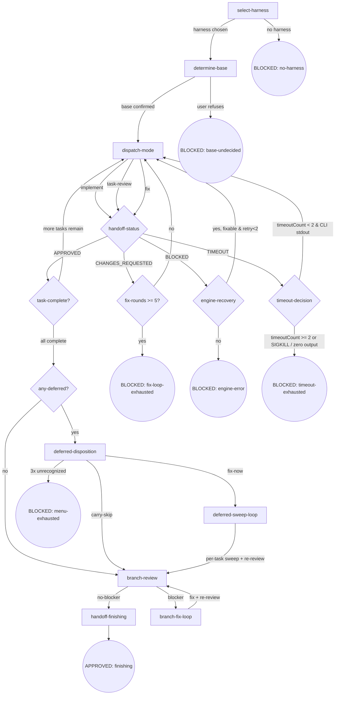

# CLI-Driven Development（cdd）

用选定的 harness CLI 执行计划任务的三模式链。本技能同时是编器与引擎：既执行也做编器决策（模式链、Final Review）。

## Flow Digraph

## Node Definitions

### `select-harness`

- **Do**: 调用 [cli-select](../cli-select/SKILL.md) 的 [ask](../cli-select/SKILL.md#ask) 节点（跨 skill 调用），获取用户选定的 harness 名；将 `--harness <name>` 作为**显式 CLI 参数**传递给所有下游 `cdd-task.mjs` / `cdd-review.mjs` 调用（禁止隐式 env var 传播——延续 P7 I1）。
- **Read**: cli-select 的 `ask` 节点返回的 harness 名。
- **Exit**: 选定 harness → `determine-base`；cli-select BLOCKED → BLOCKED: no-harness。
- **Fail**: cli-select 返回 BLOCKED（engine bug / 用户取消）→ 本节点同 BLOCKED。

### `determine-base`

- **Do**: 按 [base-branch.md](./docs/base-branch.md) 方法论按顺序尝试推断源：① plan 文档 `base` 字段 ② branch upstream（`git rev-parse --abbrev-ref @{u}`）③ 对话上下文（历史消息明确提及 base）④ fallback 询问用户。确定后写入 `.superpowers/cdd/<slug>/base-branch.json`（schema：`{base, source: "plan-field"|"branch-upstream"|"conversation-context"|"user-confirmed", confirmed_at}`；slug = CDD workspace slug；source 四值对应 4 推断源）。**Scope 解析**：CDD 场景 scope = `cdd`，slug = CDD workspace slug。
- **Read**: plan 文档 + `git rev-parse --abbrev-ref @{u}` + 对话上下文 + `.superpowers/cdd/<slug>/base-branch.json`（可选，若已存在则跳过推断）。
- **Exit**: base 已确认（artifact 写入或已存在）→ `dispatch-mode`（首个 task 的 implement）。
- **Fail**: 用户拒绝确认 → BLOCKED: base-undecided。

### `dispatch-mode`

- **Do**: 派发 cdd-task.mjs 前执行以下步骤：
  1. 生成 brief：`node bin/engine/lib/brief.mjs --task N --plan <path> --output <workspace>/task-N-brief.md`
  2. 记录 dispatch-time HEAD：`git rev-parse HEAD` → 写入 `progress.json.lastDispatchHead`
  3. task-review 模式时：通过 review-package 脚本生成 review diff
  4. **三模式链强制执行（#207）**：fix 模式——验证该 task 的 task-review handoff 存在且 status = APPROVED；否则拒绝 dispatch（报告给用户）
  5. 派发：`node {pluginRoot}/bin/engine/cdd-task.mjs --harness <name> --task N --mode <mode> [--scope blocker-only|deferred-sweep]`（`--scope` 仅 `--mode fix` 时有效；默认 `blocker-only`）。**Background execution**（程序级强化）：必须以 background 模式运行 CLI（harness 支持时用 `run_in_background`，不支持时超时+轮询）。返回后**必须读 handoff.json 判断状态**（Orchestrator handoff 检查义务——#181 核心）：解析 `status` 字段（APPROVED / CHANGES_REQUESTED / BLOCKED / TIMEOUT），**不凭 stdout 是否为空判断有无变更**。**超时处理**：若 `invokeCli` 返回 `timedOut: true`，读 `progress.json` `timeoutCount` 并路由到 `timeout-decision`（digraph 中的决策节点）。brief 生成使用 `--task N` 索引（CDD 级唯一索引——#185 fix 后语义）。scope 默认 `blocker-only`；deferred-sweep 仅当 deferred-disposition 决策为 fix-now 时启用。
- **Read**: `CDD_HANDOFF_PATH`（`task-N-handoff.json`）+ open-findings（fix mode 时）+ brief 生成依赖的 plan 段落 + `progress.json`（timeoutCount，超时时）。
- **Exit**: 构造 CLI 命令并 spawn → 进入 `handoff-status`（决策节点，按 handoff status 路由）。超时时 → 进入 `timeout-decision`。
- **Fail**: 嵌套 CLI 失败且 handoff 缺失 → runner.mjs 已写 BLOCKED handoff（含 stderr 进 blocker），本节点读取并路由到 BLOCKED: engine-error。三模式链强制执行违规（fix dispatch 无先前 task-review APPROVED）→ 报告给用户，拒绝 dispatch。

### `handoff-status`（决策节点）

- **Do**: 读 `handoff.json` 的 `status` 字段。路由前执行 commit-contract 验证：
  1. `node bin/engine/lib/contract.mjs --check-dirty` — dirty tree → 路由到 BLOCKED: engine-error
  2. `node bin/engine/lib/contract.mjs --check-head --handoff <path> --progress <path>` — head 不匹配 → 路由到 BLOCKED: engine-error
  然后按 status 路由：`APPROVED` → `task-complete?`；`CHANGES_REQUESTED` → dispatch-mode（fix mode，blocker-only scope；dispatch-mode 内部维护 fix-round 计数器，≥ 5 时路由到 BLOCKED: fix-loop-exhausted）；`BLOCKED` → `engine-recovery`（决策节点——读 blocker 判断可修复性；可修复 + retry<2 → 重 dispatch 同 mode；不可修复/retry≥2 → BLOCKED: engine-error；retry 计数器通过 `progress.json` `engine-recovery-count` 管理，不走 `handoff.json.retryCount`——见下方 §D 偏差声明）；`TIMEOUT` → `timeout-decision`（决策节点——读 `progress.json` `timeoutCount`；< 2 + CLI stdout 存在 → 重试 dispatch-mode；≥ 2 或 SIGKILL / 零输出 → BLOCKED: timeout-exhausted）；`NEEDS_CONTEXT` → **implicit fail-open**（orchestrator 手工调查后以相同 mode 重派 dispatch-mode；不在 digraph 中作为边）。
- **Read**: `handoff.json`。
- **Exit**: 按 status 路由→见上方 Do 字段。
- **Fail**: commit-contract 验证失败（dirty tree 或 head 不匹配）→ BLOCKED: engine-error。`status` 字段缺失或非法（非 APPROVED/CHANGES_REQUESTED/BLOCKED 之一；NEEDS_CONTEXT 为已知但隐式处理的状态，由 Exit 字段的 fail-open 路径处理，不走此 Fail 分支）。

### `engine-recovery`（决策节点）

- **Do**: 读当前 `handoff.json` 的 blocker 字段并判断可修复性：① 若 blocker 描述可修复条件（如 dirty tree → 先 commit，缺失 artifact → 重新生成）**且** `progress.json` `engine-recovery-count` < 2 → 递增 recovery 计数 → 以相同 mode 重派 `dispatch-mode`；② 若不可修复或 `engine-recovery-count` ≥ 2 → 终态 `BLOCKED: engine-error`。
- **Read**: `handoff.json`（blocker 字段）+ `progress.json`（engine-recovery-count；每次 recovery 尝试递增）。
- **Exit**: 可修复 + retry<2 → `dispatch-mode`（同 mode，同 task）；不可修复或 retry≥2 → `BLOCKED: engine-error`。
- **Fail**: blocker 字段为空或不可解析 → 终态 `BLOCKED: engine-error`。

> **§D 偏差声明（deliberate spec §2.3 step 4 departure）**：Spec §2.3 规定复用 `handoff.json.retryCount`（由 engine 层 `runner.mjs` 管理）。本 plan 改为 `progress.json` `engine-recovery-count`（由 orchestrator 层 skill 管理）。理由：P10 scope 限定「不改控制流」（design §1 范围边界）；`runner.mjs` 当前无 retry 基础设施，retry 是 skill digraph 的 `engine-recovery` 决策节点逻辑（orchestrator 层），非 engine 循环——由 orchestrator 跨 re-dispatch 保留计数，不改 `runner.mjs`。

### `timeout-decision`（决策节点）

- **Do**：读 `progress.json` `timeoutCount` 判断超时重试资格：① 若 `timeoutCount < 2` **且** CLI 产生了部分 stdout（超时前有非空输出）→ 递增 `progress.json` `timeoutCount` → 重派 `dispatch-mode`（同 task，同 mode——带 partial handoff 上下文重试）；② 若 `timeoutCount >= 2` **或** CLI 被 SIGKILL 终止 **或** CLI 产生零输出 → 终态 `BLOCKED: timeout-exhausted`。`timeoutCount` 持久化在 `progress.json`（与 `engine-recovery-count` 同模式），不写入 `handoff.json`。
- **Read**：`progress.json`（timeoutCount）+ 超时 dispatch 的 CLI stdout 存在性检查。
- **Exit**：timeoutCount < 2 且 CLI stdout 存在 → `dispatch-mode`（重试）；timeoutCount >= 2 或 SIGKILL / 零输出 → `BLOCKED: timeout-exhausted`。
- **Fail**：`progress.json` 不可读或 timeoutCount 不可解析 → 终态 `BLOCKED: timeout-exhausted`。

### `task-complete?`（决策节点）

- **Do**: 检查 ledger `progress.json` + 所有 task 的 handoff：① 若 ledger 已有 `Task N: complete` 行对应该 task 且还有后续未完成任务 → 继续 dispatch；② 若 ledger 含所有 task 的 complete 行 → 进入 `any-deferred?`。**task-review 不可跳过**（#181 纪律）：每 task 必跑 implement → task-review → （fix 如需）→ ledger 完整链路；不允许从 implement 直接跳到 ledger。**ledger 追加纪律**：仅当 handoff `status: APPROVED` 时追加 `Task N: complete` 行（CLI 子进程不写 ledger）。
- **Read**: `progress.json`（CDD_LEDGER）+ 所有 `task-N-handoff.json`。
- **Exit**: 还有未完成 task → `dispatch-mode`（下一 task 的 implement）；所有 task APPROVED → `any-deferred?`。
- **Fail**: 某 task handoff 缺失或 status 非 APPROVED 但 ledger 无该 task 的 complete 行 → BLOCKED: engine-error。

### `any-deferred?`（决策节点）

- **Do**: 扫描所有 `task-N-handoff.json` 的 `findings[]`，提取 `deferred: true` 项；按 task 分组汇总（生成内存中的 deferred rollup）；非空 → `deferred-disposition`；空 → `branch-review`。
- **Read**: 所有 `task-N-handoff.json` 的 `findings[]`。
- **Exit**: 存在 `deferred: true` 项 → `deferred-disposition`；无 → `branch-review`。
- **Fail**: handoff 文件损坏或不可解析 → BLOCKED: engine-error。

### `deferred-disposition`

- **Do**: 向用户呈现累积 deferred findings（按 task 分组）：每 task 列出 `findings[].deferred=true` 项（severity + summary + 推荐 fix）；**用户选择**：① fix-now（进入 deferred-sweep-loop；sweep 处理全部 deferred findings——"pure record" nits 也不例外；sweep 完成 = findings[] 全部清空（无论代码是否实际修改）；sweep 后无逐 task 二次确认）② carry-skip（携带跳过，直接 branch-review）。呈现时说明 deferred 项为 warn/nit 级别，不影响 APPROVED 语义，但修复后分支更干净。
- **Read**: any-deferred? 节点聚合的 deferred rollup。
- **Exit**: fix-now → `deferred-sweep-loop`；carry-skip → `branch-review`。
- **Fail**: 用户拒绝决策（present-menu 累计 3 次机会耗尽，同 P6 finishing `present-menu` 计数模型）→ BLOCKED: menu-exhausted。

### `deferred-sweep-loop`

- **Do**: 按 task 单独跑 deferred-sweep：对每 task 的 `findings[].deferred=true` 项，派发 `node {pluginRoot}/bin/engine/cdd-task.mjs --harness <name> --task N --mode fix --scope deferred-sweep`（fix 双通道：deferred-sweep）；sweep 处理全部 deferred findings——"pure record" nits 也不例外。fix CLI 返回后：
  - 若 agent exit code = 0：task-review re-review（验证修复）；若 re-review 返回新 blocker → 走 fix 循环（≤ 5 轮）；re-review APPROVED → (1) `node bin/engine/lib/contract.mjs --clear-findings --handoff <path>`（原地清空 `findings[]`），(2) 设置 handoff.status = "APPROVED"，(3) 追加 `Task N: complete` 到 ledger → 继续下一 task 的 sweep。
  - 若 agent exit code ≠ 0：报告该 task 失败；继续下一 task 的 sweep（`findings[]` 保留，status 不变）。
  **Controller 约束**：deferred findings 修复必须走本节点 `--mode fix` dispatch；禁止在引擎 CLI 路径之外手写修复（见 I7）。
- **Read**: 每 task 的 handoff + fix 模式返回的 handoff 更新。
- **Exit**: 所有 deferred-sweep task 完成（re-review APPROVED）→ `branch-review`。
- **Fail**: 某 task sweep 陷入 fix-loop-exhausted → BLOCKED: fix-loop-exhausted。

### `branch-review`

- **Do**: `node {pluginRoot}/bin/engine/cdd-review.mjs --harness <name> --template branch-review --param BASE=<read from base-branch.json#base> --param HEAD=<head> --param PLAN=<plan-path>`（BASE 从 artifact 读，**移除 `origin/develop` 硬编码**）。**Background execution**（程序级强化）。返回后**读 handoff.json 判断状态**（同 dispatch-mode 节点纪律）。**持久化 diff + report 到 workspace**（#181 纪律）：写 `<workspace>/branch-review.diff` + `<workspace>/branch-review-report.md`（内容从 cdd-review 输出 + findings 提取）。
- **Read**: `base-branch.json`（取 base 名）+ branch HEAD + plan 路径 + cdd-review 输出。
- **Exit**: 无 blocker → `handoff-finishing`；有 blocker → `branch-fix-loop`；仅有 deferred → `handoff-finishing`（deferred 项不阻塞 finishing）。
- **Fail**: cdd-review 失败且无 handoff → BLOCKED: engine-error。

### `branch-fix-loop`

- **Do**: 基于 branch-review 的 blocker findings，orchestrator 直接（或派发嵌套 CLI）修复；修复后**重跑 branch-review**（回到 `branch-review` 节点）。分支级 fix 循环，无硬性上限（但建议 ≤ 3 轮；超出由用户决策是否继续）。
- **Read**: branch-review 的 findings（来自 handoff `findings[]`）。
- **Exit**: 修复后 branch-review 无 blocker → `handoff-finishing`。
- **Fail**: 多轮修复后 blocker 不消 → **implicit fail-open**（停手 + report 给用户，branch 保留，用户手动决策）。

### `handoff-finishing`

- **Do**: 准备交接给 `osuperpowers:finishing`：确保 `.superpowers/cdd/<slug>/base-branch.json` 已写入（finishing 的 `read-base` 节点消费同一 artifact）；总结 branch 状态（commits count / base / 未修 deferred 项数量）；调用 `osuperpowers:finishing` 接管后续（merge / PR / keep / discard 四选项）。
- **Read**: `base-branch.json` + ledger + 所有 handoff + branch-review 最终状态。
- **Exit**: 交接完成 → APPROVED: finishing。
- **Fail**: finishing 接管失败 → **implicit fail-open**（branch 保留，用户手动 finishing）。

## Invariants

| # | Invariant |
|---|-----------|
| I1 | **Explicit Propagation** — 所选 harness 仅以 `--harness <name>` 显式 CLI 参数传播给下游（`cdd-task.mjs` / `cdd-review.mjs`）；禁止 skill 层与引擎层任何形式的隐式环境变量传递（`CDD_HARNESS` / `HARNESS_NAME` 等均不允许）——延续 P7 I1。 |
| I2 | **CLI Background Execution** — 所有 CLI mode 调用（`cdd-task.mjs` / `cdd-review.mjs`）必须以 background 方式运行——harness 支持时用 `run_in_background`，不支持时超时+轮询（overall spec v1.9 程序级强化）。 |
| I3 | **No --resume / -c** — 所有嵌套 CLI 调用禁止携带历史 session 标志（`--resume` / `-c` 等），使用 one-shot print mode。 |
| I4 | **Fix Dual-Channel Contract** — fix 模式两通道：`--scope blocker-only`（默认，fix.md 仅处理 non-deferred 项；deferred 项保留在 handoff `findings[]` 跨轮次不动，不进 fix loop）｜`--scope deferred-sweep`（用户决策后，处理 deferred 项）。`runner.mjs` 把 scope 映射为 `CDD_FINDINGS_SCOPE` env；`fix.md` 的 `{{FINDINGS_SCOPE}}` 占位符按 env 展开。 |
| I5 | **Three-Mode Chain Completeness** — 每 task 必走 implement → task-review → （fix 如需）→ ledger 完整链路；不允许跳过 task-review 直接从 implement 到 ledger（#181 纪律）。 |
| I6 | **No Controller Bypass** — 当引擎可用（cdd-task.mjs / cdd-review.mjs 可运行）时，orchestrator 禁止手写控制流绕过引擎处理。所有 task 执行、review、fix 派发必须走引擎 CLI 调用；禁止 orchestrator 层直接操控 handoff/ledger 状态来替代引擎处理。 |
| I7 | **No Hand-Written Deferred Fix** — deferred findings 修复必须走 `--mode fix` dispatch（`deferred-disposition` fix-now → `deferred-sweep-loop`）；controller 禁止在引擎 CLI 路径之外手写 deferred findings 的修复。**降级路径**：当引擎完全不可用时（exit 3 / harness 缺失 / retry 计数命中 `engine-recovery` 硬上限 retry≥2），controller 可直接修复但**必须在 `progress.json` 记录降级原因**（severity + summary + reason）；engine 恢复后补 `--mode fix` re-review。 |
| I8 | **Timeout Retry with Cap** — `dispatch-mode` 返回 `TIMEOUT` 时，`timeout-decision` 读取 `progress.json` `timeoutCount`。若 `timeoutCount < 2` 且 CLI 产生了部分 stdout（超时前非空输出），递增 `timeoutCount` 并通过 `dispatch-mode` 重试。若 `timeoutCount >= 2` 或 CLI 被 SIGKILL 终止或产生零输出 → 终态 `BLOCKED: timeout-exhausted`。`timeoutCount` 持久化在 `progress.json`（与 `engine-recovery-count` 同模式）。 |

## Failure Modes

跨节点的失败行为映射（与 Node Fail 字段互补）：

| failure | behavior | reason | recovery |
|---------|----------|--------|----------|
| `cli-select` BLOCKED | BLOCKED: no-harness | 无法获取 harness 名 | 由 cli-select 节点的 report-issue 路径处理 |
| determine-base 用户拒绝确认 | BLOCKED: base-undecided | merge/PR 到错误 base 代价高 | 用户重跑 CDD 时重新询问 |
| 嵌套 CLI 失败 + handoff 缺失 | BLOCKED: engine-error | 引擎 bug 信号 | `osuperpowers:report-issue` 上报，label `bug, dogfood, osuperpowers, cdd` |
| handoff `status: BLOCKED` | `engine-recovery` 决策 → 重 dispatch 或 BLOCKED: engine-error | runner.mjs 已捕获 blocker（dirty tree / CLI 失败） | engine-recovery 读 blocker：可修复 + retry<2 → 重 dispatch；否则终态 BLOCKED |
| handoff `status: TIMEOUT` | `timeout-decision` → 重试或 BLOCKED: timeout-exhausted | CLI 超时未完成 | timeout-decision 读 `timeoutCount`：< 2 + 部分 stdout → 重试（递增计数）；≥ 2 或 SIGKILL / 零输出 → 终态 BLOCKED: timeout-exhausted |
| timeout exhaustion（timeoutCount ≥ 2） | BLOCKED: timeout-exhausted | 重试上限已到；CLI 持续超时 | 检查超时配置；检查 workspace 资源；增大超时或修复底层性能问题 |
| task 级 fix-loop ≥ 5 轮 | BLOCKED: fix-loop-exhausted | 避免 task 级无限循环 | 用户决策：手工修 / 重新 review scope / 放弃 |
| handoff JSON 损坏或 status 字段非法 | BLOCKED: engine-error | 契约违规（runner self-validate 应已拦截） | report-issue 上报 |
| deferred-disposition 累计 3 次呈现耗尽 | BLOCKED: menu-exhausted | 无法获取用户决策 | 用户重跑 CDD |
| branch-fix-loop 多轮 blocker 不消 | **implicit fail-open** | 分支级 blocker 可能需手工调查（无硬性上限，建议 ≤ 3 轮；超出由用户决策） | 停手 + report，branch 保留，用户手动 finishing |
| `osuperpowers:finishing` 接管失败 | **implicit fail-open** | finishing 自身问题 | branch 保留，用户手动 finishing |
| controller bypass engine | **implicit fail-open**（降级） | 引擎完全不可用（exit 3 / harness 缺失 / retry≥2 硬上限）；controller 直接手写 deferred findings 修复 | 记录降级原因到 `progress.json`（severity + summary + reason）；engine 恢复后补 `--mode fix` re-review |

**Fail-open vs BLOCKED 约定**：

- **BLOCKED**：显式终态节点（digraph 圆角圆），需用户介入恢复。
- **implicit fail-open**：节点级失败（不在 digraph），流程停手 + report 给用户。
