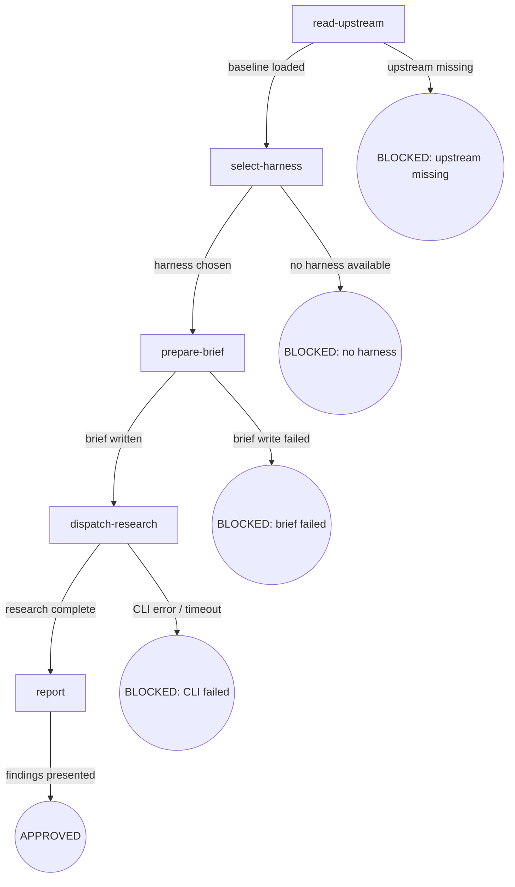

# Osuperpowers CLI Research

Delegate a research question to a background agent via cdd-research.mjs: read upstream baseline, select harness, prepare brief, dispatch CLI, report findings.

## Flow Digraph

## Node Definitions

### `read-upstream`

- **Do**: Read the mattpocock-skills research SKILL.md to load the research framework and methodology. This is a Read operation, not a Skill invocation — the upstream skill is consumed as reference material, not invoked as a sub-skill.
- **Read**: `vendors/mattpocock-skills/skills/engineering/research/SKILL.md`
- **Exit**: File exists and is readable → `select-harness`; file missing or unreadable → BLOCKED (upstream missing)
- **Fail**: File read error → BLOCKED (upstream missing) with installation guidance

### `select-harness`

- **Do**: Call the cli-select ask node (cross-skill call via `osuperpowers:cli-select`) to detect available harnesses and ask the user to select one. The selected harness name is returned for use in `dispatch-research`.
- **Read**: cli-select node output (selected harness name)
- **Exit**: User selects a harness → `prepare-brief`; no harnesses available or user cancels → BLOCKED (no harness)
- **Fail**: cli-select execution failure → BLOCKED (no harness); user cancellation → treated as user-side, not counted in Failure Modes

### `prepare-brief`

- **Do**: Extract the research question and findings output path from user input. Write a brief Markdown file with three sections: `## Research Questions`, `## Scope`, `## Expected Output`. The brief file is written to a temporary path under the workspace `.superpowers/` directory.
- **Read**: User input (research question, optional output path override)
- **Exit**: Brief file written successfully → `dispatch-research`; file write error → BLOCKED (brief failed)
- **Fail**: Filesystem write error (permissions, disk full) → BLOCKED (brief failed)

### `dispatch-research`

- **Do**: Execute `node {pluginRoot}/bin/engine/cdd-research.mjs --harness <name> --brief <brief-path> --output <findings-path>` as a background process. Monitor for completion; do not block the main session — the CLI runs asynchronously.
- **Read**: `{pluginRoot}/bin/engine/cdd-research.mjs` (CLI script)
- **Exit**: CLI exits 0 and findings file is written → `report`; CLI exits non-zero or times out → BLOCKED (CLI failed)
- **Fail**: CLI execution error / non-zero exit / timeout → BLOCKED (CLI failed); record stderr for diagnostics

### `report`

- **Do**: Read the findings file produced by cdd-research.mjs and present the results to the user. Summarize key findings and cite sources as documented in the upstream research framework.
- **Read**: `<findings-path>` (output from dispatch-research)
- **Exit**: Findings presented to user → APPROVED
- **Fail**: Findings file missing or empty → report error to user with diagnostics from dispatch-research stderr

## Invariants

| # | Invariant |
|---|---|
| I1 | **Read not Skill-invoke** — the upstream mattpocock-skills research SKILL.md is consumed via the Read tool as reference material; it is never invoked as a sub-skill (no `Skill("research")` call). The research framework is loaded as context, not executed as a separate skill flow |
| I2 | **CLI Background Execution** — `cdd-research.mjs` must run as a background process (spawn, not exec). The main session must not block waiting for CLI completion. Timeout and completion are monitored asynchronously |
| I3 | **Findings Path Caller-Determined** — the output path for findings is determined by the caller (user or invoking skill) and passed via `--output` to cdd-research.mjs. The skill does not choose or override the findings path |

## Failure Modes

| failure | behavior | reason | recovery |
|---|---|---|---|
| Upstream SKILL.md missing | BLOCKED (upstream missing) | Block policy: no silent fallback when baseline is missing | Install vendored submodules: `git submodule update --init` |
| No harness available | BLOCKED (no harness) | Cannot dispatch research without a target harness | Install a supported harness per cli-select documentation |
| Brief write failure | BLOCKED (brief failed) | Cannot dispatch without a valid brief file | Check workspace permissions and disk space |
| cdd-research.mjs CLI error | BLOCKED (CLI failed) | CLI failure may indicate engine bug or harness misconfiguration | Check stderr diagnostics; invoke `osuperpowers:report-issue` if engine bug suspected |
| cdd-research.mjs timeout | BLOCKED (CLI failed) | Long-running research exceeded timeout threshold | Review timeout configuration in cdd-research.mjs; increase if appropriate |
| Findings file missing | report error with diagnostics | CLI may have exited 0 but failed to write output | Check cdd-research.mjs stderr; verify output path permissions |
