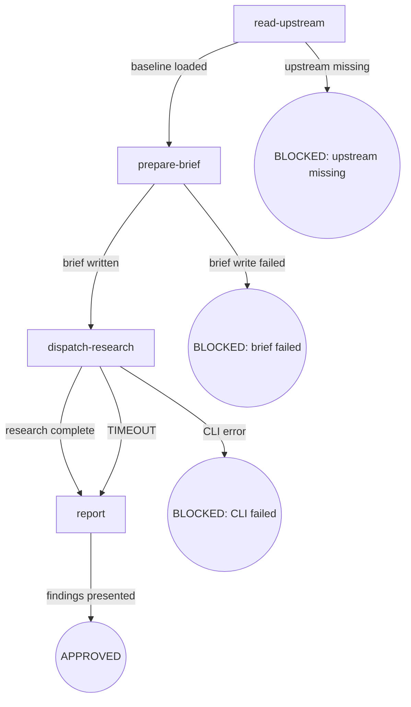

# Osuperpowers CLI Research

Delegate a research question to a background agent via `cdd research`: read upstream baseline, prepare brief, dispatch CLI, report findings.

## Flow Digraph

## Node Definitions

### `read-upstream`

- **Do**: Read the mattpocock-skills research SKILL.md to load the research framework and methodology. This is a Read operation, not a Skill invocation — the upstream skill is consumed as reference material, not invoked as a sub-skill.
- **Read**: `vendors/mattpocock-skills/skills/engineering/research/SKILL.md`
- **Exit**: File exists and is readable → `prepare-brief`; file missing or unreadable → BLOCKED (upstream missing)
- **Fail**: File read error → BLOCKED (upstream missing) with installation guidance

### `prepare-brief`

- **Do**: Extract the research question and findings output path from user input. Write a brief Markdown file with three sections: `## Research Questions`, `## Scope`, `## Expected Output`. The brief file is written to a temporary path under the workspace `.superpowers/` directory.
- **Read**: User input (research question, optional output path override)
- **Exit**: Brief file written successfully → `dispatch-research`; file write error → BLOCKED (brief failed)
- **Fail**: Filesystem write error (permissions, disk full) → BLOCKED (brief failed)

### `dispatch-research`

- **Do**: Execute `cdd research --brief <brief-path> --output <findings-path>` as a background process. Monitor for completion; do not block the main session — the CLI runs asynchronously. (Host harness is ambient-detected by the engine — no `--harness` flag.)
- **Read**: `cdd research` (CLI script)
- **Exit**: CLI exits 0 and findings file is written → `report`; CLI exits non-zero → BLOCKED (CLI failed); CLI times out → `report` (fail-open — read partial findings if available, then proceed to report; timeout is not retryable in research context)
- **Fail**: CLI execution error / non-zero exit → BLOCKED (CLI failed); CLI timeout → fail-open to `report` (research is optional enhancement, partial findings are valuable; no timeout-count increment); record stderr for diagnostics

### `report`

- **Do**: Read the findings file produced by `cdd research` and present the results to the user. Summarize key findings and cite sources as documented in the upstream research framework.
- **Read**: `<findings-path>` (output from dispatch-research)
- **Exit**: Findings presented to user → APPROVED
- **Fail**: Findings file missing or empty → report error to user with diagnostics from dispatch-research stderr

## Invariants

| # | Invariant |
|---|---|
| I1 | **Read not Skill-invoke** — the upstream mattpocock-skills research SKILL.md is consumed via the Read tool as reference material; it is never invoked as a sub-skill (no `Skill("research")` call). The research framework is loaded as context, not executed as a separate skill flow |
| I2 | **CLI Background Execution** — `cdd research` must run as a background process (spawn, not exec). The main session must not block waiting for CLI completion. Timeout and completion are monitored asynchronously |
| I3 | **Findings Path Caller-Determined** — the output path for findings is determined by the caller (user or invoking skill) and passed via `--output` to `cdd research`. The skill does not choose or override the findings path |

## Failure Modes

| failure | behavior | reason | recovery |
|---|---|---|---|
| Upstream SKILL.md missing | BLOCKED (upstream missing) | Block policy: no silent fallback when baseline is missing | Install vendored submodules: `git submodule update --init` |
| Brief write failure | BLOCKED (brief failed) | Cannot dispatch without a valid brief file | Check workspace permissions and disk space |
| `cdd research` CLI error | BLOCKED (CLI failed) | CLI failure may indicate engine bug or harness misconfiguration | Check stderr diagnostics; invoke `osuperpowers:report-issue` if engine bug suspected |
| `cdd research` timeout | fail-open → report | Long-running research exceeded timeout; partial findings may exist | Read partial findings file if available; report to user with timeout note; research is optional enhancement, not worth blocking |
| Findings file missing | report error with diagnostics | CLI may have exited 0 but failed to write output | Check `cdd research` stderr; verify output path permissions |
