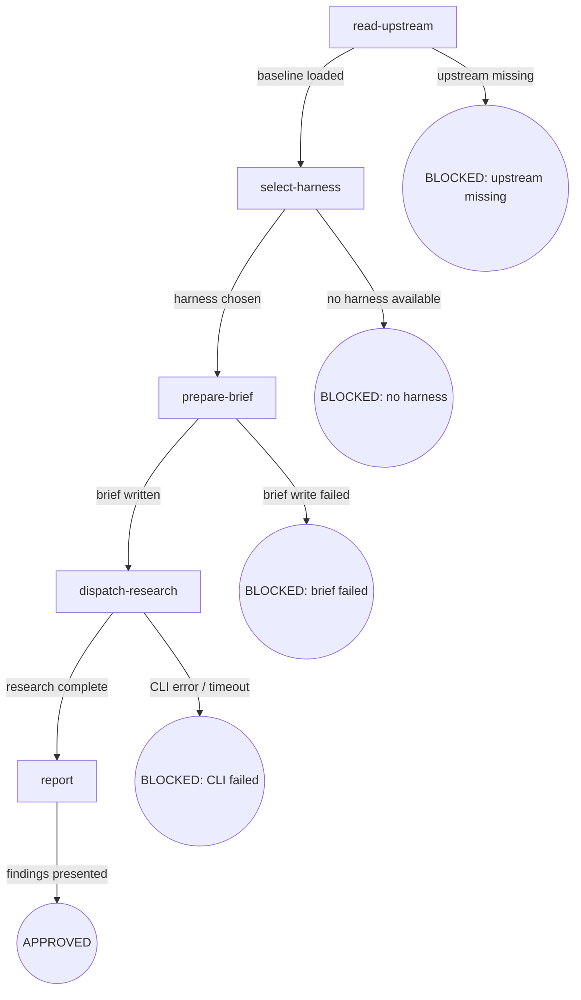

# Osuperpowers CLI Research

将研究问题委托给后台 agent 通过 cdd-research.mjs 执行：读取上游基线、选择 harness、准备 brief、调度 CLI、报告 findings。

## Flow Digraph

## Node Definitions

### `read-upstream`

- **Do**：读取 mattpocock-skills 的 research SKILL.md 以加载研究框架和方法论。这是 Read 操作，不是 Skill 调用——上游 skill 作为参考材料被消费，不作为子 skill 被调用。
- **Read**：`vendors/mattpocock-skills/skills/engineering/research/SKILL.md`
- **Exit**：文件存在且可读 → `select-harness`；文件缺失或不可读 → BLOCKED（upstream missing）
- **Fail**：文件读取错误 → BLOCKED（upstream missing），附安装指引

### `select-harness`

- **Do**：调用 cli-select ask 节点（跨 skill 调用 `osuperpowers:cli-select`）以检测可用 harness 并询问用户选择。所选 harness 名称返回给 `dispatch-research` 使用。
- **Read**：cli-select 节点输出（所选 harness 名称）
- **Exit**：用户选定 harness → `prepare-brief`；无可用 harness 或用户取消 → BLOCKED（no harness）
- **Fail**：cli-select 执行失败 → BLOCKED（no harness）；用户取消视为用户侧，不计入 Failure Modes

### `prepare-brief`

- **Do**：从用户输入中提取研究问题和 findings 输出路径。编写 brief Markdown 文件，包含三个章节：`## Research Questions`、`## Scope`、`## Expected Output`。brief 文件写入 workspace `.superpowers/` 目录下的临时路径。
- **Read**：用户输入（研究问题，可选输出路径覆盖）
- **Exit**：brief 文件写入成功 → `dispatch-research`；文件写入错误 → BLOCKED（brief failed）
- **Fail**：文件系统写入错误（权限、磁盘满）→ BLOCKED（brief failed）

### `dispatch-research`

- **Do**：执行 `node {pluginRoot}/bin/engine/cdd-research.mjs --harness <name> --brief <brief-path> --output <findings-path>` 作为后台进程。监控完成状态；不阻塞主会话——CLI 异步运行。
- **Read**：`{pluginRoot}/bin/engine/cdd-research.mjs`（CLI 脚本）
- **Exit**：CLI 退出码 0 且 findings 文件已写入 → `report`；CLI 退出码非 0 或超时 → BLOCKED（CLI failed）
- **Fail**：CLI 执行错误 / 非零退出码 / 超时 → BLOCKED（CLI failed）；记录 stderr 用于诊断

### `report`

- **Do**：读取 cdd-research.mjs 生成的 findings 文件并向用户展示结果。按照上游研究框架的文档格式总结关键发现并引用来源。
- **Read**：`<findings-path>`（dispatch-research 的输出）
- **Exit**：findings 已展示给用户 → APPROVED
- **Fail**：findings 文件缺失或为空 → 向用户报告错误并附 dispatch-research 的 stderr 诊断信息

## Invariants

| # | Invariant |
|---|---|
| I1 | **Read 而非 Skill-invoke** — 上游 mattpocock-skills research SKILL.md 通过 Read 工具作为参考材料被消费；**绝不**作为子 skill 被调用（不执行 `Skill("research")`）。研究框架作为上下文加载，不作为独立 skill 流执行 |
| I2 | **CLI 后台执行** — `cdd-research.mjs` 必须作为后台进程运行（spawn，非 exec）。主会话不得阻塞等待 CLI 完成。超时和完成状态异步监控 |
| I3 | **Findings 路径由调用方决定** — findings 输出路径由调用方（用户或调用 skill）通过 `--output` 传递给 cdd-research.mjs。本 skill 不选择或覆盖 findings 路径 |

## Failure Modes

| failure | behavior | reason | recovery |
|---|---|---|---|
| 上游 SKILL.md 缺失 | BLOCKED（upstream missing） | Block 政策：基线缺失时禁止静默 fallback | 安装 vendored submodules：`git submodule update --init` |
| 无可用 harness | BLOCKED（no harness） | 无目标 harness 则无法调度研究 | 按 cli-select 文档安装支持的 harness |
| Brief 写入失败 | BLOCKED（brief failed） | 无有效 brief 文件则无法调度 | 检查 workspace 权限和磁盘空间 |
| cdd-research.mjs CLI 错误 | BLOCKED（CLI failed） | CLI 失败可能表示引擎 bug 或 harness 配置问题 | 检查 stderr 诊断信息；疑似引擎 bug 时调用 `osuperpowers:report-issue` |
| cdd-research.mjs 超时 | BLOCKED（CLI failed） | 长时间运行的研究超出超时阈值 | 检查 cdd-research.mjs 中的超时配置；适当时增大 |
| findings 文件缺失 | 报告错误并附诊断信息 | CLI 可能退出码为 0 但未写入输出 | 检查 cdd-research.mjs stderr；验证输出路径权限 |
