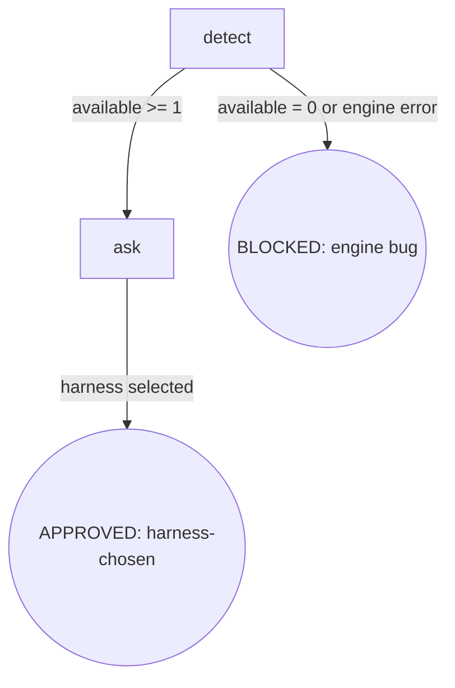

# Osuperpowers CLI Select

Select the harness CLI to execute tasks: detect, list, recommend, ask. Returns selected harness name via explicit `--harness <name>` to the caller.

## Flow Digraph

## Node Definitions

### `detect`

- **Do**: Run `{plugin_root}/bin/engine/cdd-select.mjs` to discover available harnesses and parse its 3-line output:
  - `available:<csv>` — harnesses with `channel=install-and-use` that are installed (participate in recommendation + user selection; referred to as "full harness")
  - `unsupported_installed:<csv>` — harnesses with `channel≠install-and-use` that are installed (informational only, excluded from recommendations; referred to as "not-supported harness")
  - `recommended:<name>` — recommended default (engine computes priority: `droid > pi > current harness > alphabetical`)
- **Read**: `{plugin_root}/bin/engine/cdd-select.mjs` stdout (3-line fixed format)
- **Exit**: `available` contains ≥ 1 item → `ask`; `available` is empty or script exits non-zero → BLOCKED (engine bug)
- **Fail**: Node.js error / script not found / non-zero exit → same BLOCKED (engine bug); recovery per Failure Modes table

### `ask`

- **Do**: Use `AskUserQuestion` (or harness equivalent) to list each item in `available`; **mark the recommended item with `(Recommended)` and place it first**; wait for user selection. Once selected, return the chosen harness name to the caller as an explicit `--harness <name>` argument for downstream `cdd-task.mjs`. Implicit propagation via environment variables is forbidden (I1)
- **Read**: `available` list + `recommended` field (from detect node output)
- **Exit**: User selects 1 item → APPROVED (harness-chosen, returns selected name)
- **Fail**: `AskUserQuestion` unavailable / user cancels selection → treated as user-side cancellation, not counted in Failure Modes (caller decides fallback)

## Invariants

| # | Invariant |
|---|---|
| I1 | **Explicit Propagation** — selected harness is propagated to downstream tools (`cdd-task.mjs` / `cdd-review.mjs`) only via explicit `--harness <name>` CLI argument; any form of implicit environment variable propagation at both skill and engine layers is forbidden (`CDD_HARNESS`, `HARNESS_NAME`, etc. are all disallowed). **Engine status confirmation**: `cdd-select.mjs` only reads env vars for host harness detection purposes (`CURSOR_TRACE_ID` / `CLAUDE_CODE_SESSION_ID` / `AI_AGENT` — identifies host identity only, does not select target harness); it does not read any harness selection env var, so the I1 engine-layer constraint confirms current behavior with no engine changes needed |

## Failure Modes

| failure | behavior | reason | recovery |
|---|---|---|---|
| `available:` is empty | BLOCKED (engine bug) | The orchestrator's host harness necessarily exists (`detectCurrentHarness` should detect at least the host); empty list = engine detection bug signal, not user-side absence | Invoke `osuperpowers:report-issue`; labels `bug, dogfood, osuperpowers` |
| `cdd-select.mjs` execution failure | BLOCKED (same as above) | Engine script execution failure = engine bug (workspace resolution was stabilized in P1, not an expected scenario) | Invoke `osuperpowers:report-issue`; same labels as above |

**Fail-open vs BLOCKED convention**:

- **BLOCKED**: explicit terminal node (digraph rounded circle), requires user intervention to recover, corresponds to a digraph edge
- **implicit fail-open**: node-level failure (not in digraph), flow stops + report to user

cli-select has no implicit fail-open scenarios — all failures route to the explicit BLOCKED node.
