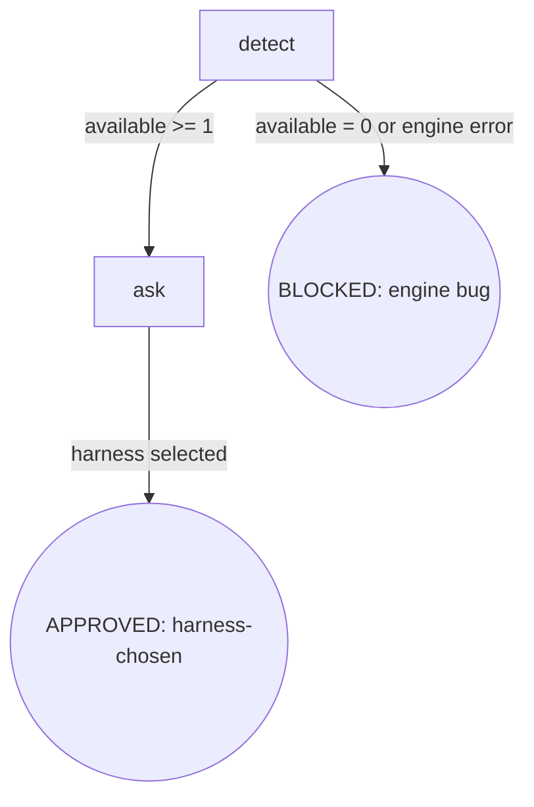

# Osuperpowers CLI Select

选择执行任务的 harness CLI：检测、列出、推荐、询问。以显式 `--harness <name>` 向调用方返回所选 harness 名称。

## Flow Digraph

## Node Definitions

### `detect`

- **Do**：运行 `{plugin_root}/bin/engine/cdd-select.mjs` 发现可用 harness，解析 3 行输出：
  - `available:<csv>` — `channel=install-and-use` 且已安装的 harness（参与推荐 + 用户选择；文档中称 "full harness"）
  - `unsupported_installed:<csv>` — `channel≠install-and-use` 但已安装（提示性，不参与推荐；文档中称 "not-supported harness"）
  - `recommended:<name>` — 推荐默认（引擎按优先级 `droid > pi > 当前 harness > 字母序` 计算）
- **Read**：`{plugin_root}/bin/engine/cdd-select.mjs` 的 stdout（3 行固定格式）
- **Exit**：`available` 列表含至少 1 项 → `ask`；`available` 为空或脚本以非零退出码结束 → BLOCKED（engine bug）
- **Fail**：Node.js 错误 / 脚本不存在 / 退出码非 0/1 → 同 BLOCKED（engine bug）；恢复操作见 Failure Modes 表

### `ask`

- **Do**：使用 `AskUserQuestion`（或 harness 等效工具）列出 `available` 各项；**推荐项标记 `(Recommended)` 并置于选项首位**；等待用户选择。选定后，把所选 harness 名返回给调用方，作为调用方下游 `cdd-task.mjs --harness <name>` 的显式参数。**禁止**通过环境变量隐式传播（I1）
- **Read**：`available` 列表 + `recommended` 字段（来自 detect 节点输出）
- **Exit**：用户选定 1 项 → APPROVED（harness-chosen，返回所选名）
- **Fail**：`AskUserQuestion` 不可用 / 用户取消选择 → 视为用户侧取消，不计入 Failure Modes（由调用方决定 fallback）

## Invariants

| # | Invariant |
|---|---|
| I1 | **显式传播** — 所选 harness 仅以 `--harness <name>` 显式 CLI 参数传播给下游（`cdd-task.mjs` / `cdd-review.mjs`）；**禁止** skill 层与引擎层任何形式的隐式环境变量传递（`CDD_HARNESS` / `HARNESS_NAME` 等均不允许）。**引擎现状确认**：`cdd-select.mjs` 当前仅读取 `CURSOR_TRACE_ID` / `CLAUDE_CODE_SESSION_ID` / `AI_AGENT` 等宿主 harness 检测用途的环境变量（仅识别宿主身份，不选择目标 harness）；不读取任何 harness 选择类 env var，故 I1 引擎层约束为现状确认，无需引擎改动 |

## Failure Modes

| failure | behavior | reason | recovery |
|---|---|---|---|
| `available:` 为空 | BLOCKED（engine bug） | orchestrator 运行所在 harness 必然存在（`detectCurrentHarness` 应至少识别宿主）；空列表 = 引擎检测 bug 信号，非用户侧缺失 | 调用 `osuperpowers:report-issue` 上报；label `bug, dogfood, osuperpowers` |
| `cdd-select.mjs` 执行失败 | BLOCKED（同上） | 引擎脚本执行失败 = 引擎 bug（workspace 解析已在 P1 稳定，非预期场景） | 调用 `osuperpowers:report-issue` 上报；label 同上 |

**Fail-open vs BLOCKED 约定**：

- **BLOCKED**：显式终态节点（digraph 圆角圆），需用户介入恢复，对应 digraph 边
- **implicit fail-open**：节点级失败（不在 digraph 中），流程停手 + report 给用户

cli-select 没有 implicit fail-open 场景——所有失败都路由到显式 BLOCKED 节点。
