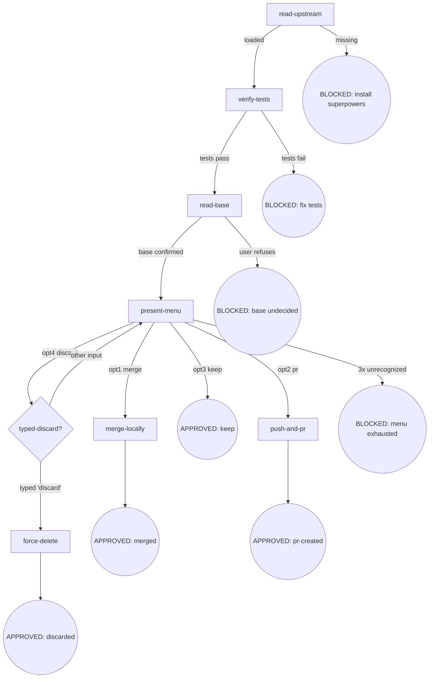

# Osuperpowers Finishing

Development branch finishing: merge / PR / keep / discard.

## Flow Digraph



## Node Definitions

### `read-upstream`

- **Do**: Read upstream `superpowers:finishing-a-development-branch` SKILL.md as the process baseline. **Read, not Skill-invoke** (Skill-invoke triggers router interception — I3). Resolution: ① harness plugin system locates the sibling `superpowers` plugin's SKILL.md; ② fallback to vendored path in the same repo. The baseline is the SKILL.md file only — harness-injected docs (CLAUDE.md, README, vendor contributor guides) are not the baseline
- **Read**: Upstream `superpowers:finishing-a-development-branch` SKILL.md file
- **Exit**: File exists and readable → `verify-tests`; missing → BLOCKED (install superpowers plugin)
- **Fail**: Skill-invoke upstream → violates I3

### `verify-tests`

- **Do**: Run the project's full test suite (`npm test` / `cargo test` / `pytest` / `go test ./...`, per project configuration). Tests must pass before entering the finishing flow. **No test configuration** (no `scripts.test` / no `Cargo.toml` / no `pyproject.toml` test section, etc.) → treat as passed (the project does not require tests; finishing does not impose a test threshold)
- **Read**: Project test configuration (package.json scripts / Cargo.toml / pyproject.toml, etc.)
- **Exit**: All green (or no test configuration) → `read-base`; any failure → BLOCKED (fix tests)
- **Fail**: "Tests passed earlier" → still re-run against the current tree; do not skip based on historical results

### `read-base`

- **Do**: Determine the base branch (merge / PR target). Read workspace artifact `.superpowers/<scope>/<slug>/base-branch.json` (see [base-branch.md](../cli-driven-development/docs/base-branch.md) for methodology + schema); artifact missing (standalone finishing scenario) → **try these inference sources in order, taking the first definitive result**: ① plan document (`base` field) ② branch upstream (`git rev-parse --abbrev-ref @{u}`) ③ conversation context (base explicitly mentioned in prior messages); **all exhausted → ask user to confirm** → write to artifact. **Scope resolution**: CDD-driven → scope = `cdd`, slug = CDD workspace slug; standalone → scope = `standalone`, slug = sanitized feature branch name. **Slug sanitize**: lowercase → replace non-alphanumeric (`/`, space, `_`, `.`, etc.) with `-` → trim leading/trailing `-` → collapse consecutive `-` → truncate to 64 characters. Examples: `feature/my-branch` → `feature-my-branch`; `Bugfix/UI_Fix` → `bugfix-ui-fix`; `refs/heads/release-2026.08` → `refs-heads-release-2026-08`
- **Read**: `.superpowers/{cdd,standalone}/<slug>/base-branch.json` (optional) + plan document + `git rev-parse --abbrev-ref @{u}` + conversation context
- **Exit**: Base confirmed (artifact exists or written this invocation) → `present-menu`
- **Fail**: User refuses to confirm → BLOCKED (base undecided; do not proceed with merge/PR)

### `present-menu`

- **Do**: Present 4-option menu (normal-repo variant, fixed — I1 No Worktrees):
  ```
  Implementation complete. What would you like to do?
  1. Merge back to <base-branch> locally
  2. Push and create a Pull Request
  3. Keep the branch as-is (I'll handle it later)
  4. Discard this work
  Which option?
  ```
  Wait for user selection
- **Read**: `base-branch.json` (base name for opt1 prompt)
- **Exit**: opt1 → `merge-locally`; opt2 → `push-and-pr`; opt3 → APPROVED: keep; opt4 → `typed-discard?`
- **Fail**: Unrecognized input → re-present, **cumulative maximum 3 presentation attempts (including the first)**; `typed-discard?` fallback counts toward this counter (does not reset); 3 attempts exhausted → BLOCKED (menu exhausted)

### `merge-locally`

- **Do**: Checkout base → pull → merge feature branch → run `verify-tests` on merged result. All green: `git branch -d <feature-branch>` (auto-delete feature branch). Follow I2: merge commit title uses conventional commits format, no attribution
- **Read**: `base-branch.json` (base name) + feature branch name (`git rev-parse --abbrev-ref HEAD`)
- **Exit**: Merged + tests green + branch deleted → APPROVED: merged
- **Fail**: Merge conflict or merged-result tests fail → **implicit fail-open** (no APPROVED, no explicit BLOCKED node; flow stops + report to user; **base branch retains the merge commit (no `git reset --hard HEAD~1` rollback) + feature branch retained**; local merge is unpushed — user can investigate then: `git reset --hard HEAD~1` to rollback / fix tests and re-run finishing / handle manually)

### `push-and-pr`

- **Do**: `git push -u origin <feature-branch>` + create PR (target = base from `base-branch.json`). PR title = conventional commits format; PR body = `## Summary` + `## Test Plan` only; no attribution sections / trailers / footers (I2). If repo has a PR template (`.github/PULL_REQUEST_TEMPLATE.md`, etc.), fill Summary/Test Plan within the template structure; otherwise use minimal body. Follow forge CLI (`gh pr create` / `glab mr create`, etc.) or forge default URL
- **Read**: `base-branch.json` (base) + feature branch + PR template (if exists)
- **Exit**: PR created successfully → APPROVED: pr-created (output URL)
- **Fail**: Push rejected (remote advanced) or PR creation fails → **implicit fail-open** (no APPROVED, no explicit BLOCKED node; flow stops + report to user with specific cause and recovery guidance; feature branch retained)

### `force-delete`

- **Do**: Pre-check feature branch for uncommitted changes (`git status --porcelain` + `git log @{u}..HEAD`); uncommitted/unpushed changes present → show commit list + reflog recovery guidance → require user to confirm again (typed-discard confirmed deletion intent only, does not override data-loss notification). Pass: `git branch -D <feature-branch>`. Preserve working tree (No Worktrees invariant skips cleanup)
- **Read**: Feature branch name + `git status` + `git log @{u}..HEAD`
- **Exit**: Branch deleted → APPROVED: discarded
- **Fail**: Branch does not exist → report + still treat as APPROVED (user intent satisfied); **user refuses data-loss confirmation → fallback to `present-menu` (counter does not reset)**

### `typed-discard?`

- **Do**: Require user to type the literal `discard` to confirm deletion. Present:
  ```
  This will permanently delete:
  - Branch <name>
  - All commits: <commit-list>
  Type 'discard' to confirm.
  ```
  Only `discard` (case-sensitive, no leading/trailing whitespace) is accepted; any other input (`yes` / `y` / `Discard` / `discard `) → fallback to `present-menu` (present-menu retry counter **does not reset**; typed-discard fallback counts toward the 3-presentation limit; **if counter already exhausted on fallback → BLOCKED: menu exhausted, do not present menu**)
- **Read**: User input
- **Exit**: Input === `"discard"` → `force-delete`; other → `present-menu` (retry, counter does not reset)
- **Fail**: — (fallback is designed behavior, not failure)

## Invariants

| # | Invariant |
|---|---|
| I1 | **No Worktrees** — skip upstream worktree detection block and Step 6 cleanup; menu is fixed to normal-repo variant; worktree state is a pre-development violation (not in finishing's scope) |
| I2 | **Conventional Commits + No Attribution** — merge commit / PR title follows conventional commits; no trailers / footers / inline attribution; PR body uses only `## Summary` + `## Test Plan` |
| I3 | **Read, not Skill-invoke** — upstream skill files are Read only, never Skill-invoked (triggers router interception) |

## Failure Modes

| failure | behavior | reason |
|---|---|---|
| Upstream superpowers:finishing-a-development-branch SKILL.md missing | BLOCKED (with install superpowers plugin guidance) | Block policy: no silent fallback |
| Test suite fails | BLOCKED (fix tests before running finishing) | Do not skip based on historical results; do not merge/PR a red branch |
| Base branch undecided (user refuses to confirm) | BLOCKED | Merging to wrong base is expensive to undo |
| Menu unrecognized input reaches 3-attempt limit | BLOCKED (menu exhausted) | Cannot obtain user decision |
| Merge conflict | **implicit fail-open** (stop + report, feature branch retained, user resolves then re-runs finishing) | Do not auto-resolve conflicts |
| Merged-result tests fail | **implicit fail-open** (stop + report, base branch **retains merge commit — no rollback**, feature branch retained) | Do not assume flaky; local merge is unpushed — user can investigate then: reset / fix-and-rerun / handle manually |
| Push rejected (remote advanced) | **implicit fail-open** (stop + report, no force-push) | User decision needed (rebase / force-push) |
| PR creation fails | **implicit fail-open** (stop + report URL + manual creation guidance) | Does not block branch retention |

**Fail-open vs BLOCKED convention:**

- **BLOCKED**: explicit terminal node (digraph rounded circle), requires user intervention to resume the flow, corresponds to a digraph edge
- **implicit fail-open**: node-level failure (not in digraph), flow stops + report to user; no APPROVED produced; user manually recovers then re-runs finishing (does not resume current flow)
