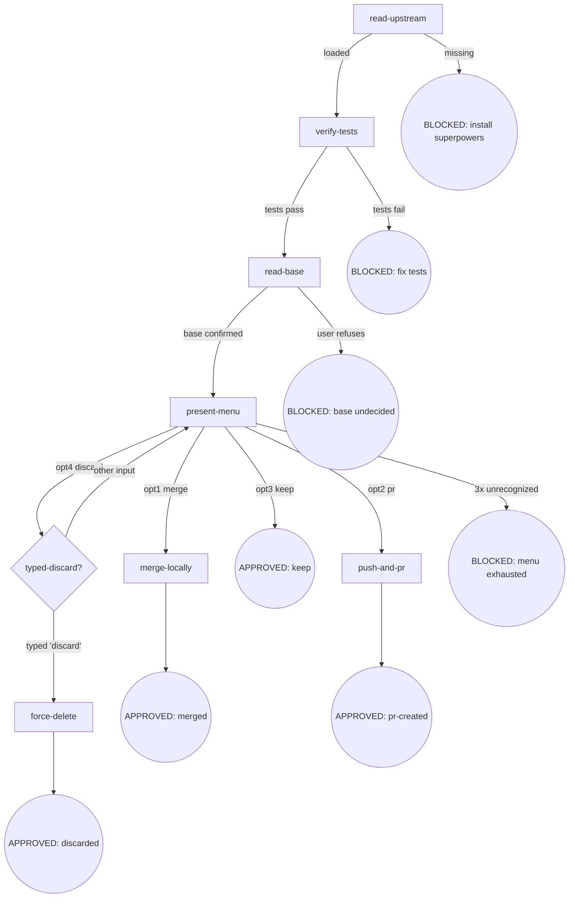

# Osuperpowers Finishing

开发分支收尾：合并 / PR / 保留 / 丢弃。

## Flow Digraph



## Node Definitions

### `read-upstream`

- **Do**: Read 上游 `superpowers:finishing-a-development-branch` SKILL.md 作为流程基线。**Read 而非 Skill-invoke**（Skill-invoke 触发 router 拦截——I3）。解析策略：① 通过 harness plugin 系统定位 sibling `superpowers` plugin 内的 SKILL.md；② 回退到同 repo 的 vendored 路径。基线仅为 SKILL.md 文件——harness 注入的文档（CLAUDE.md、README、vendor 贡献指南）不是基线
- **Read**: 上游 `superpowers:finishing-a-development-branch` SKILL.md 文件
- **Exit**: 文件存在且可读 → `verify-tests`；缺失 → BLOCKED（安装 superpowers plugin）
- **Fail**: Skill-invoke 上游 → 违反 I3

### `verify-tests`

- **Do**: 运行项目完整测试套件（`npm test` / `cargo test` / `pytest` / `go test ./...` 等，依项目配置）。测试套件通过后才进入 finishing 流程。**项目无测试配置**（无 `scripts.test` / 无 `Cargo.toml` / 无 `pyproject.toml` 测试段等）→ 视为通过（项目本身不要求测试，finishing 不强制添加测试门槛）
- **Read**: 项目测试配置（package.json scripts / Cargo.toml / pyproject.toml 等）
- **Exit**: 全绿（或无测试配置）→ `read-base`；任何失败 → BLOCKED（修复测试）
- **Fail**: "测试之前通过过" → 仍以当前树为准重跑；不基于历史结果跳过

### `read-base`

- **Do**: 确定 base 分支（merge / PR 的目标分支）。Read workspace artifact `.superpowers/<scope>/<slug>/base-branch.json`（详见 [base-branch.md](../cli-driven-development/docs/base-branch.md) 方法论 + schema）；artifact 缺失（standalone finishing 场景）→ **按顺序尝试以下推断源，取首个可确定 base 的来源**：① plan 文档（`base` 字段）② branch upstream（`git rev-parse --abbrev-ref @{u}` 解析）③ 对话上下文（历史消息明确提及的 base）；**均无法确定 → 询问用户确认** → 写入 artifact。**Scope 解析**：CDD-driven 场景 scope = `cdd`，slug = CDD workspace 的 slug；standalone 场景 scope = `standalone`，slug = feature branch 名 sanitize。**Slug sanitize 规则**：lowercase → 非 alphanumeric 字符（`/`、空格、`_`、`.` 等）替换为 `-` → 前后 `-` trim → 连续 `-` 合并 → 截 64 字符。例：`feature/my-branch` → `feature-my-branch`；`Bugfix/UI_Fix` → `bugfix-ui-fix`；`refs/heads/release-2026.08` → `refs-heads-release-2026-08`
- **Read**: `.superpowers/{cdd,standalone}/<slug>/base-branch.json`（可选）+ plan 文档 + `git rev-parse --abbrev-ref @{u}` + 对话上下文
- **Exit**: base 已确认（artifact 存在或本次写入）→ `present-menu`
- **Fail**: 用户拒绝确认 → BLOCKED（base undecided，不继续 merge/PR）

### `present-menu`

- **Do**: 呈现 4 选项菜单（normal-repo variant，固定——I1 No Worktrees）：
  ```
  Implementation complete. What would you like to do?
  1. Merge back to <base-branch> locally
  2. Push and create a Pull Request
  3. Keep the branch as-is (I'll handle it later)
  4. Discard this work
  Which option?
  ```
  等待用户选择
- **Read**: `base-branch.json`（取 base 名称填入 opt1 提示）
- **Exit**: opt1 → `merge-locally`；opt2 → `push-and-pr`；opt3 → APPROVED: keep；opt4 → `typed-discard?`
- **Fail**: 未收到明确选项 → 重呈现，**累计最多 3 次呈现机会（含首次呈现）**；typed-discard? 回退计入此计数器（不重置）；3 次机会耗尽 → BLOCKED（menu exhausted）

### `merge-locally`

- **Do**: checkout base → pull → merge feature 分支 → 在 merged 结果上运行 `verify-tests`。全绿后：`git branch -d <feature-branch>`（自动删除 feature 分支）。遵循 I2：merge commit 标题为 conventional commits 格式，无 attribution
- **Read**: `base-branch.json`（base 名称）+ feature branch 名称（`git rev-parse --abbrev-ref HEAD`）
- **Exit**: merged + 测试绿 + 分支已删除 → APPROVED: merged
- **Fail**: merge conflict 或 merged-result 测试失败 → **implicit fail-open**（不产出 APPROVED，不进入显式 BLOCKED 节点；流程停手 + report 给用户；**base 分支保留 merge commit（不 `git reset --hard HEAD~1` 回滚）+ feature branch 保留**；本地 merge 未推送，用户可调查后决策：`git reset --hard HEAD~1` 回滚 / 修复测试后重跑 finishing / 手动处理）

### `push-and-pr`

- **Do**: `git push -u origin <feature-branch>` + 创建 PR（目标 = base-branch.json 的 base）。PR 标题 = conventional commits 格式；PR body 仅 `## Summary` + `## Test Plan`；无 attribution sections / trailers / footers（I2）。若 repo 存在 PR 模板（`.github/PULL_REQUEST_TEMPLATE.md` 等），按模板结构填充 Summary/Test Plan 段落；否则使用最小 body。遵循 forge CLI（`gh pr create` / `glab mr create` 等）或 forge 默认 URL
- **Read**: `base-branch.json`（base）+ feature branch + PR 模板（如存在）
- **Exit**: PR 创建成功 → APPROVED: pr-created（输出 URL）
- **Fail**: push rejected（remote 前进）或 PR 创建失败 → **implicit fail-open**（不产出 APPROVED，不进入显式 BLOCKED 节点；流程停手 + report 给用户含具体原因与恢复指引；feature branch 保留）

### `force-delete`

- **Do**: 前置检查 feature 分支未提交改动（`git status --porcelain` + `git log @{u}..HEAD`）；有未提交/未推送改动 → 呈现 commit list + reflog 恢复指引 → 要求用户再次确认（typed-discard 仅确认删除意图，不覆盖数据丢失告知）。通过后 `git branch -D <feature-branch>`。保留工作树（No Worktrees invariant 跳过 cleanup）
- **Read**: feature branch 名称 + `git status` + `git log @{u}..HEAD`
- **Exit**: branch 已删除 → APPROVED: discarded
- **Fail**: branch 不存在 → report + 仍视为 APPROVED（用户意图已满足）；**用户拒绝数据丢失确认 → 回退 `present-menu`（计数不重置）**

### `typed-discard?`

- **Do**: 要求用户键入字面量 `discard` 确认删除。呈现：
  ```
  This will permanently delete:
  - Branch <name>
  - All commits: <commit-list>
  Type 'discard' to confirm.
  ```
  仅 `discard`（大小写敏感、无前后空白）接受；任何其他输入（`yes` / `y` / `Discard` / `discard `）→ 回退 `present-menu`（present-menu 的重试计数器**不重置**，typed-discard 回退计入 present-menu 的 3 次呈现上限；**若回退时计数器已耗尽 → BLOCKED: menu exhausted，不再呈现菜单**）
- **Read**: 用户输入
- **Exit**: 输入 === `"discard"` → `force-delete`；其他 → `present-menu`（重试，计数不重置）
- **Fail**: —（回退是设计内行为，不是失败）

## Invariants

| # | Invariant |
|---|---|
| I1 | **No Worktrees** — 跳过上游 worktree 检测块与 Step 6 cleanup；菜单固定 normal-repo variant；worktree 状态属前置违规（不在 finishing 处理范围） |
| I2 | **Conventional Commits + No Attribution** — merge commit / PR title 遵循 conventional commits；无 trailers / footers / inline attribution；PR body 仅 `## Summary` + `## Test Plan` |
| I3 | **Read, not Skill-invoke** — 上游 skill 只 Read 文件，不 Skill-invoke（触发 router 拦截） |

## Failure Modes

| failure | behavior | reason |
|---|---|---|
| 上游 superpowers:finishing-a-development-branch SKILL.md 缺失 | BLOCKED（含安装 superpowers plugin 指引） | block 政策：不静默 fallback |
| 测试套件失败 | BLOCKED（修复测试后再跑 finishing） | 不基于历史结果跳过；不合并/PR 红灯分支 |
| base 分支未决（用户拒绝确认） | BLOCKED | merge 到错误 base 代价高 |
| 菜单无效输入达 3 次上限 | BLOCKED（menu exhausted） | 无法获取用户决策 |
| merge conflict | **implicit fail-open**（停手 + report，feature branch 保留，用户手动解决后重跑 finishing） | 不自动解决冲突 |
| merged-result 测试失败 | **implicit fail-open**（停手 + report，base 分支**保留 merge commit 不回滚**，feature branch 保留） | 不自动假设 flaky；本地 merge 未推送，用户可调查后决策（reset / 修复后重跑 / 手动处理） |
| push rejected（remote 前进） | **implicit fail-open**（停手 + report，不 force-push） | 需用户决策（rebase / force-push） |
| PR 创建失败 | **implicit fail-open**（停手 + report URL + 指引手动创建） | 不阻塞分支保留 |

**Fail-open vs BLOCKED 约定**：

- **BLOCKED**：显式终态节点（digraph 圆角圆），需用户介入才能恢复 flow，对应 digraph 边
- **implicit fail-open**：节点级失败（不出现在 digraph），流程停手 + report 给用户；不产出 APPROVED；用户手动恢复后重跑 finishing（不恢复当前 flow）
