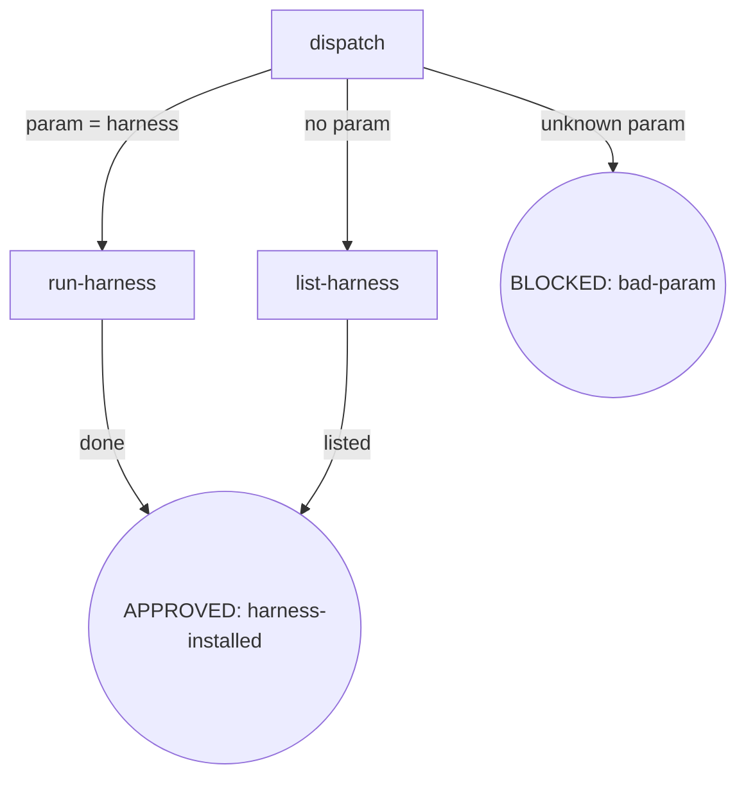

<!-- osuperpowers-version: 0.1.1 -->

### dispatch

- **Do**: Parse the invocation arguments. `init` accepts only the `harness` subcommand (or no argument). The `router`/`spor` entry points are gone (deleted; see design spec §1.1). Flags such as `--harness` **must** follow the `harness` subcommand (e.g. `init harness --harness foo`); `init --harness foo` with no subcommand → BLOCKED (bad-param).
- **Read**: Invocation arguments (CLI args / slash command arguments)
- **Exit**: `param=harness` → `run-harness`; no argument → `list-harness`; any other argument (including a flag with no subcommand) → BLOCKED (bad-param)
- **Fail**: Unknown argument / flag with no subcommand → BLOCKED (bad-param, suggest the available entry point `harness`)

### run-harness

- **Do**: Execute the node-anchored flow in `harness.md` (detect→guide→config→trust→summarize).
- **Read**: `harness.md`
- **Exit**: Complete → APPROVED (harness-installed)
- **Fail**: See the `Fail` field of each node in `harness.md` + Failure Modes

### list-harness

- **Do**: With no argument, list the available entry points (`harness`) and show usage `init harness [--harness …] [--dry-run]`.
- **Read**: None
- **Exit**: Listed → APPROVED (harness-installed)
- **Fail**: None (display only)
