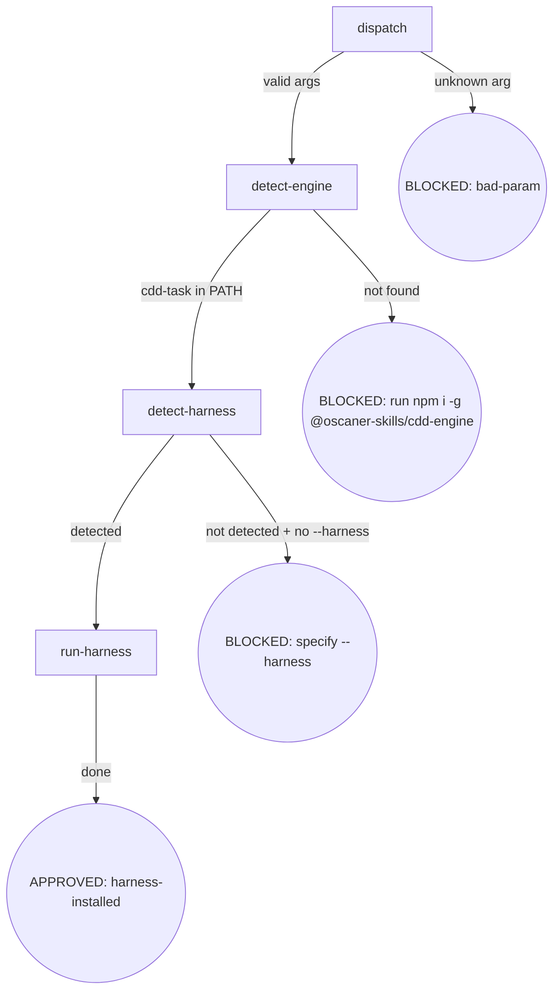

<!-- osuperpowers-version: 0.1.1 -->

### dispatch

- **Do**: Parse invocation arguments. `init` accepts `[--harness <name>] [--dry-run]`.
  No subcommand is required — `harness` subcommand is removed.
  `init` alone → auto-detect current harness.
  `init --harness claude` → install for claude specifically.
  Any positional argument → BLOCKED (bad-param, suggest correct usage).
- **Read**: Invocation arguments
- **Exit**: Valid args → `detect-engine`; unknown positional arg → BLOCKED (bad-param)
- **Fail**: Unknown arg → BLOCKED (bad-param, suggest `init [--harness <name>]`)

### detect-engine

- **Do**: Check if `cdd-task` is in PATH (`command -v cdd-task` or equivalent).
  - In PATH → proceed to `detect-harness`
  - Not in PATH → BLOCKED (soft): output install guidance:
    `@oscaner-skills/cdd-engine not installed. Run: npm i -g @oscaner-skills/cdd-engine`
  - `--dry-run` → skip install check (preview only)
- **Read**: PATH environment
- **Exit**: Found → `detect-harness`; not found → BLOCKED (soft, not process.exit)
- **Fail**: PATH check error → fail-open (log warning, continue)

### detect-harness

- **Do**: Determine target harness from `--harness <name>` or auto-detect from environment
  (`CLAUDE_CODE_SESSION_ID` → `claude`; `CURSOR_TRACE_ID` → `cursor-agent`; etc.).
  `--harness` flag takes precedence over auto-detection.
  Auto-detected + not in `config.harnesses` → BLOCKED (unknown harness).
  No `--harness` + cannot auto-detect → BLOCKED (specify `--harness`).
- **Read**: `--harness` flag; `process.env` (`CLAUDE_CODE_SESSION_ID`, `CURSOR_TRACE_ID`, `AI_AGENT`)
- **Exit**: Detected → `run-harness` (existing config flow continues); not detected → BLOCKED
- **Fail**: Unknown `--harness` value → BLOCKED (bad-param)

### run-harness

- **Do**: Execute the node-anchored flow in `harness.md` (detect-engine → detect-harness → guide → config → trust → summarize).
- **Read**: `harness.md`
- **Exit**: Complete → APPROVED (harness-installed)
- **Fail**: See the `Fail` field of each node in `harness.md` + Failure Modes