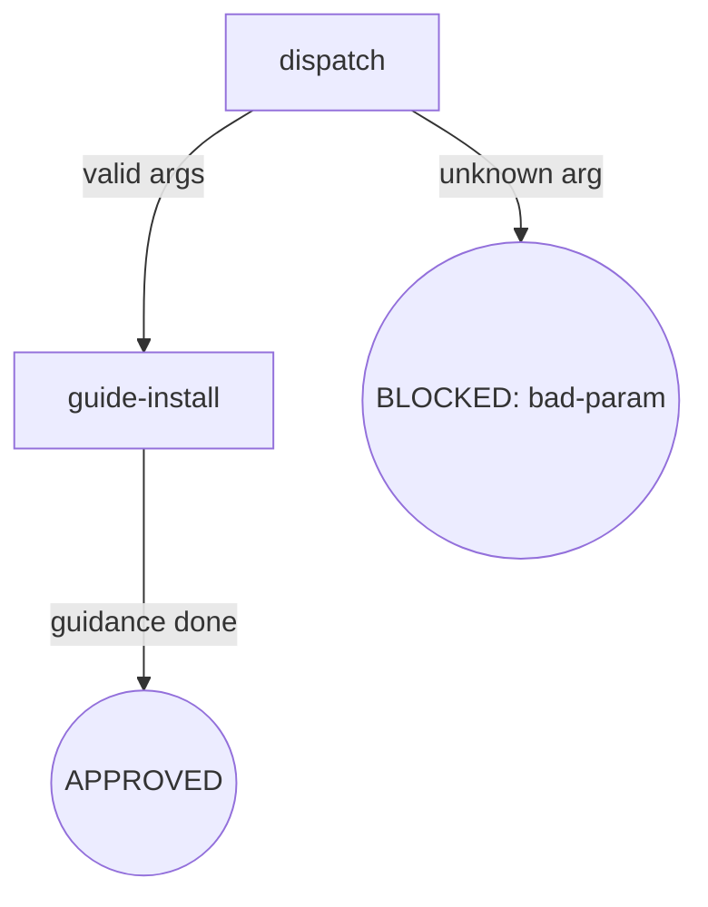

<!-- osuperpowers-version: 0.1.1 -->

### dispatch

- **Do**: Parse invocation arguments. `init` accepts `[--dry-run]`.
  Any positional argument → BLOCKED (bad-param, suggest `init [--dry-run]`).
- **Read**: Invocation arguments
- **Exit**: Valid args → `guide-install`; unknown positional arg → BLOCKED (bad-param)
- **Fail**: Unknown arg → BLOCKED (bad-param)

### guide-install

- **Do**: Guide the user through installing the osuperpowers plugin from the harness's own plugin marketplace. osuperpowers installs through each harness's own plugin marketplace; claude/cursor-agent need no per-harness config file or trust ceremony. Also check whether the `cdd` engine CLI is in PATH (`command -v cdd`); when missing, print install guidance —
  `@oscaner-skills/cdd-engine not installed. Run: npm i -g @oscaner-skills/cdd-engine`
  `--dry-run` → preview only (no install performed).
- **Read**: PATH environment
- **Exit**: Guidance done → APPROVED
- **Fail**: PATH check error → fail-open (log warning, continue)

## Failure Modes

| failure | behavior | reason | recovery |
|---|---|---|---|
| `cdd` not in PATH | BLOCKED (soft) | `@oscaner-skills/cdd-engine` not installed | Run `npm i -g @oscaner-skills/cdd-engine` |
| Unknown positional arg | BLOCKED (bad-param) | Arg misuse | Suggest `init [--dry-run]` |