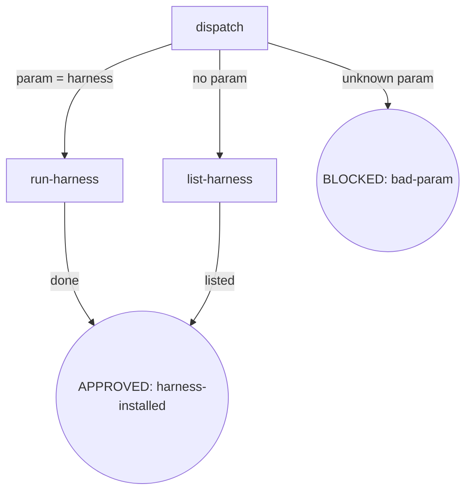

<!-- osuperpowers-version: 0.1.1 -->

### dispatch

- **Do**: 解析调用参数。`init` 仅接受 `harness` 子命令（或空参数）。无 `router`/`spor` 入口（已删除，见 design spec §1.1）。`--harness` 等 flag **必须**跟在 `harness` 子命令之后（如 `init harness --harness foo`）；`init --harness foo` 无子命令 → BLOCKED（bad-param）。
- **Read**: 调用参数（CLI args / slash command 参数）
- **Exit**: `param=harness` → `run-harness`；无参数 → `list-harness`；其他参数（含无子命令的 flag）→ BLOCKED（bad-param）
- **Fail**: 未知参数 / 无子命令的 flag → BLOCKED（bad-param，提示可用入口 `harness`）

### run-harness

- **Do**: 执行 `harness.md` 的节点锚定式流程（detect→guide→config→trust→summarize）。
- **Read**: `harness.md`
- **Exit**: 完成 → APPROVED（harness-installed）
- **Fail**: 见 `harness.md` 节点 Fail 字段 + Failure Modes

### list-harness

- **Do**: 无参数时列出可用入口（`harness`），提示 `init harness [--harness …] [--dry-run]` 用法。
- **Read**: 无
- **Exit**: 列出 → APPROVED（harness-installed）
- **Fail**: 无（纯展示）
