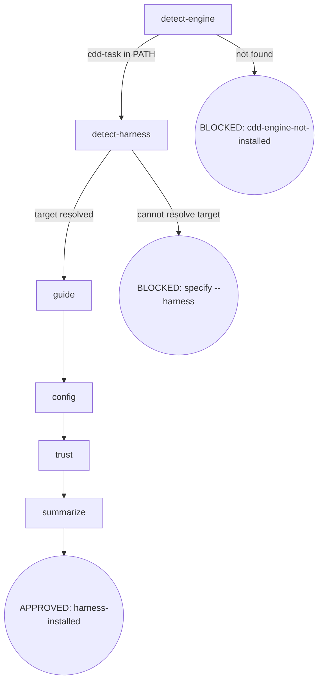

# init

`init` installs per-harness osuperpowers configuration (detect / guide / write native config / trust ceremony / summarize) so that the osuperpowers:*/cli-* trigger self-checks take effect across all installed harnesses. Under the hood it runs `node <plugin-root>/bin/init/install-harness.mjs` from the **installed package** (`<plugin-root>` = wherever the marketplace actually installed osuperpowers, not the source checkout path).

```text
/init [--harness …] [--dry-run]
```



### detect-engine

- **Do**: Check if `cdd-task` is in PATH (`command -v cdd-task` or equivalent).
  - In PATH → proceed to `detect-harness`
  - Not in PATH → BLOCKED (soft): output install guidance:
    `@oscaner-skills/cdd-engine not installed. Run: npm i -g @oscaner-skills/cdd-engine`
  - `--dry-run` → skip install check (preview only)
- **Read**: PATH environment
- **Exit**: Found → `detect-harness`; not found → BLOCKED (soft, not process.exit)
- **Fail**: PATH check error → fail-open (log warning, continue)

### detect-harness

- **Do**: Determine target harness from `--harness <name>` or auto-detect from environment
  (`CLAUDE_CODE_SESSION_ID` → `claude`; `CURSOR_TRACE_ID` → `cursor-agent`; etc.).
  `--harness` flag takes precedence over auto-detection.
  Auto-detected + not in `config.harnesses` → BLOCKED (unknown harness).
  No `--harness` + cannot auto-detect → BLOCKED (specify `--harness`).
  An `install-and-use` channel harness, once resolved, proceeds straight to guide (guide only prints the probe + install hint, writes no files).
- **Read**: `--harness` flag; `process.env` (`CLAUDE_CODE_SESSION_ID`, `CURSOR_TRACE_ID`, `AI_AGENT`); `config.harnesses` (installed-package config); `--dry-run` argument
- **Exit**: Target resolved → `guide`; not resolved + no `--harness` → BLOCKED (specify `--harness`)
- **Fail**: Unknown `--harness` value → BLOCKED (bad-param); `--dry-run` only previews, writes no files

### guide

- **Do**: The `install-and-use` channel prints the probe + install hint without writing any files; `--dry-run` only previews.
- **Read**: The resolved target harness
- **Exit**: Guidance done → `config`
- **Fail**: None (guidance writes no files, no side effects)

### config

- **Do**: The init channel (native harness): write config (template derived from `configs/`) + copy skills; JSON deep-merge / TOML append, preserving the user's non-conflicting content (idempotent). **An `install-and-use` channel harness is a no-op / skip at this node** (its install goes through guide's package-channel hint; config writing does not apply).
- **Read**: `configs/` templates; already-written config (for idempotent merge)
- **Exit**: Config written / skipped → `trust`
- **Fail**: File write failure → fail-open (report the error, keep parts already written, prompt the user to check manually)

### trust

- **Do**: Writing config ≠ trust taking effect. For harnesses that need a trust ceremony, guide the user to perform it (grok `grok --trust`, codex `/hooks`, gemini first-time fingerprint acceptance, trae Enable + sandbox/local). **Harnesses with no corresponding trust ceremony (e.g. the `install-and-use` channel) skip this step**; summarize marks them "active" rather than "needs manual trust".
- **Read**: The list of harnesses with config written
- **Exit**: Summarize trust steps → `summarize`
- **Fail**: User skips trust → still APPROVED, but summarize explicitly marks "needs manual trust"

### summarize

- **Do**: Summarize each harness's status: config written (active) / guided through package channel (user must install the package) / skipped (not detected) + any steps requiring manual trust. These three states align with the output of detect/config/trust.
- **Read**: Status of the detect-harness / config / trust nodes
- **Exit**: Output summary → APPROVED (harness-installed)
- **Fail**: None (display only)

## Invariants

| # | Invariant |
|---|---|
| I1 | **Idempotent** — re-running overwrites config (JSON deep-merge / TOML append), preserving the user's manually appended non-conflicting content |
| I2 | **Dry-Run-First** — on first run (or when impact is unknown), preview the paths to be written with `--dry-run` first; never silently write files |
| I3 | **Config ≠ Trust** — writing config does not imply trust has taken effect; the trust ceremony must be explicitly guided for the user to perform |

## Failure Modes

| failure | behavior | reason | recovery |
|---|---|---|---|
| `cdd-task` not in PATH | BLOCKED (soft) | `@oscaner-skills/cdd-engine` not installed | Run `npm i -g @oscaner-skills/cdd-engine` |
| Unknown `--harness` | exit 1 / BLOCKED (bad-param) | Util rejects unknown harness | Suggest the list of available harnesses |
| No `--harness` + cannot auto-detect | BLOCKED (specify `--harness`) | Cannot determine target harness | Pass `--harness <name>` explicitly |
| `config` file write failure | fail-open (report + keep parts written) | Filesystem permission / wrong path | Prompt the user to check path permissions manually |
| User skips trust ceremony | APPROVED (marked needs manual trust) | Trust is a user-side decision | summarize explicitly lists the trust steps still to perform |