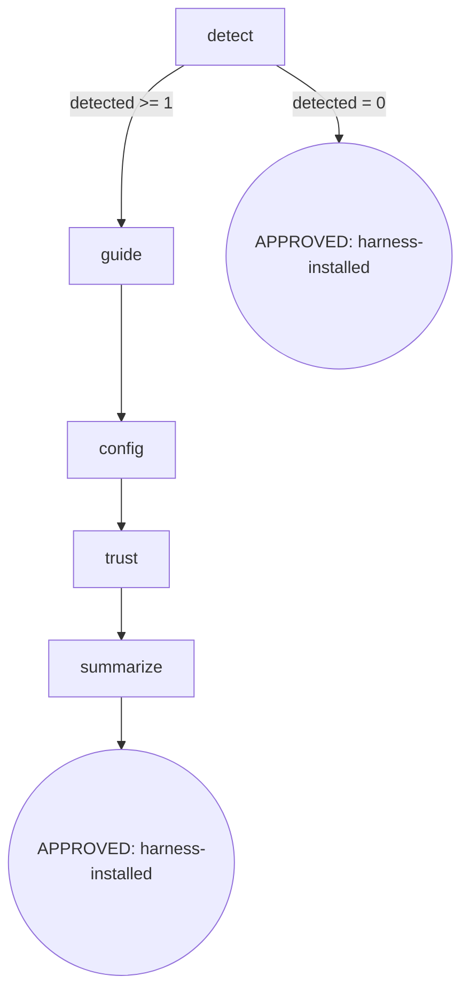

# init harness

`init harness` 安装 per-harness 的 osuperpowers 配置（探测 / 引导 / 写原生 config / 信任仪式 / 汇总），让 osuperpowers:*/cli-* 触发自检在所有已装 harness 上生效。底层从**已安装包**运行 `node <plugin-root>/bin/init/install-harness.mjs`（`<plugin-root>` = marketplace 实际安装 osuperpowers 的位置，非源 checkout 路径）。

```text
/init harness [--harness …] [--dry-run]
```



### detect

- **Do**: 用 harness-detect util（`command -v <cli>`；`cli` 源 = `config.harnesses[h].cli ?? h`）探测已安装 harness；`unknown --harness` → 工具 exit 1。`install-and-use` 通道 harness 在 detect 命中后即进 guide（guide 仅打印 probe + install hint，不写文件）。
- **Read**: `config.harnesses`（已安装包 config）；`--harness` / `--dry-run` 参数
- **Exit**: `detected ≥ 1` → `guide`；`detected = 0` → APPROVED（harness-installed，skip——未检测 harness 跳过是预期行为）
- **Fail**: 未知 `--harness` → exit 1（调用方处理）；`--dry-run` 只预览不写文件

### guide

- **Do**: install-and-use 通道打印 probe + install hint，不写文件；`--dry-run` 仅预览。
- **Read**: 检测到的 harness 列表
- **Exit**: 引导完成 → `config`
- **Fail**: 无（引导不写文件，无副作用）

### config

- **Do**: init 通道（native harness）：写 config（从 `configs/` 派生模板）+ 复制 skills；JSON 深合并 / TOML 追加，保留用户非冲突内容（幂等）。**install-and-use 通道 harness 在此节点为 no-op / skip**（其安装走 guide 的包通道提示，config 写入不适用）。
- **Read**: `configs/` 模板；已写 config（用于 idempotent merge）
- **Exit**: config 写入 / skip → `trust`
- **Fail**: 写文件失败 → fail-open（报告错误，保留已写部分，提示用户手动检查）

### trust

- **Do**: config 写入 ≠ 信任生效。对需要信任仪式的 harness 引导用户执行信任仪式（grok `grok --trust`、codex `/hooks`、gemini 首次接受指纹、trae Enable + sandbox/local）。**无对应信任仪式的 harness（如 install-and-use 通道）跳过此步**，summarize 标注「已生效」而非「需人工信任」。
- **Read**: 已写 config 的 harness 列表
- **Exit**: 汇总信任步骤 → `summarize`
- **Fail**: 用户跳过信任 → 仍 APPROVED，但 summarize 明确标注「需人工信任」

### summarize

- **Do**: 汇总各 harness 状态：已写 config（生效）/ 引导包通道（需用户装包）/ 跳过（未检测）+ 需人工信任步骤。三种状态对齐 detect/config/trust 的输出。
- **Read**: detect / config / trust 三节点状态
- **Exit**: 汇总输出 → APPROVED（harness-installed）
- **Fail**: 无（纯展示）

## Invariants

| # | Invariant |
|---|---|
| I1 | **Idempotent** — 重复运行覆盖 config（JSON 深合并 / TOML 追加），保留用户手动追加的非冲突内容 |
| I2 | **Dry-Run-First** — 首次运行（或未知影响面）先 `--dry-run` 预览将写路径，不静默写文件 |
| I3 | **Config ≠ Trust** — config 写入不蕴含信任生效；信任仪式需显式引导用户执行 |

## Failure Modes

| failure | behavior | reason | recovery |
|---|---|---|---|
| 未知 `--harness` | exit 1 | 工具拒绝未知 harness | 提示可用 harness 列表 |
| `config` 写文件失败 | fail-open（报告 + 保留已写部分） | 文件系统权限 / 路径错误 | 提示用户手动检查路径权限 |
| 用户跳过信任仪式 | APPROVED（标注需人工信任） | 信任是用户侧决策 | summarize 明确列出待执行信任步骤 |
