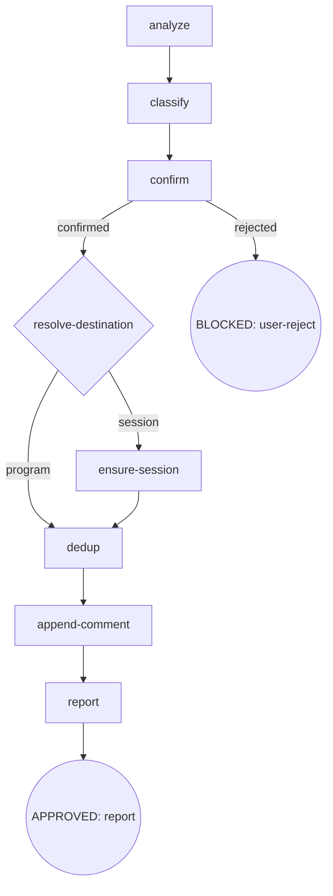

# Osuperpowers Report Issue

Analyze SDD/CDD sessions (`.superpowers/sdd/*/progress.md` + `.superpowers/cdd/*/progress.md` + git log) to find bugs and enhancements, then attach findings to `Oscaner/skills` issues via `gh`. Findings go through one of two channels — the **program channel** (comments on the current program's phase-owning issue) or the **session channel** (comments on a find-or-create session master). The flow is a digraph: `analyze → classify → confirm → resolve-destination → {program · session} → dedup → append-comment → report`. All issue bodies are produced by the renderer CLI at `scripts/report-templates.mjs`; `pluginRoot` is resolved by ascending to the nearest `.claude-plugin/plugin.json` (same discovery as the gate hook). Manual trigger only.

## Flow Digraph

7 process steps / 8 nodes: `analyze` · `classify` · `confirm` · `resolve-destination` (routing diamond) · `ensure-session` · `dedup` · `append-comment` · `report`.

## Node Definitions

### `analyze`

- **Do**: Read three sources in priority order — ① session context (primary): tool-call records / errors / handoff / review findings visible in this session; ② ledger: all files under `{repo}/.superpowers/sdd/*/progress.md` and `{repo}/.superpowers/cdd/*/progress.md`, extracting lines containing `fix round` / `BLOCKED` / `parked` / `CHANGES_REQUESTED`; ③ git log: `git log $(git merge-base HEAD origin/main)..HEAD --oneline`, falling back to `git log -20 --oneline` when `origin/main` is unavailable. Identify repeated fix-round patterns. Do not paste API keys, tokens, or secrets — replace any match of `API_KEY=...` / `TOKEN=...` / `SECRET=...` / `PASSWORD=...` with `[REDACTED]` before including in findings.
- **Read**: session context; `{repo}/.superpowers/{sdd,cdd}/*/progress.md`; git log
- **Exit**: extracted findings → `classify`
- **Fail**: ledger / git log unavailable → use session context only (fail-open, never block)

### `classify`

- **Do**: Classify each finding as `bug` (tool/script behavior does not match spec — timeouts, wrong exit codes, gate misjudgment, handoff schema errors) or `enhancement` (process can be improved but not broken — DX gaps, missing docs, insufficient CI coverage, template gaps). Each finding includes **Title** (short, usable as an issue or comment title directly), **one-line description**, **affected component** (skill name / script path / command), and **evidence** (specific error output or ledger entry). The type selects the renderer's `lang`-mapped section headings; findings carry no type labels (labels are not used on per-finding comments).
- **Read**: findings output by `analyze`
- **Exit**: classification complete → `confirm`
- **Fail**: type undeterminable → default `enhancement` (conservative)

### `confirm`

- **Do**: Present the findings as a numbered list and ask: "Is this accurate overall? Any additions or removals?" Findings never include branch names, absolute paths, or filenames by default; such context is added only when the user opts in at this gate (I6). Do **not** pre-create or pre-comment on any gh issue before explicit confirmation.
- **Read**: classified findings
- **Exit**: user confirms → `resolve-destination`; user rejects → BLOCKED (user-reject)
- **Fail**: no response / explicit rejection → BLOCKED (user-reject, flow terminates)

### `resolve-destination`

- **Do**: Resolve the reporting channel for the confirmed findings.
  - **Cache-first**: read `.superpowers/cdd/<slug>/report-target.json` in the current session workspace. Hit `program` → reuse that issue number (never a new issue); hit `session` → reuse the existing master (date unchanged). The cache is CDD-scope only; a standalone run never consumes or writes it.
  - **Cache miss**: resolve the program chain — `progress.json#plan` → plan-header **`Spec:`** field (`**Spec:** [<name>-design.md](…)`, the plan's design-spec link) → overall spec → the phase-owning issue of this program (e.g. #232). Success → program channel.
  - **Guard**: resolution failure / missing progress / standalone run → session channel (fail-open, never block). The program channel never creates an issue; the only `gh issue create` in the flow is the session master at `ensure-session`.
  - Persist the resolved target back to the cache so subsequent findings in this session reuse it.
- **Read**: `.superpowers/cdd/<slug>/report-target.json`; `progress.json#plan`; plan-header spec chain; phase-owning issue number
- **Exit**: program → `dedup`; session → `ensure-session`
- **Fail**: program-chain resolution fails → session channel (fail-open, never block)

### `ensure-session`

- **Do**: Find or create the session **master** issue.
  - **Find**: reuse the cached session target, or an existing master with this session's title.
  - **Create**: `gh issue create --repo Oscaner/skills` with labels `session`, `osuperpowers`. Title = `renderTitle(masterDef, { slugOrStandalone, date })` from the renderer module → `[Session report] <slug|standalone> <YYYY-MM-DD>`; `date` = creation day (reuse never changes it). Body = run `node "${pluginRoot}/scripts/report-templates.mjs" --mode master` on stdin JSON `{ kind, meta, findings }` → Session metadata + Findings Summary table + `## Report meta (auto)`.
  - The master is the aggregation point: session-channel findings are appended as comments to it.
- **Read**: report-target cache; renderer CLI
- **Exit**: master found or created → `dedup`
- **Fail**: master creation fails → degrade (prompt the user to create the master manually, then retry; keep findings)

### `dedup`

- **Do**: For each finding, query `gh issue list --repo Oscaner/skills --state all --limit 100 --json number,title,body,state`. Match case-insensitively by **affected component** + **core behavior words** (e.g. `timeout` / `CHANGES_REQUESTED` / `exit 137`) + **title/body keywords**:
  - **Open match** → append to the matched issue (dedup attach).
  - **Closed match** → never reopen (I4); file on the resolved destination and pass `related` = `Regression / follow-up of #NNN (closed)`.
  - **No match** → append to the resolved destination (resolution target or session master).
- **Read**: `gh issue list` output; confirmed findings
- **Exit**: dedup decisions complete → `append-comment`
- **Fail**: `gh` unavailable / network failure → fail-open (record stderr, keep finding for manual retry)

### `append-comment`

- **Do**: For each finding in order, produce the comment body by running `node "${pluginRoot}/scripts/report-templates.mjs" --mode comment` on stdin JSON `{ finding, lang, related, meta }` → `renderComment` output (section headings per `finding.type` × `lang`, optional `## Related`, then `## Report meta (auto)` with `meta` = `{ skill, harness, kind, step, cdd, date }`). Then file it:
  - **Program channel**: `gh issue comment --repo Oscaner/skills <target>` (resolution target or dedup-matched open issue).
  - **Session channel**: `gh issue comment --repo Oscaner/skills <master>`, then PATCH the master body via `gh issue edit --repo Oscaner/skills <master> --body …` with the re-rendered `--mode master` output. Findings accumulated in the Findings Summary = those already appended **in this run** (do not re-read comments — avoids a read-modify-write race).
  - Each finding's `kind` in report-meta is exactly one of `program` / `consumer-cdd` / `standalone` (I7).
- **Read**: renderer CLI; resolved targets; confirmed findings
- **Exit**: all comments appended → `report`
- **Fail**: a single append fails → fail-open (report stderr, keep finding for manual retry)

### `report`

- **Do**: Print a summary of results: each appended comment → issue URL; created master → master URL; `Regression / follow-up of #NNN (closed)` notes → the closed issue number; failed or skipped finding → reason.
- **Read**: final action for each finding
- **Exit**: summary presented → APPROVED (report)
- **Fail**: none (display only)

## Failure Modes

| failure | behavior | reason | recovery |
|---|---|---|---|
| User rejects filing (confirm rejected) | BLOCKED (user-reject) | no issue or comment pre-created without confirmation (I1) | flow terminates, nothing filed |
| `gh` CLI unavailable / network failure | fail-open (record stderr, keep finding) | external tool dependency | manual retry using the recorded stderr |
| resolve-destination resolution failure | fail-open → session channel | program chain unavailable (missing progress / plan / overall) | findings still filed against a session master |
| Session master creation fails | degrade (prompt manual creation + retry) | `gh issue create` may fail on title, labels, or permissions | user creates the master manually, then retry |
| Master Summary PATCH fails | fail-open (report stderr) | `gh issue edit` transient failure | findings remain as comments; sync the Summary manually |

## Invariants

| # | Invariant |
|---|---|
| I1 | **Confirm Gate** — no gh issue is created or commented on before explicit user confirmation (hard gate at `confirm`) |
| I3 | **Manual Trigger Only** — report-issue runs only on manual trigger, never automatically |
| I4 | **Never Reopen** — dedup queries `--state all`; closed matches are never reopened — the finding is filed with `## Related` = `Regression / follow-up of #NNN (closed)` |
| I5 | **Renderer Determinism** — every finding body and the master body is produced by `scripts/report-templates.mjs` (`--mode comment` / `--mode master`); no hand-assembled paragraph structure in this skill |
| I6 | **Privacy Code** — branch names, absolute paths, and filenames are never auto-included in issue content; such context enters only on consumer opt-in at `confirm` |
| I7 | **Kind Enumerated** — every finding's report-meta `kind` is exactly one of `program` / `consumer-cdd` / `standalone` |
