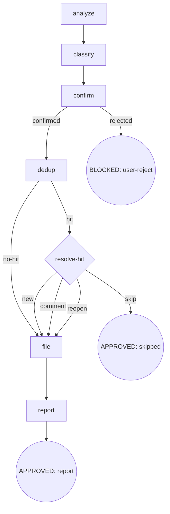

# Osuperpowers Report Issue

Analyze SDD/CDD sessions (`.superpowers/sdd/*/progress.md` + `.superpowers/cdd/*/progress.md` + git log) to find bugs and enhancements, then file issues against `Oscaner/skills` via `gh`. The flow is a digraph: `analyze → classify → confirm → dedup → {resolve-hit} → file → report`. Labels follow `dogfood,<type>[,cdd]` format. Manual trigger only.

## Flow Digraph

6 steps / 7 nodes: `analyze` · `classify` · `confirm` · `dedup` · `resolve-hit` (dedup-hit diamond) · `file` · `report`.

## Node Definitions

### `analyze`

- **Do**: Read three sources in priority order — ① session context (primary): tool-call records / errors / handoff / review findings visible in this session; ② ledger: all files under `{repo}/.superpowers/sdd/*/progress.md` and `{repo}/.superpowers/cdd/*/progress.md`, extracting lines containing `fix round` / `BLOCKED` / `parked` / `deferred` / `CHANGES_REQUESTED`; ③ git log: `git log $(git merge-base HEAD origin/main)..HEAD --oneline`, falling back to `git log -20 --oneline` when `origin/main` is unavailable. Identify repeated fix-round patterns. Do not paste API keys, tokens, or secrets — replace any match of `API_KEY=...` / `TOKEN=...` / `SECRET=...` / `PASSWORD=...` with `[REDACTED]` before including in findings.
- **Read**: session context; `{repo}/.superpowers/{sdd,cdd}/*/progress.md`; git log
- **Exit**: extracted findings → `classify`
- **Fail**: ledger / git log unavailable → use session context only (fail-open, never block)

### `classify`

- **Do**: Classify each finding as `bug` (tool/script behavior does not match spec — timeouts, wrong exit codes, gate misjudgment, handoff schema errors) or `enhancement` (process can be improved but not broken — DX gaps, missing docs, insufficient CI coverage, template gaps). Each finding includes **Title** (short, usable as issue title directly), **one-line description**, **affected component** (skill name / script path / command), and **evidence** (specific error output or ledger entry). Label each finding `dogfood,<type>` (add `,cdd` when the finding is CDD-related).
- **Read**: findings output by `analyze`
- **Exit**: classification complete → `confirm`
- **Fail**: type undeterminable → default `enhancement` (conservative)

### `confirm`

- **Do**: Present the findings as a numbered list and ask: "Is this accurate overall? Any additions or removals?" Do **not** pre-create any gh issue before explicit confirmation.
- **Read**: classified findings
- **Exit**: user confirms → `dedup`; user rejects → BLOCKED (user-reject)
- **Fail**: no response / explicit rejection → BLOCKED (user-reject, flow terminates)

### `dedup`

- **Do**: For each confirmed finding, check for duplicates: `gh issue list --repo Oscaner/skills --state all --limit 100 --json number,title,body,state`. Match keywords — the **affected component name** (e.g. `cdd-task.mjs`, `handoff-writer`, `gate`) plus **core behavior words** (e.g. `timeout`, `CHANGES_REQUESTED`, `exit 137`) — case-insensitively against existing issue titles and bodies.
- **Read**: `gh issue list` output; confirmed findings
- **Exit**: hit → `resolve-hit`; no-hit → `file`
- **Fail**: `gh` unavailable / network failure → fail-open (report, skip filing, suggest manual)

### `resolve-hit`

- **Do**: When an existing issue matches, differentiate by state:
  - **Open match**: show the match and let the user choose: **Create new issue / Add comment to existing / Skip**.
  - **Closed match**: show the match (including close reason if available) and let the user choose: **Create new issue / Reopen + comment / Comment-only / Skip**. Reopen uses `gh issue reopen --repo Oscaner/skills <number>` before commenting.
- **Read**: matched issue (number + title + body + state)
- **Exit**: new → `file`; comment → `file` (comment path); reopen → `file` (reopen path); skip → APPROVED (skipped)
- **Fail**: no response → default skip (no duplicate filing)

### `file`

- **Do**: Run `gh issue create --repo Oscaner/skills` with labels `dogfood,<type>` (add `,cdd` for CDD-related findings). On a dedup hit via the comment path, run `gh issue comment --repo Oscaner/skills`. On a dedup hit via the reopen path, run `gh issue reopen --repo Oscaner/skills <number>` then `gh issue comment --repo Oscaner/skills <number>`. For the issue body: Read the template file from `skills/report-issue/templates/` chosen by session language × finding type — `(en, bug)` → `bug-en.md`; `(en, enhancement)` → `enhancement-en.md`; `(zh, bug)` → `bug-zh.md`; `(zh, enhancement)` → `enhancement-zh.md` — then fill in the placeholders (`{{CONTEXT}}`, `{{PROBLEM}}`, `{{IMPACT}}`, `{{SUGGESTED_FIX}}` / `{{SUGGESTED_APPROACH}}`) with the finding's details.
- **Read**: classified label set; template files in `skills/report-issue/templates/`; finding evidence
- **Exit**: filing complete → `report`
- **Fail**: `gh issue create` fails → fail-open (report stderr, keep finding for manual retry)

### `report`

- **Do**: Print all results: new issue → URL; appended comment → URL; Skip → list reason.
- **Read**: final action for each finding
- **Exit**: summary → APPROVED (report)
- **Fail**: none (display only)

## Failure Modes

| failure | behavior | reason | recovery |
|---|---|---|---|
| User rejects filing (confirm rejected) | BLOCKED (user-reject) | no issue pre-created without confirmation | flow terminates, no issue created |
| `gh` CLI unavailable / network failure | fail-open (report + suggest manual) | external tool dependency | keep findings for retry |
| dedup hit, user no response | default skip | avoid duplicate filing | no duplicate issue created |
| `gh issue create` fails | fail-open (report stderr) | external API error | keep finding for manual retry |
| `gh issue reopen` fails | fail-open (report stderr, keep finding for manual retry) | closed issue may be locked or restricted | user manually reopens |

## Invariants

| # | Invariant |
|---|---|
| I1 | **Confirm Gate** — no gh issue is pre-created before explicit user confirmation (hard gate at `confirm`) |
| I2 | **Label Format** — labels are always `dogfood,<type>[,cdd]`; no component segment |
| I3 | **Manual Trigger Only** — report-issue runs only on manual trigger, never automatically |
| I4 | **Closed Issue Awareness** — dedup queries `--state all` (not just open); closed matches present reopen+comment option; regressions against closed issues must not silently create duplicates |
