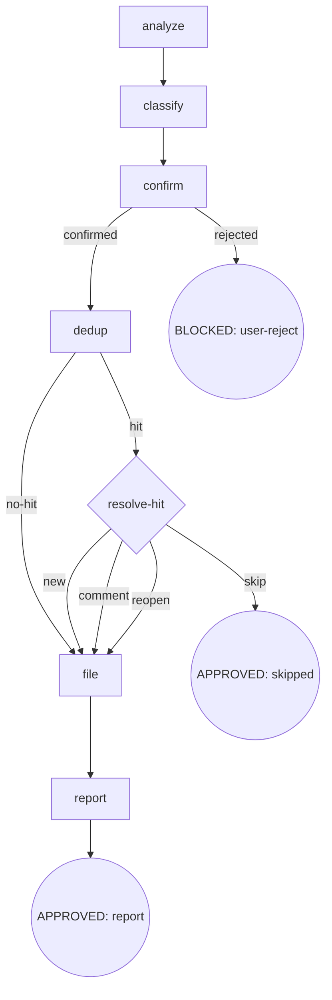

# Osuperpowers Report Issue

分析 SDD/CDD 会话（`.superpowers/sdd/*/progress.md` + `.superpowers/cdd/*/progress.md` + git log）找出 bug 与增强，再经 `gh` 对 `Oscaner/skills` 提 issue。流程为 digraph：`analyze → classify → confirm → dedup → {resolve-hit} → file → report`。组件标签按受影响包分类（osuperpowers / osuperpowers-router，规则 #136）。仅手动触发。

## Flow Digraph



6 步 / 7 节点：analyze · classify · confirm · dedup · resolve-hit（dedup 命中菱形）· file · report。

## Node Definitions

### `analyze`

- **Do**: 按优先级读三源——① 会话上下文（主）：本会话可见的工具调用记录、报错、handoff、评审发现；② ledger：repo 根下 `.superpowers/sdd/*/progress.md` 与 `.superpowers/cdd/*/progress.md` 全读，抽取含 `fix round`、`BLOCKED`、`parked`、`deferred`、`CHANGES_REQUESTED` 的行；③ git log：`git log $(git merge-base HEAD origin/main)..HEAD --oneline`，`origin/main` 不可用则回退 `git log -20 --oneline`。识别重复 fix-round 模式。
- **Read**: 会话上下文；`{repo}/.superpowers/{sdd,cdd}/*/progress.md`；git log
- **Exit**: 提取 findings → `classify`
- **Fail**: ledger / git log 不可用 → 仅用会话上下文（fail-open，不阻塞）

### `classify`

- **Do**: 每条 finding 分类——`bug`（工具/脚本行为与 spec 不符：超时、错误退出码、gate 误判、handoff schema 错误）/ `enhancement`（流程可改进但未坏：DX 缺口、文档缺失、CI 覆盖不足、模板缺口）。每条含 **Title**（短，可直接作 issue 标题）、**一句话描述**、**受影响组件**（技能名 / 脚本路径 / 命令）、**证据**（具体报错或 ledger 条目）。对受影响组件应用 **#136 组件标签分类**（见下）。组件模糊（跨插件/无法确定）默认 `osuperpowers`——不新增交互 prompt；用户可在 `confirm` 节点纠正分类。

  **#136 组件标签分类**（受影响组件归属哪个包）：
  - ① 受影响组件 ∈ `packages/osuperpowers/`（cdd-task.mjs / runner.mjs / cli-select / 编排技能 / gate）→ label `osuperpowers`。
  - ② 受影响组件 ∈ `packages/osuperpowers-router/`（hooks / overrides manifest / prompt-expansion / cursor hooks）→ label `osuperpowers-router`。
  - ③ 跨插件 / 无法确定 → 默认 `osuperpowers`（不交互 prompt；用户可在 `confirm` 纠正）。
  - **CDD 维度**：finding 涉及 CDD / cdd-task.mjs / orchestrator / handoff → 追加 `cdd`。

- **Read**: `analyze` 输出的 findings
- **Exit**: 分类完成 → `confirm`
- **Fail**: 类型无法判定 → 默认 `enhancement`（偏保守）

### `confirm`

- **Do**: 将 findings 编号列表呈现给用户，问「整体准确吗？有增删吗？」——**未获明确确认前不预建 gh issue**。若用户认为组件分类（`osuperpowers` / `osuperpowers-router` / `cdd`）有误，在此节点纠正后再提。
- **Read**: 分类后的 findings
- **Exit**: 用户确认 → `dedup`；用户拒绝 → BLOCKED（user-reject）
- **Fail**: 无响应 / 明确拒绝 → BLOCKED（user-reject，流程终止）

### `dedup`

- **Do**: 对每个确认 finding 查重：`gh issue list --repo Oscaner/skills --state all --limit 100 --json number,title,body,state`；关键词（组件名 + 行为词）大小写不敏感子串匹配。
- **Read**: `gh issue list` 输出；confirmed findings
- **Exit**: 命中 → `resolve-hit`；未命中 → `file`
- **Fail**: `gh` 不可用 / 网络失败 → fail-open（报告，跳 filing，提示手动）

### `resolve-hit`

- **Do**: 命中已有 issue 时按状态区分：
  - **Open 匹配**：展示匹配项，用户三选一：**Create new issue / Add comment to existing / Skip**。
  - **Closed 匹配**：展示匹配项（含关闭原因，如有），用户四选一：**Create new issue / Reopen + comment / Comment-only / Skip**。Reopen 先执行 `gh issue reopen --repo Oscaner/skills <number>` 再 comment。
- **Read**: 匹配到的 issue（number + title + body + state）
- **Exit**: new → `file`；comment → `file`（comment 路径）；reopen → `file`（reopen 路径）；skip → APPROVED（skipped）
- **Fail**: 无响应 → 默认 skip（不重复 filing）

### `file`

- **Do**: 按 **#136 组件分类 label** 调 `gh issue create`（`gh issue create --repo Oscaner/skills --label "<type>,dogfood,<component>[,cdd]"`）；comment 路径走 `gh issue comment --repo Oscaner/skills`；reopen 路径先 `gh issue reopen --repo Oscaner/skills <number>` 再 `gh issue comment --repo Oscaner/skills <number>`。body 用 `## Issue Body Templates` prose（按会话语言选 EN/CN × bug/enhancement）。关键字示例用当前工具名（如 `cdd-task.mjs`），不用已删除旧工具名。
- **Read**: 分类后的 label 集；`## Issue Body Templates` prose；finding evidence
- **Exit**: filing 完成 → `report`
- **Fail**: `gh issue create` 失败 → fail-open（报告 stderr，保留供手动重试）

### `report`

- **Do**: 打印全部结果：new issue → URL；appended comment → URL；Skip → 列出原因。
- **Read**: 各 finding 的最终动作
- **Exit**: 汇总 → APPROVED（report）
- **Fail**: 无（纯展示）

## Failure Modes

| failure | behavior | reason | recovery |
|---|---|---|---|
| 用户拒绝 filing（confirm rejected） | BLOCKED（user-reject） | 未确认不预建 issue | 流程终止，issue 不创建 |
| `gh` CLI 不可用 / 网络失败 | fail-open（报告 + 提示手动） | 外部工具依赖 | 保留 findings 供重试 |
| dedup 命中后用户无响应 | 默认 skip | 避免重复 filing | 不创建重复 issue |
| `gh issue create` 失败 | fail-open（报告 stderr） | 外部 API 错误 | 保留 finding 供手动重试 |
| `gh issue reopen` 失败 | fail-open（报告 stderr，保留供手动重试） | 已关闭 issue 可能被锁定或受限 | 用户手动 reopen |

## Invariants

| # | Invariant |
|---|---|
| I1 | **Confirm Gate** — 未获用户明确确认前不预建任何 gh issue（confirm 节点硬门） |
| I2 | **Component-Label** — label 按受影响组件分类（`osuperpowers` / `osuperpowers-router`），不硬编码 `osuperpowers-router`（#136） |
| I3 | **Manual Trigger Only** — report-issue 仅手动触发，从不自动 |
| I4 | **Closed Issue Awareness** — dedup 查询 `--state all`（非仅 open）；closed 匹配展示 reopen+comment 选项；针对已关闭 issue 的回归不得静默创建重复 issue |

## Issue Body Templates

按会话语言（检测用户最近消息，默认英文）与 finding 类型（bug / enhancement）选模板。保留原 4 段模板正文，不节点化。

### Bug — English

```markdown
## Context

<!-- dogfood session context: branch, date, osuperpowers skills in use -->

## Problem

<!-- what happened, with exact error messages or tool output -->

## Impact

<!-- what this blocked or degraded -- token cost, extra rounds, incorrect state -->

## Suggested fix

<!-- concrete suggestion, or "Under investigation" -->

## Related

<!-- links to related issues or commits, if known -->
```

### Bug — 中文

```markdown
## 背景

<!-- Dogfood session 上下文：分支、日期、使用了哪些 osuperpowers skill -->

## 问题

<!-- 发生了什么，尽量附上具体报错信息或工具输出 -->

## 影响

<!-- 阻塞或降级了什么——token 消耗、额外轮次、状态错误等 -->

## 建议修复

<!-- 具体建议；若暂不清楚则写"待排查" -->

## 相关

<!-- 相关 issue 链接或 commit，如有 -->
```

### Enhancement — English

```markdown
## Context

<!-- dogfood session context: branch, date, osuperpowers skills in use -->

## Current behavior

<!-- what happens today -->

## Desired behavior

<!-- what should happen instead -->

## Suggested approach

<!-- concrete suggestion, or "Open for discussion" -->

## Related

<!-- links to related issues or commits, if known -->
```

### Enhancement — 中文

```markdown
## 背景

<!-- Dogfood session 上下文：分支、日期、使用了哪些 osuperpowers skill -->

## 当前行为

<!-- 目前的实际表现 -->

## 期望行为

<!-- 应该是什么表现 -->

## 建议方案

<!-- 具体建议；若暂不清楚则写"欢迎讨论" -->

## 相关

<!-- 相关 issue 链接或 commit，如有 -->
```
