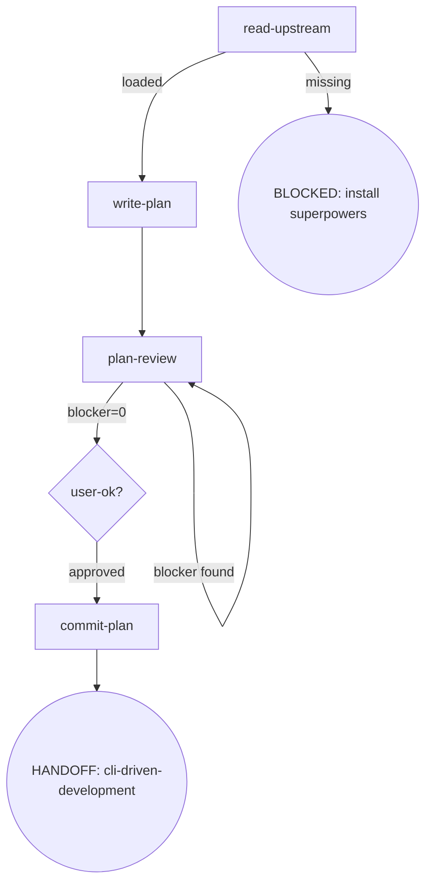

# Osuperpowers Writing-Plans

Full plan-writing flow orchestration, callable standalone.

## Flow Digraph

## Node Definitions

### `read-upstream`

- **Do**: Read upstream `superpowers:writing-plans` SKILL.md as the process baseline. **Read, not Skill-invoke** (Skill-invoke triggers router interception — I1). Resolution: ① harness plugin system locates the sibling `superpowers` plugin's SKILL.md; ② fallback to vendored path in the same repo. The baseline is the SKILL.md file only — harness-injected docs (CLAUDE.md, README, vendor contributor guides) are not the baseline
- **Read**: Upstream `superpowers:writing-plans` SKILL.md file
- **Exit**: File exists and readable → `write-plan`; missing → BLOCKED (install superpowers plugin)
- **Fail**: Skill-invoke upstream → violates I1

### `write-plan`

- **Do**: Write the complete plan document to `docs/superpowers/plans/YYYY-MM-DD-<feature>.md`. Task headings MUST use `### Task N:` colon format — matching brief.mjs extraction pattern (`/^### Task \d+:/`). Em dash (`—`), Chinese colon (`：`), or any other delimiter will cause brief extraction failure at CDD dispatch time. Before writing, perform scope-check (if spec covers multiple subsystems, suggest splitting into separate plans). After writing, present the complete plan to the user in one message. Includes self-review (spec coverage check + placeholder scan + type consistency) — issues found during self-review are fixed inline, not looped or passed to plan-review
- **Read**: Approved spec document + upstream plan template structure
- **Exit**: Plan written + self-review passed → `plan-review`

### `plan-review`

- **Do**: Execute one review per cycle — one dispatch: `cdd review --type plan --harness <name> --doc <path> --spec <spec-path>` (covers completeness / decomposition / buildability in a single run; findings are lens-tagged; round auto-increments in the engine; `--spec` carries the approved spec doc as the plan's reference pointer). **Self-review, manual checks, or any other substitute for cdd review CLI invocation is forbidden.** Review Stopping (I4): follow [Review Stopping](../_docs/review.md#rule-review-stopping) in review.md — blocker>0: cli-fix-all-findings (`cdd fix --type plan --harness <name> --doc <path> --findings <handoff-path>`) → re-run; blocker=0: all findings already fixed → done (no re-run)
- **Read**: Plan document + spec document + [review.md](../_docs/review.md)
- **Exit**: blocker=0 → `user-ok?`
- **Fail**: Re-run review after blocker=0 → violates I4 (Review Stopping)

### `user-ok?`

- **Do**: Confirm the plan is ready to commit. All findings (blocker + warn + nit) were already fixed by `cli-fix-all-findings`; no review re-run and no fix list is offered after blocker=0
- **Read**: none — the plan was reviewed and all findings fixed in the cycle
- **Exit**: user approves → `commit-plan`
- **Fail**: Re-run review → violates I4

### `commit-plan`

- **Do**: Commit plan document to git. Plan approved = commit immediately (I2); do not wait for dev merge
- **Read**: Plan file path
- **Exit**: Commit complete → HANDOFF: cli-driven-development
- **Fail**: Git error → report + fail-open (do not block user plan review)

## Invariants

| # | Invariant |
|---|---|
| I1 | **Read, not Skill-invoke** — upstream skill files are Read only, never Skill-invoked |
| I2 | **Plan commit discipline** — plan approved = commit immediately; do not wait for dev merge |
| I3 | **Task Heading H3** — Plan task headings MUST use H3 (`### Task N:` format), matching brief.mjs extraction pattern. H2 or any other level will cause brief extraction failure at CDD dispatch time |
| I4 | **Review Stopping** — see [Review Stopping](../_docs/review.md#rule-review-stopping) in review.md |

## Failure Modes

| failure | behavior | reason |
|---|---|---|
| Upstream superpowers:writing-plans SKILL.md missing | BLOCKED (with install superpowers plugin guidance) | Block policy: no silent fallback |
| Git commit error | report + fail-open | Do not block user plan review |
| plan-review re-run after blocker=0 | Violates I4 (Review Stopping) — stop + report to user | Agent declares blocker=0 after fixing without re-running cdd review on that pass |
