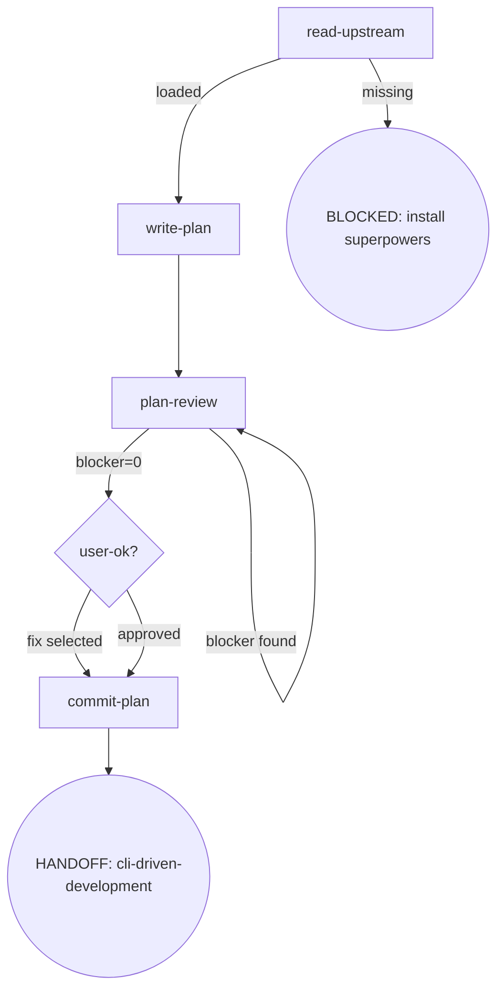

# Osuperpowers Writing-Plans

Full plan-writing flow orchestration, callable standalone.

## Flow Digraph

## Node Definitions

### `read-upstream`

- **Do**: Read upstream `superpowers:writing-plans` SKILL.md as the process baseline. **Read, not Skill-invoke** (Skill-invoke triggers router interception — I1). Resolution: ① harness plugin system locates the sibling `superpowers` plugin's SKILL.md; ② fallback to vendored path in the same repo. The baseline is the SKILL.md file only — harness-injected docs (CLAUDE.md, README, vendor contributor guides) are not the baseline
- **Read**: Upstream `superpowers:writing-plans` SKILL.md file
- **Exit**: File exists and readable → `write-plan`; missing → BLOCKED (install superpowers plugin)
- **Fail**: Skill-invoke upstream → violates I1

### `write-plan`

- **Do**: Write the complete plan document to `docs/superpowers/plans/YYYY-MM-DD-<feature>.md`. Task headings MUST use `### Task N:` colon format — matching brief.mjs extraction pattern (`/^### Task \d+:/`). Em dash (`—`), Chinese colon (`：`), or any other delimiter will cause brief extraction failure at CDD dispatch time. Before writing, perform scope-check (if spec covers multiple subsystems, suggest splitting into separate plans). After writing, present the complete plan to the user in one message. Includes self-review (spec coverage check + placeholder scan + type consistency) — issues found during self-review are fixed inline, not looped or passed to plan-review
- **Read**: Approved spec document + upstream plan template structure
- **Exit**: Plan written + self-review passed → `plan-review`

### `plan-review`

- **Do**: Execute 3-pass plan-review, dispatching an independent `docs-task` CLI call per pass: `node docs-task --harness <name> --mode review --template plan-review --doc <path> --param SPEC=<spec-path> --param PASS=<lens>`. Pass lenses: **Pass 1** `completeness` — spec coverage + missing tasks; **Pass 2** `decomposition` — task boundaries + interfaces (delta-scoped: only changes since last blocker-free pass); **Pass 3** `buildability` — type consistency + placeholder scan (always full-doc). All 3 passes are mandatory — D1 skip-on-clean does not apply. Review Stopping (I4): ① run all 3 passes; ② if blocker>0 → fix all findings (blocker + warn + nit) using `docs-task --mode fix` → re-run affected pass(es); ③ if blocker=0 on all passes → fix remaining warn/nit from captured output (no new docs-task call) → done
- **Read**: Plan document + spec document + [docs-review.md](../_docs/docs-review.md)
- **Exit**: blocker=0 → `user-ok?` (present warn/nit)
- **Fail**: Re-run review after all passes show blocker=0 → violates I4 (Review Stopping). New docs-task review call for warn/nit → violates I4

### `user-ok?`

- **Do**: Present warn/nit list from plan-review output. User options: ① Proceed to Execution Handoff ② Fix selected warns/nits. Re-run is never offered after blocker=0
- **Read**: warn/nit findings from plan-review output (read from already-captured output; no new cdd-review call)
- **Exit**: Proceed → `commit-plan`; fix selected → apply fixes (intermediate step, not modeled as separate node) → `commit-plan` (no review re-run)
- **Fail**: Re-run review → violates I4

### `commit-plan`

- **Do**: Commit plan document to git. Plan approved = commit immediately (I2); do not wait for dev merge
- **Read**: Plan file path
- **Exit**: Commit complete → HANDOFF: cli-driven-development
- **Fail**: Git error → report + fail-open (do not block user plan review)

## Invariants

| # | Invariant |
|---|---|
| I1 | **Read, not Skill-invoke** — upstream skill files are Read only, never Skill-invoked |
| I2 | **Plan commit discipline** — plan approved = commit immediately; do not wait for dev merge |
| I3 | **Task Heading H3** — Plan task headings MUST use H3 (`### Task N:` format), matching brief.mjs extraction pattern. H2 or any other level will cause brief extraction failure at CDD dispatch time |
| I4 | **Review Stopping** — see [Review Stopping](../_docs/docs-review.md#rule-review-stopping) in docs-review.md |

## Failure Modes

| failure | behavior | reason |
|---|---|---|
| Upstream superpowers:writing-plans SKILL.md missing | BLOCKED (with install superpowers plugin guidance) | Block policy: no silent fallback |
| Git commit error | report + fail-open | Do not block user plan review |
| plan-review re-run after blocker=0 | Violates I4 (Review Stopping) — stop + report to user | Agent declares blocker=0 after fixing without re-running cdd-review on that pass |
