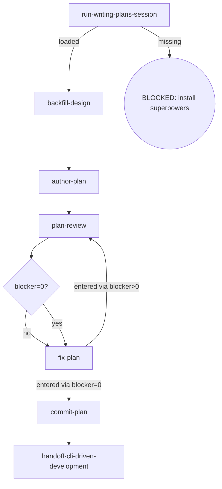

# Osuperpowers Writing-Plans

Writes a plan document from an approved spec, backfills the design when planning surfaces substantive drift, reviews under the cdd plan contract, commits on approval, and hands off to cli-driven-development.

## Flow Digraph

## Node Definitions

### `run-writing-plans-session`

- **Do**: Run a /superpowers:writing-plans session — the harness loads the upstream skill and runs its flow to plan the approved spec (session-call; the upstream document is not read)
- **Read**: nothing before the session; the session plans from the approved spec
- **Exit**: Session loaded → `backfill-design`; upstream missing → BLOCKED (install superpowers)
- **Fail**: Upstream superpowers plugin missing → BLOCKED: install superpowers (no downgrade, no skip, no inline restatement)

### `backfill-design`

- **Do**: Check the session's plan against the approved design. Substantive drift (factual error / missing constraint / a new implementation step the design does not cover) → **backfill the design spec first** — revise the spec + record the drift — so spec and plan agree before plan-review (overall v1.6 rule). Cross-phase matters still backfill to the parent overall per Boundary rules
- **Read**: approved spec + session output
- **Exit**: spec ↔ plan consistent → `author-plan`
- **Fail**: Entering plan-review with an un-backfilled drift → violates the design-backfill rule (overall v1.6)

### `author-plan`

- **Do**: Write the complete plan document to `docs/osuperpowers/plans/YYYY-MM-DD-<feature>.md`. Plan header MUST carry the approved design link as **`**Spec:**` on line 2** (immediately after the `# Title`): `**Spec:** [<name>-design.md](docs/osuperpowers/specs/<name>-design.md)` — the same source as `plan-review`'s `--spec` pointer; `report-issues` resolves program attribution through this header (workspace plan record → **`**Spec:**`** → overall → Related), the plan record being the first hop of its program chain. Task headings MUST use `### Task N:` colon format — matching brief.mjs extraction (`/^### Task \d+:/`); em dash / Chinese colon / any other delimiter fails brief extraction at dispatch time. Includes self-review (spec coverage + placeholder scan + type consistency) — issues found are fixed inline, not looped or passed to plan-review
- **Read**: approved spec + `backfill-design` output
- **Exit**: Plan written + self-review passed → `plan-review`
- **Fail**: Write error or self-review finds an unfixable defect → report + fail-open (do not block plan review)

### `plan-review`

- **Do**: Execute one review per cycle — one dispatch: `cdd review --type plan --plan <path> --spec <spec-path>` (completeness / decomposition / buildability in one run; findings are lens-tagged; round auto-increments in the engine). Self-review, manual checks, or any other substitute for cdd review CLI invocation is forbidden. All findings are fixed from the captured handoff; `blocker=0` → no re-run. Ensure the working tree is clean before entering review (engine entry gate: dirty → BLOCKED; the orchestrator writes no tree during dispatch)
- **Read**: plan document + spec document
- **Exit**: Blockers routed via `blocker=0?` → `fix-plan` (both branches; the edge inherits the re-run routing)
- **Fail**: Re-running the review after blocker=0 → violates the review-stopping discipline

### `fix-plan`

- **Do**: Fix ALL findings (blocker + warn + nit) via `cdd fix --type plan --plan <path> --findings <workspace>/plan-review-{R}.json`. No new review invocation — work from the findings already captured in the current cycle
- **Read**: captured plan-review handoff (current cycle findings)
- **Exit**: entered via blocker>0 → `plan-review` (re-run); entered via blocker=0 → `commit-plan` (no re-run)
- **Fail**: Invoking a new review instead of fixing from captured findings → violates the review-stopping discipline

### `commit-plan`

- **Do**: `git add` the plan + conventional commit. Plan approved = commit immediately (I2); do not wait for dev merge
- **Read**: Plan file path
- **Exit**: Commit complete → `handoff-cli-driven-development`
- **Fail**: Git error → report + fail-open (do not block user plan review)

### `handoff-cli-driven-development`

- **Do**: Run a /osuperpowers:cli-driven-development session to implement the approved plan
- **Read**: The committed plan file
- **Exit**: Handoff session loaded → flow ends for this skill
- **Fail**: Target skill missing → BLOCKED (install osuperpowers)

## Invariants

| # | Invariant |
|---|---|
| I1 | **Review Stopping** — blocker=0 → fix all findings via `cdd fix`, then stop; do not re-run the same ref (for spec/plan the engine binds the ref to `(doc_path, doc_hash)` and rejects a same-ref re-run; editing the plan opens a new review round legitimately). Fixes always dispatch via `cdd fix`; the orchestrator must not edit in place as a substitute |
| I2 | **Plan commit discipline** — plan approved = commit immediately; do not wait for dev merge |

## Failure Modes

| failure | behavior | reason |
|---|---|---|
| Upstream superpowers plugin missing | BLOCKED (install superpowers) | Block policy: no silent fallback |
| Design drift not backfilled before plan-review | BLOCKED (design-backfill violation) | spec and plan must agree before review |
| Git commit error | report + fail-open | Do not block user plan review |
