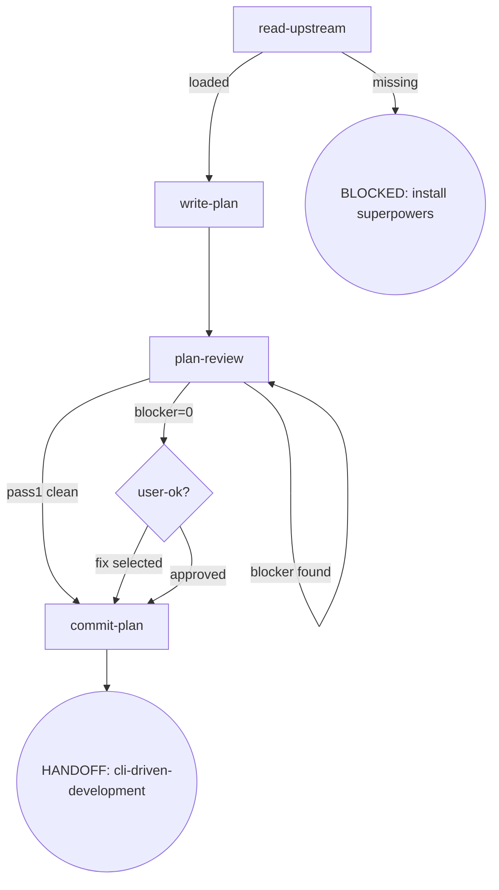

# Osuperpowers Writing-Plans

完整 plan 写作流程编排，可单独调用。

## Flow Digraph

## Node Definitions

### `read-upstream`

- **Do**: 读取上游 `superpowers:writing-plans` SKILL.md 作为流程基线。**读取，不 Skill-invoke**（Skill-invoke 触发 router 拦截——I1）。解析策略：① harness plugin 系统定位 sibling `superpowers` plugin 的 SKILL.md；② 回退到同 repo 的 vendored 路径。基线仅为 SKILL.md 文件——harness 注入的文档（CLAUDE.md、README、vendor 贡献指南）不是基线
- **Read**: 上游 `superpowers:writing-plans` SKILL.md 文件
- **Exit**: 文件存在且可读 → `write-plan`；缺失 → BLOCKED（安装 superpowers plugin）
- **Fail**: Skill-invoke 上游 → 违反 I1

### `write-plan`

- **Do**: 逐节写入 plan 到 `docs/superpowers/plans/YYYY-MM-DD-<feature>.md`。每节一次 tool call（Section-by-Section——I2）。写入前执行 scope-check（如 spec 覆盖多子系统，建议拆分为独立 plans）。全部节写完后一次性呈现给用户。含 self-review（spec 覆盖检查 + placeholder 扫描 + 类型一致性）——self-review 发现的问题 inline 修复，不循环、不传递给 plan-review
- **Read**: 已批准的 spec 文档 + 上游 plan 模板结构
- **Exit**: plan 写入完成 + self-review 通过 → `plan-review`
- **Fail**: 一次性批量写入 → 违反 I2

### `plan-review`

- **Do**: 执行 3-pass plan-review（completeness & spec alignment / task decomposition / buildability & type consistency），每 pass 派发独立 `cdd-review` CLI 调用：`node {pluginRoot}/bin/engine/cdd-review.mjs --harness <name> --template plan-review --param PASS=<pass-type> --param DOC=<path> --param SPEC=<spec-path>`。遵循 [docs-review.md](../_docs/docs-review.md) 的 D1/D2/D3 规则。Review Stopping：① run 3-pass → ② blocker → fix → re-run only that pass → loop until blocker=0 → ③ all blocker=0 → present warn/nit → proceed。Pass 1 零发现（D1）→ skip subsequent passes → `commit-plan`。仅 Pass 2 为 delta scope；Pass 3 始终 full-doc
- **Read**: plan 文档 + spec 文档 + [docs-review.md](../_docs/docs-review.md)
- **Exit**: blocker=0 → `user-ok?`（呈现 warn/nit）；Pass 1 clean（D1）→ skip to `commit-plan`
- **Fail**: blocker=0 后重跑 review → 违反 I4。为新 warn/nit 发起新 cdd-review → 违反 I4

### `user-ok?`

- **Do**: 呈现 plan-review 输出的 warn/nit 列表。用户选项：① Proceed to Execution Handoff ② Fix selected warns/nits。blocker=0 后不提供重跑
- **Read**: plan-review 输出的 warn/nit findings（从已有输出读取，不发新 cdd-review）
- **Exit**: proceed → `commit-plan`；fix selected → 执行修复（中间步骤，不建模为独立节点）→ `commit-plan`（不重跑 review）
- **Fail**: 重跑 review → 违反 I4

### `commit-plan`

- **Do**: 将 plan 文档提交到 git。Plan 获批即 commit（I3），不等 dev 合并
- **Read**: plan 文件路径
- **Exit**: commit 完成 → HANDOFF: cli-driven-development
- **Fail**: git 错误 → report + fail-open（不阻塞用户审阅 plan）

## Invariants

| # | Invariant |
|---|---|
| I1 | **读取，不 Skill-invoke** — 上游 skill 文件只 Read，不 Skill-invoke（触发 router 拦截） |
| I2 | **逐节写入** — plan 逐节写入，每节一次 tool call；写入粒度与确认时机解耦 |
| I3 | **Plan commit 纪律** — plan 获批即 commit，不等 dev 合并 |
| I4 | **Review Stopping** — 重跑仅由 blocker 驱动；blocker=0 后不重跑；不为获取 warn/nit 发起新 cdd-review |

## Failure Modes

| failure | behavior | reason |
|---|---|---|
| 上游 superpowers:writing-plans SKILL.md 缺失 | BLOCKED（含安装 superpowers plugin 指引） | block 政策：不静默 fallback |
| Git commit 错误 | report + fail-open | 不阻塞用户审阅 plan |
