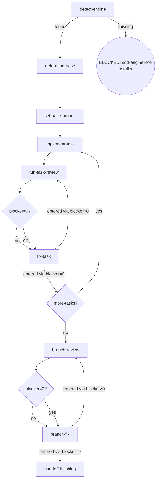

# CLI-Driven Development (cdd)

Execute planned tasks with the host harness CLI (ambient detection — no selection step) via a three-mode chain. This skill is both orchestrator and engine: it executes AND makes orchestrator decisions (mode chain, final review).

## Flow Digraph

The branch loop is node-for-node isomorphic with the task loop above it and with the spec/plan/task-family loops of the `writing-*` orchestrators: a review lane, a `{blocker=0?}` decision that routes both arms through the fix lane, a blocker>0 back-edge (re-review on the moved ref) and a blocker=0 forward-edge (finishing). `K ─ I ─ J ─ L` is the same skeleton as `D[review] → {blocker=0?} → F[fix] → …`.

## Node Definitions

### `detect-engine`

- **Do**: Verify the engine is installed: `command -v cdd`. Found → `determine-base`; missing → BLOCKED: cdd-engine-not-installed — run `npm i -g @oscaner-skills/cdd-engine`, then retry.
- **Read**: PATH environment variable
- **Exit**: Found → `determine-base`; missing → BLOCKED: cdd-engine-not-installed (soft exit with install guidance)
- **Fail**: PATH check errors → fail-open, proceed with a warning

### `determine-base`

- **Do**: Follow the [base-branch.md](./docs/base-branch.md) methodology — inference sources in order: plan `base` field → branch upstream (`git rev-parse --abbrev-ref @{u}`) → conversation context. If none yields a definitive base, AskUserQuestion — do not guess. Base may already be present in the artifact (skip inference).
- **Read**: plan document + git upstream + conversation context + `cdd base-branch get --plan <path>` (skip inference when the artifact is present)
- **Exit**: base resolved → `set-base-branch`
- **Fail**: user refuses to confirm → BLOCKED: base-undecided

### `set-base-branch`

- **Do**: Persist the base via the engine CLI — `cdd base-branch set --plan <path> --base <branch> --source <enum>`, where `source` is `plan-field` | `branch-upstream` | `conversation-context` | `user-confirmed`. The engine is the sole write/read path for the artifact — never hand-write it; `set` is idempotent, refusals and validation errors are engine-handled (exit 2).
- **Read**: `cdd base-branch get --plan <path>` (artifact JSON on stdout)
- **Exit**: artifact written (or already present) → `implement-task`
- **Fail**: engine refusal / validation error → report to user; user decides (no hand-written artifact)

### `implement-task`

- **Do**: Dispatch `cdd implement --task <n> --plan <path>` — background execution (harness `run_in_background` when supported; timeout + poll otherwise). One task at a time. Every nested `cdd` dispatch in this skill forbids historical session flags (`--resume` / `-c`) — one-shot print mode only.
- **Read**: output contract — `status` / `blocker` / `artifacts` (absolute paths) / `counters`
- **Exit**: dispatch complete → `run-task-review`
- **Fail**: nested CLI exits with no output → BLOCKED: engine-error (report via `osuperpowers:report-issues`)

### `run-task-review`

- **Do**: Dispatch `cdd review --type task --task <n> --plan <path>` — background execution. Every task goes through implement → review → (fix if blockers); review is unskippable — a task never goes straight from implement to completion. Ensure the working tree is clean before entering review (engine entry gate: dirty → BLOCKED; the orchestrator writes no tree during dispatch).
- **Read**: output contract — `status` + captured review `findings[]`; routes by blocker severity
- **Exit**: `blocker=0?` routes to `fix-task` (both branches; the re-run path is determined by the entry edge)
- **Fail**: review exits with no output → BLOCKED: engine-error

### `fix-task`

- **Do**: Fix ALL review findings (blocker + warn + nit) via `cdd fix --type task --task <n> --plan <path> --findings <handoff>` — `<handoff>` is the current cycle's handoff path from `artifacts`. No new review invocation — work from the findings already captured in this cycle. A finding tagged to a LATER task (`Task N:`, N later than the current) belongs to the plan's pending-acceptance zone, not this fix: the orchestrator collects it there (I6) — the fix agent holds zero plan-modification authority.
- **Read**: captured review handoff `findings[]` (path from `artifacts`)
- **Exit**: entered via blocker>0 → `run-task-review` (re-run); entered via blocker=0 → `more-tasks?` (no re-run after blocker=0)
- **Fail**: invoking a new review instead of fixing from captured findings → violates the convergence discipline

### `branch-review`

- **Do**: Dispatch `cdd review --type branch --plan <path> --base <merge-base> --head <head>` — `<merge-base>` = `git merge-base HEAD origin/<base>` with `<base>` from `cdd base-branch get --plan <path>`; `<head>` = `git rev-parse HEAD`; background execution. Persist the diff to the workspace (`git diff <base>..<head> --stat`). Ensure the working tree is clean before entering review (engine entry gate: dirty → BLOCKED; the orchestrator writes no tree during dispatch).
- **Read**: `cdd base-branch get` output + branch HEAD + review output contract
- **Exit**: `blocker=0?` routes to `branch-fix` (both branches; the re-run path is determined by the entry edge)
- **Fail**: review exits with no output → BLOCKED: engine-error

### `branch-fix`

- **Do**: Dispatch `cdd fix --type branch --plan <path> --findings <handoff>` — `<handoff>` is the current cycle's source review handoff (`branch-review-{base7}..{head7}-r{R}.json` from `artifacts`); this is the ONLY fix channel for branch findings — an engine-closed `branch-review → branch-fix → re-review` loop with zero inline orchestration (the orchestrator never hand-applies a finding as an editor edit — I5). The fix lands real commits (the engine's exit gate requires a clean tree + `commits.head` match); the ref embedded in the file name (BASE..HEAD commit range) moves with the fix commit → a re-review of the NEW ref is a new review (Review Convergence law, I3). Rounds are a soft cap only (recommended ≤ 3; beyond that the user decides) — a rigid hard cap would deadlock the terminal gate with a persistent blocker, a deliberate symmetry exception to the hard media ceilings (reason recorded, not patched).
- **Read**: captured branch-review handoff `findings[]` (path from `artifacts`)
- **Exit**: entered via blocker>0 → `branch-review` (re-run on the moved ref); entered via blocker=0 → `handoff-finishing` (no re-review after blocker=0)
- **Fail**: blockers persist after multiple rounds → implicit fail-open (stop + report; branch preserved; user decides)

### `handoff-finishing`

- **Do**: Prepare the handoff to `osuperpowers:finishing`: ensure the base-branch artifact is written (finishing reads the same artifact inside its `run-finishing-session` merge/PR flow); summarize branch state (commits count / base); invoke `osuperpowers:finishing` to take over (merge / PR / keep / discard).
- **Read**: `cdd base-branch get --plan <path>` output + final branch-review state
- **Exit**: handoff complete → APPROVED: finishing
- **Fail**: finishing takeover fails → implicit fail-open (branch preserved; user finishes manually)

## Invariants

| # | Invariant |
|---|-----------|
| I1 | **Host Harness Autodetection** — the engine resolves the host harness internally from ambient environment markers; the orchestrator never passes a harness name down to `cdd`. |
| I2 | **CLI Background Execution** — all `cdd <subcommand>` calls run in background — harness `run_in_background` when supported; timeout + poll otherwise. |
| I3 | **Review Convergence** — blocker=0 → fix all findings (blocker + warn + nit) via `cdd fix`, then stop; do not re-run. Review refs are commit ranges with a double signature: task/branch ref = BASE..HEAD (the fix commit moves HEAD → a re-review of the NEW ref is a new review), plan/spec ref = doc_hash (content evolution → new ref) — the fix commit moves the ref and the engine cannot intercept it, so this discipline is the only guard. No re-review after a blocker=0 review; the cycle ends with the fix of all captured findings. |
| I4 | **Three-Mode Chain Completeness** — every task goes through the full implement → review → (fix if blockers) chain; review is unskippable, and fix dispatch requires a prior APPROVED review handoff for that task. |
| I5 | **No Controller Bypass** — when the engine is available, the orchestrator must not hand-write control-flow bypasses; all task execution / review / fix dispatch go through engine CLI calls. |
| I6 | **Pending Acceptance** — a finding that targets a LATER task tag (`### Task N:` with N later than the current task) is not fixed by this round's agent: the orchestrator collects it, as sole writer, into the plan's dedicated pending-acceptance-patch zone; fix/implement agents hold zero plan-modification authority. |

## Engine Semantics

Orchestrator-facing facts the engine guarantees — read and route on them, never re-derive:

- **Dry-run is pure simulation** — `cdd <subcommand> --dry-run` short-circuits dispatch: no agent spawn, no handoff reads, an APPROVED stub handoff plus the return block contract only (the engine writes the workspace stub regardless of tree state). It never blocks: a dirty working tree under dry-run lands a stderr WARN — never a BLOCK, exit stays 0 — and the exit gate's clean-tree discipline applies to real dispatches only. When verifying behavior with `--dry-run`, treat the stub handoff as simulation, not an acceptance record.
- **`cdd fix --type branch` closes the branch loop** — the only way back from `branch-review` findings to accepted commits is this engine channel (`--findings` = the source `branch-review-{base7}..{head7}-r{R}.json`); hand-applying findings as inline orchestrator edits is a controller bypass (I5).
- **Soft review cap** — branch-fix rounds are soft-limited (recommended ≤ 3) rather than hard-capped by design: a rigid cap between a persistent blocker and "cap exhausted" would deadlock the program's terminal gate. A deliberate symmetry exception to the hard media ceilings — the reason for the exception is recorded here, the cap is not patched; at the cap the user adjudicates (branch preserved, findings reported).

## Failure Modes

Cross-node failure handling (complements node Fail fields):

| category | handling |
|---|---|
| TIMEOUT | routed from output contract `status`; retry within the counters cap, then terminal per the output contract |
| CONTRACT_VIOLATION | blocker from output contract; report via `osuperpowers:report-issues`; no re-dispatch |
| ENGINE_SELF_WRITTEN | blocker from output contract; report via `osuperpowers:report-issues`; orchestrator never rewrites handoff state |
| EXECUTION_FAILURE | blocker from output contract; fixable + retry available → re-dispatch; else BLOCKED: engine-error |
| UNVERIFIABLE | blocker from output contract; report to user; re-dispatch only on user confirmation |
| PLAN_CONFLICT | blocker from output contract; surface to the user — never silently override the plan |

**Fail-open vs BLOCKED convention**:

- **BLOCKED**: explicit terminal state; requires user intervention to recover.
- **implicit fail-open**: node-level failure (not in digraph); flow stops + reports to user.
