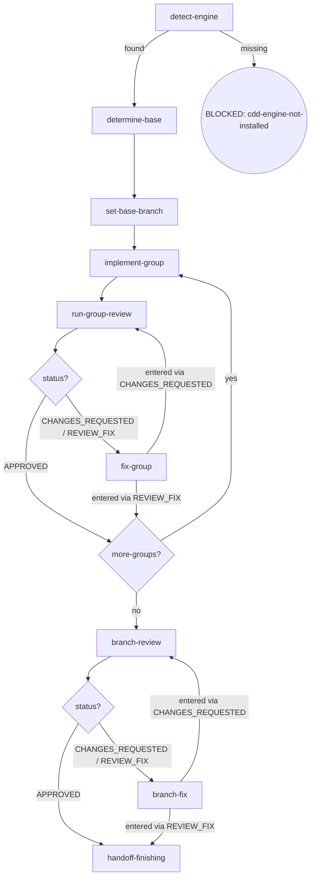

# CLI-Driven Development (cdd)

Execute planned tasks with the host harness CLI (ambient detection — no selection step) via a three-mode chain. This skill is both orchestrator and engine: it executes AND makes orchestrator decisions (mode chain, final review).

## Flow Digraph

```mermaid
flowchart TD
  A[detect-engine] -->|found| B[determine-base]
  A -->|missing| Z0((BLOCKED: cdd-engine-not-installed))
  B --> C[set-base-branch]
  C --> D[implement-group]
  D --> E[run-group-review]
  E --> F{status?}
  F -->|CHANGES_REQUESTED / REVIEW_FIX| G[fix-group]
  F -->|APPROVED| H{more-groups?}
  G -->|entered via CHANGES_REQUESTED| E
  G -->|entered via REVIEW_FIX| H{more-groups?}
  H -->|yes| D
  H -->|no| K[branch-review]
  K --> I{status?}
  I -->|CHANGES_REQUESTED / REVIEW_FIX| J[branch-fix]
  I -->|APPROVED| L[handoff-finishing]
  J -->|entered via CHANGES_REQUESTED| K
  J -->|entered via REVIEW_FIX| L[handoff-finishing]
```

## Node Definitions

### `detect-engine`

- **Do**: Verify the engine is installed: `command -v cdd`. Found → `determine-base`; missing → BLOCKED: cdd-engine-not-installed — run `npm i -g @oscaner-skills/cdd-engine`, then retry. Direct invocation — read the full output (stdout/stderr); cdd truncates its own output. Output filtering is forbidden — no piping to `tail`/`head`, no `2>&1 |`, no `EXIT=$?` capture.
- **Read**: PATH environment variable
- **Exit**: Found → `determine-base`; missing → BLOCKED: cdd-engine-not-installed (soft exit with install guidance)
- **Fail**: PATH check errors → fail-open, proceed with a warning

### `determine-base`

- **Do**: Follow the [base-branch.md](./docs/base-branch.md) methodology — inference sources in order: plan `base` field → branch upstream (`git rev-parse --abbrev-ref @{u}`) → conversation context. If none yields a definitive base, AskUserQuestion — do not guess. Base may already be present in the artifact (skip inference).
- **Read**: plan document + git upstream + conversation context + `cdd base-branch get --plan <path>` (skip inference when the artifact is present) — direct invocation: read the full output (stdout/stderr); cdd truncates its own output. Output filtering is forbidden — no piping to `tail`/`head`, no `2>&1 |`, no `EXIT=$?` capture.
- **Exit**: base resolved → `set-base-branch`
- **Fail**: user refuses to confirm → BLOCKED: base-undecided

### `set-base-branch`

- **Do**: Persist the base via the engine CLI — `cdd base-branch set --plan <path> --base <branch> --source <enum>`, where `source` is `plan-field` | `branch-upstream` | `conversation-context` | `user-confirmed`. The engine is the sole write/read path for the artifact — never hand-write it; `set` is idempotent, refusals and validation errors are engine-handled (exit 2). Direct invocation — read the full output (stdout/stderr); cdd truncates its own output. Output filtering is forbidden — no piping to `tail`/`head`, no `2>&1 |`, no `EXIT=$?` capture.
- **Read**: `cdd base-branch get --plan <path>` (artifact JSON on stdout)
- **Exit**: artifact written (or already present) → `implement-group`
- **Fail**: engine refusal / validation error → report to user; user decides (no hand-written artifact)

### `implement-group`

- **Do**: Dispatch `cdd implement --tasks <n|n,n,…> --plan <path>` — background execution (harness `run_in_background` when supported; timeout + poll otherwise). One dispatch group per iteration of the group-implement-review-fix loop: the group list derives from the plan's `## Task Groups` section via the engine's `effectiveGroups` — the declared merged groups (the `taskGroups` plan record) ∪ uncovered tasks as singleton groups; an absent section is the empty default → every `### Task N:` its own group (the all-singleton default equals the pre-group per-task dispatch). Each group dispatches with its own `--tasks` — `<n>` a singleton group, `<a,b>` a merged group. Every nested `cdd` dispatch in this skill forbids historical session flags (`--resume` / `-c`) — one-shot print mode only. Direct invocation — read the full output (stdout/stderr); cdd truncates its own output. Output filtering is forbidden — no piping to `tail`/`head`, no `2>&1 |`, no `EXIT=$?` capture.
- **Read**: output contract — the status capsule (`status:` / `blocker:` / `handoff:` + the engine's `next:` suggestion); BLOCKED grounds ride the stderr `CDD_BLOCKED:` channel; the handoff carries the committed change identity and the `findings` full text (consumed inside `cdd fix`, never by the orchestrator)
- **Exit**: dispatch complete → `run-group-review`
- **Fail**: nested CLI exits with no output → BLOCKED: engine-error (report via `osuperpowers:report-issues`); a harness abnormal exit stores a crash-only snapshot + crash record in the workspace — re-run the same command per the BLOCKED `next:` to continue (no redo, no residue loss)

### `run-group-review`

- **Do**: Dispatch `cdd review --type task --tasks <n|n,n,…> --plan <path>` — background execution. Every dispatch group goes through implement → review → (fix if findings); review is unskippable — a group never goes straight from implement to completion. Review Convergence (I3): read the `next:` suggestion from the review output — the engine's default next-step suggestion (dispatch per it when continuing directly); a mid-backfill or a user adjudication that lands governs over it (current world state). Ensure the working tree is clean before entering review (engine entry gate: dirty → BLOCKED; the orchestrator writes no tree during dispatch). Direct invocation — read the full output (stdout/stderr); cdd truncates its own output. Output filtering is forbidden — no piping to `tail`/`head`, no `2>&1 |`, no `EXIT=$?` capture.
- **Read**: the full stdout — the `next:` line names the engine's default next dispatch and the `status:` line the review conclusion (BLOCKED grounds ride the stderr `CDD_BLOCKED:` channel); findings full text lives in the handoff (`artifacts`) and is consumed inside `cdd fix` via `--findings`, never by the orchestrator
- **Exit**: the `next:` suggestion routes the next dispatch — fix / next-group continue / terminal (no self-authored status→dispatch mapping)
- **Fail**: review exits with no output → BLOCKED: engine-error; a harness abnormal exit stores a crash-only snapshot + crash record in the workspace — re-run the same command per the BLOCKED `next:` to continue (no redo, no residue loss)

### `fix-group`

- **Do**: Fix ALL review findings (blocker + warn + nit) via `cdd fix --type task --tasks <n|n,n,…> --plan <path> --findings <handoff>` — `<handoff>` is the current cycle's handoff path from `artifacts`. No new review invocation — work from the findings already captured in this cycle (the fix output's `next:` suggestion names the next hop: re-review / closure). Cross-task adjudication never happens here — the fix agent holds zero plan-modification authority, the orchestrator writes the plan as sole writer. Direct invocation — read the full output (stdout/stderr); cdd truncates its own output. Output filtering is forbidden — no piping to `tail`/`head`, no `2>&1 |`, no `EXIT=$?` capture. After the review, the orchestrator reads the `next:` suggestion for routing; findings full text is consumed by `cdd fix`'s fix-agent via `--findings <handoff>` — the orchestrator must not self-apply findings as inline edits.
- **Read**: captured review handoff `findings[]` (path from `artifacts`)
- **Exit**: the fix output's `next:` suggestion routes the next dispatch — the re-review face or the continuation/terminal face (the fix face is where the loop decides re-review vs closure; a closure conclusion never re-reviews)
- **Fail**: invoking a new review instead of fixing from captured findings → violates the convergence discipline; a harness abnormal exit stores a crash-only snapshot + crash record in the workspace — re-run the same command per the BLOCKED `next:` to continue (no redo, no residue loss)

### `branch-review`

- **Do**: Dispatch `cdd review --type branch --plan <path> --base <merge-base> --head <head>` — `<merge-base>` = `git merge-base HEAD origin/<base>`; `<head>` = `git rev-parse HEAD`; `<base>` from `cdd base-branch get --plan <path>`; background execution. Persist the diff to the workspace (`git diff <base>..<head> --stat`). Review Convergence (I3): read the `next:` suggestion from the review output — the engine's default next-step suggestion (dispatch per it when continuing directly); a mid-backfill or a user adjudication that lands governs over it (current world state). Ensure the working tree is clean before entering review (engine entry gate: dirty → BLOCKED; the orchestrator writes no tree during dispatch). Direct invocation — read the full output (stdout/stderr); cdd truncates its own output. Output filtering is forbidden — no piping to `tail`/`head`, no `2>&1 |`, no `EXIT=$?` capture.
- **Read**: `cdd base-branch get` output + branch HEAD + the review output contract (incl. the `next:` suggestion)
- **Exit**: the `next:` suggestion routes the next dispatch — `cdd fix --type branch …` or the handoff to finishing
- **Fail**: review exits with no output → BLOCKED: engine-error; a harness abnormal exit stores a crash-only snapshot + crash record in the workspace — re-run the same command per the BLOCKED `next:` to continue (no redo, no residue loss)

### `branch-fix`

- **Do**: Dispatch `cdd fix --type branch --plan <path> --findings <handoff>` — `<handoff>` is the current cycle's source review handoff (`branch-review-{base7}..{head7}-r{R}.json` from `artifacts`); this is the ONLY fix channel for branch findings — an engine-closed `branch-review → branch-fix → re-review` loop with zero inline orchestration (the orchestrator never hand-applies a finding as an editor edit — I5). The fix lands real commits (the engine's exit gate requires a clean tree + `commits.head` match); the ref embedded in the file name (BASE..HEAD commit range) moves with the fix commit → a re-review of the NEW ref is a new review (Review Convergence law, I3). Rounds are a soft cap only (recommended ≤ 3; beyond that the user decides) — a rigid hard cap would deadlock the terminal gate with a persistent blocker, a deliberate symmetry exception to the hard media ceilings (reason recorded, not patched). Direct invocation — read the full output (stdout/stderr); cdd truncates its own output. Output filtering is forbidden — no piping to `tail`/`head`, no `2>&1 |`, no `EXIT=$?` capture. After the review, the orchestrator reads the `next:` suggestion for routing; findings full text is consumed by `cdd fix`'s fix-agent via `--findings <handoff>` — the orchestrator must not self-apply findings as inline edits.
- **Read**: captured branch-review handoff `findings[]` (path from `artifacts`)
- **Exit**: the fix output's `next:` suggestion routes the next dispatch — re-review on the moved ref or the handoff to finishing
- **Fail**: blockers persist after multiple rounds → implicit fail-open (stop + report; branch preserved; user decides)

### `handoff-finishing`

- **Do**: Prepare the handoff to `osuperpowers:finishing`: ensure the base-branch artifact is written (finishing reads the same artifact inside its `run-finishing-session` merge/PR flow); summarize branch state (commits count / base); invoke `osuperpowers:finishing` to take over (merge / PR / keep / discard).
- **Read**: `cdd base-branch get --plan <path>` output + final branch-review state — direct invocation: read the full output (stdout/stderr); cdd truncates its own output. Output filtering is forbidden — no piping to `tail`/`head`, no `2>&1 |`, no `EXIT=$?` capture.
- **Exit**: handoff complete → APPROVED: finishing
- **Fail**: finishing takeover fails → implicit fail-open (branch preserved; user finishes manually)

## Invariants

| # | Invariant |
|---|-----------|
| I1 | **Host Harness Autodetection** — the engine resolves the host harness internally from ambient environment markers; the orchestrator never passes a harness name down to `cdd`. |
| I2 | **CLI Background Execution** — all `cdd <subcommand>` calls run in background — harness `run_in_background` when supported; timeout + poll otherwise. |
| I3 | **Review Convergence** — a review closes by its conclusion `status`, and the output's `next:` line carries the engine's default next-step suggestion — read the `next:` suggestion and dispatch per it when continuing directly; a mid-backfill or a user adjudication that lands governs over it (current world state wins). Fixes always dispatch via `cdd fix`; the orchestrator must not edit in place as a substitute. Review refs are commit ranges with a double signature: task/branch ref = BASE..HEAD (the fix commit moves HEAD → a re-review of the NEW ref is a new review), plan/spec ref = doc_hash (content evolution → new ref) — the fix commit moves the ref and the engine cannot intercept it, so this discipline is the only guard. |
| I4 | **Three-Mode Chain Completeness** — every dispatch group (a singleton task or a merged group) goes through the full implement → review → (fix if findings) chain; review is unskippable, and fix dispatch requires a prior review handoff for that group. |
| I5 | **No Controller Bypass** — when the engine is available, the orchestrator must not hand-write control-flow bypasses; all task execution / review / fix dispatch go through engine CLI calls. |
| I6 | **Mid-Flight Backfill** — a user-raised backfill of overall/spec/plan docs surfaced while a dispatch is in flight lands through four ordered steps on the current `cdd` call's return (any dispatch — implement/review/fix): (1) **land immediately** — hot context; no deferral to cycle close (deferral risks losing the decision); (2) **commit on its own** — committed as its own standalone change, never mixed with implementation commits; (3) **pause the loop until clean** — the loop pauses (tree clean, backfill committed) before the next dispatch; an uncommitted backfill trips the next review's entry gate (dirty → BLOCKED); (4) **audit in-band on resume** — after the loop resumes, the next review audits the backfill in-band (changed-surface booking, not a block); a backfill rewriting the current task's own plan/spec text routes through the orchestrator as Plan Sole Writer (cross-task adjudication), otherwise it rides the moving ref. |
| I7 | **Dry-run is pure simulation** — `cdd <subcommand> --dry-run` short-circuits dispatch: no agent spawn, no handoff reads, an APPROVED stub handoff plus the status-capsule output contract only (the engine writes the workspace stub regardless of tree state). It never blocks: a dirty working tree under dry-run lands a stderr WARN — never a BLOCK, exit stays 0 — and the exit gate's clean-tree discipline applies to real dispatches only. When verifying behavior with `--dry-run`, treat the stub handoff as simulation, not an acceptance record. |
| I8 | **`cdd fix --type branch` closes the branch loop** — the only way back from `branch-review` findings to accepted commits is this engine channel (`--findings` = the source `branch-review-{base7}..{head7}-r{R}.json`); hand-applying findings as inline orchestrator edits is a controller bypass (I5). |
| I9 | **Soft review cap** — branch-fix rounds are soft-limited (recommended ≤ 3) rather than hard-capped by design: a rigid cap between a persistent blocker and "cap exhausted" would deadlock the program's terminal gate. A deliberate symmetry exception to the hard media ceilings — the cap is not patched; at the cap the user adjudicates (branch preserved, findings reported). |
| I10 | **Entry gate reads the tree, not the committed range** — the review entry gate checks working-tree cleanliness only (dirty → BLOCKED; dry-run → WARN). It does not assert that HEAD holds exactly the task's canonical commits, so a committed mid-flight backfill clears the gate. The subsequent review audits the widened range — off-ledger changes surface as a changed-surface booking (an engine WARN, not a block) and the scope axis decides; visible, not a block. |

## Failure Modes

Cross-node failure handling (complements node Fail fields):

| category | handling |
|---|---|
| TIMEOUT | routed from output contract `status`; retry within the handoff's counters cap, then terminal per the output contract |
| HARNESS_ABORT | `status: BLOCKED` from the output contract + the stderr `CDD_BLOCKED:` reason + the `next:` same-command resume — a harness abnormal exit stores a crash-only snapshot + crash record in the workspace; re-run the same command per the `next:` to continue (no redo, no residue loss) |
| CONTRACT_VIOLATION | `status: BLOCKED` from the output contract + the stderr `CDD_BLOCKED:` reason; report via `osuperpowers:report-issues`; no re-dispatch |
| ENGINE_SELF_WRITTEN | `status: BLOCKED` from the output contract + the stderr `CDD_BLOCKED:` reason; report via `osuperpowers:report-issues`; orchestrator never rewrites handoff state |
| EXECUTION_FAILURE | `status: BLOCKED` from the output contract + the stderr `CDD_BLOCKED:` reason; fixable + retry available → re-dispatch; else BLOCKED: engine-error |
| UNVERIFIABLE | `status: BLOCKED` from the output contract + the stderr `CDD_BLOCKED:` reason; report to user; re-dispatch only on user confirmation |
| PLAN_CONFLICT | `status: BLOCKED` from the output contract + the stderr `CDD_BLOCKED:` reason; surface to the user — never silently override the plan |

**Fail-open vs BLOCKED convention**:

- **BLOCKED**: explicit terminal state; requires user intervention to recover.
- **implicit fail-open**: node-level failure (not in digraph); flow stops + reports to user.
