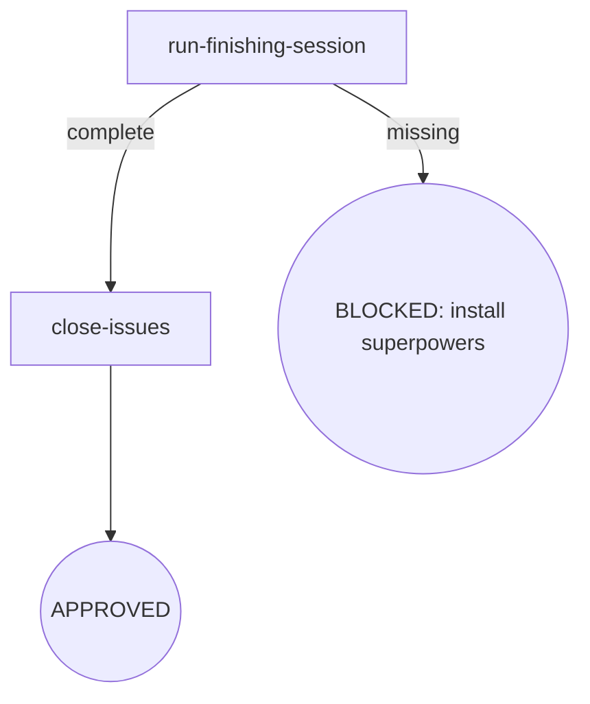

# Osuperpowers Finishing

Development branch finishing: the imported upstream flow decides merge / PR / keep / discard, then related issues are closed.

> **Backfill timing (consumer-parity P2 v1.12, 2026-09-21)**: the parent-overall backfill is no longer a finishing step — it is a **precondition of branch-review** (`backfill-overall` = orchestration obligation executed after plan-complete and before branch-review; the engine's closeout 统一规则 hard-gates plan-bearing dispatches on unpaid terminal debt, incl. branch-review). Finishing owns merge / PR / keep / discard + close-issues only.

## Flow Digraph

## Node Definitions

### `run-finishing-session`

- **Do**: Import `/superpowers:finishing-a-development-branch` — its flow is consumed inline as this session's baseline (loading an upstream skill imports its flow once; no second spawn) and runs its full finish loop (verify tests → read base → 4-option menu → execute merge / PR / keep / discard); it lands the finish decision (merged / PR created / kept / discarded) that routes `close-issues`. **Upstream steps are not restated here.** Personal rules enforced at this boundary: normal-repo menu (No Worktrees — I1); merge commit / PR title in conventional commits, PR body `## Summary` + `## Test Plan` only, zero attribution (I2); the strict typed-discard gate — the literal `discard` only (case-sensitive, no leading/trailing whitespace); any other input falls back to the menu **without resetting its presentation counter** (3 attempts max → BLOCKED). **Backfill is not finishing's scope** — the parent-overall backfill is an orchestration obligation executed before branch-review (P2 v1.12: branch-review pre-flight hard-gates on unpaid terminal debt)
- **Read**: landed finish decision + base branch (`.osuperpowers/cdd/<slug>/base-branch.json`, or inference per [base-branch.md](../cli-driven-development/docs/base-branch.md))
- **Exit**: Finish decision landed (merged / PR created / kept / discarded) → `close-issues`
- **Fail**: Upstream superpowers plugin missing → BLOCKED (install superpowers); menu exhausted after 3 unrecognized inputs → BLOCKED (menu exhausted); tests red → BLOCKED (fix tests)

### `close-issues`

- **Do**: Close the issues that shipped with the finished work — for each `#NNN` in the phase's scope, `gh issue close NNN` with the shipped state
- **Read**: phase spec Issue inventory + finished branch
- **Exit**: Issues closed → APPROVED
- **Fail**: `gh` unavailable → report + fail-open (do not block the finish)

## Invariants

| # | Invariant |
|---|---|
| I1 | **No Worktrees** — skip the upstream worktree detection block and its cleanup; the menu is fixed to the normal-repo variant; worktree state is a pre-development violation (not finishing's scope) |
| I2 | **Conventional Commits + No Attribution** — merge commit / PR title follows conventional commits; no trailers / footers / inline attribution; PR body uses only `## Summary` + `## Test Plan` |

## Failure Modes

| failure | behavior | reason |
|---|---|---|
| Upstream superpowers plugin missing | BLOCKED (install superpowers) | Block policy: no silent fallback |
| Tests red before merge | BLOCKED (fix tests) | Do not merge/PR a red branch |
| Menu unrecognized input reaches the 3-attempt limit | BLOCKED (menu exhausted) | Cannot obtain user decision |
| Merge conflict / push rejected / PR failure | implicit fail-open (stop + report; branch and base retained; user recovers then re-runs finishing) | Do not auto-resolve |
