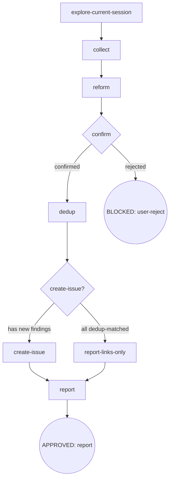

# Osuperpowers Report Issues

Analyze the current CDD session (session context records + `{repo}/.osuperpowers/cdd/*/progress.md` ledger + git log) to find bugs and enhancements, then file **one aggregate issue** on `Oscaner/skills` via `gh`. Confirmed findings that dedup-match an existing open issue are recorded as links — in the new issue body's Dedup region when an issue is created, else in the links-only list (`report-links-only`) when every finding matched — no per-finding comments are filed, and no issue is ever touched outside its creation. The flow is a digraph: `explore-current-session → collect → reform → confirm → dedup → create-issue? → {create-issue | report-links-only} → report`. Findings never include branch names, absolute paths, or filenames by default. The issue body is produced by the renderer CLI at `scripts/report-templates.mjs` — a bare-call single entry (stdin JSON → aggregate body → stdout, no mode flag); `pluginRoot` is resolved by ascending to the nearest `.claude-plugin/plugin.json`. Repo development tool, not a regular workflow skill. Manual trigger only, never automatic.

## Flow Digraph

## Node Definitions

### `explore-current-session`

- **Do**: Capture the four-field Session Context snapshot once at report start (taken by this node; every downstream node derives from this snapshot, never from the live cwd) —
  - **root**: git top-level of the harness launch cwd (`git rev-parse --show-toplevel`). Captured once; never re-derived from the real-time cwd (`cd` during exploration does not change it).
  - **workspace**: `.osuperpowers/cdd/<run-slug>/` of the current CDD run — present only when this session is a CDD run. Cross-repo reuse is forbidden: the workspace must resolve under `root`.
  - **harness**: the harness this session runs in (e.g. `claude-code`) — the value of the Session region's `- Harness:` row (report-meta 2+1 session-level line).
  - **program-owning issue** (CDD runs only): the phase-owning issue of the current program, resolved from the run workspace — `progress.json#plan` → plan-header `**Spec:**` chain → the owning issue. A pure lookup feeding the Related region's Program link (I9), never a routing decision.
- **Read**: harness launch cwd; (when CDD run) the run workspace
- **Exit**: snapshot complete → `collect`
- **Fail**: workspace cannot resolve under `root` → BLOCKED (cross-repo reuse forbidden)

### `collect`

- **Do**: Collect candidate findings from the session's reference sources — ① session context records: tool-call records / errors / handoff / review findings visible in this session; ② ledger: `{repo}/.osuperpowers/cdd/*/progress.md` files, extracting lines containing `fix round` / `BLOCKED` / `parked` / `CHANGES_REQUESTED`; ③ git log: `git log $(git merge-base HEAD origin/main)..HEAD --oneline`, falling back to `git log -20 --oneline` when `origin/main` is unavailable. These sources are described for reference, not as a fixed channel contract — in practice the surface flexes with the task; every candidate passes the **toolchain scope filter** regardless of how it surfaced.
  Apply the **toolchain scope filter**: a candidate enters the list only when it satisfies both —
  - **component slot**: the affected component is in the `components` enumeration (e.g. `osuperpowers:report-issues`, `cdd-engine`);
  - **behavior predicate**: the finding touches a toolchain artifact — cdd command output / handoff / progress ledger / issue form / skill flow node.
  Consumer-project domain rules (e.g. a missing ruff config in the consumer project, a project-specific test flake) are **rejected samples**: component-free findings never enter the list. The `.superpowers/sdd/*/progress.md` ledger is never scanned (SDD belongs to the superpowers domain; this toolchain's predicates face cdd artifacts only). Redact secrets: replace any match of `API_KEY=...` / `TOKEN=...` / `SECRET=...` / `PASSWORD=...` with `[REDACTED]` before a finding leaves this node.
- **Read**: session context records; `{repo}/.osuperpowers/cdd/*/progress.md`; git log
- **Exit**: filtered findings → `reform`
- **Fail**: ledger / git log unavailable → use session context only (fail-open, never block)

### `reform`

- **Do**: Prepare each finding for filing — **privacy strip** (Evidence Contract I6, both directions: no consumer-identifiable data + a maintainer-reproducible mechanism) and **maintainer-friendly formatting** (readable problem statement, impact, suggested fix). Then derive the **neutral topic**: a short phrase from the first finding with type/component labels stripped, ≤ 60 chars — the base for the issue title. The title is the topic itself: no shell prefix and no run slug leak into it (E-1), so the title stays stable for consumers.
- **Read**: collected findings
- **Exit**: reformed findings + topic → `confirm`
- **Fail**: no finding survives reform → BLOCKED (nothing to report)

### `confirm`

- **Do**: Human gate — present the N findings as a numbered list **plus the recommended topic**; the user may add, remove, or edit findings and confirm or replace the topic. Do **not** pre-create or pre-comment on any gh issue before explicit confirmation (I1). Findings never include branch names, absolute paths, or filenames by default; such context is added only when the user opts in at this gate (I6).
- **Read**: reformed findings + topic
- **Exit**: user confirms → `dedup`; user rejects → BLOCKED (user-reject)
- **Fail**: no response / explicit rejection → BLOCKED (user-reject, flow terminates)

### `dedup`

- **Do**: Run **single-pass dedup** over the repository's recent issue history. Window constant (I8): issues **updated within the last 90 days** — GitHub search accepts no relative duration, so materialize the window as an ISO absolute date: `date -v-90d +%F` → `YYYY-MM-DD`. Run one query, one network round-trip:
  `gh issue list --repo Oscaner/skills --state all --limit 100 --search "updated:>=<now-90d-ISO>"`
  `--state all` + `--search` covers open and closed issues in the same pass (search returns both states; no state is lost). Match each finding in memory, case-insensitively, by **affected component** + **core behavior words** (e.g. `timeout` / `CHANGES_REQUESTED` / `exit 137`) + **title/body keywords**:
  - **Open match** → record the hit as `#N (open): <component> · <reason>` with a conditional landing: the issue body's Dedup region (`- Dedup → #N (open): …`) when the create-issue branch runs, or the links-only list when the create-issue? gate routes everything to report-links-only (all findings matched — no issue, no body). Never append a comment to, or edit, the matched issue (I1).
  - **Closed match** → record `Regression / follow-up of #N (closed)` for the Related region; never reopen.
- **Read**: the single `gh issue list` output; confirmed findings
- **Exit**: dedup decisions complete → `create-issue?`
- **Fail**: `gh` unavailable / network failure → fail-open (record stderr, keep finding for manual retry)

### `create-issue?`

- **Do**: Gate (R1): if **all** confirmed findings matched an open issue in `dedup`, creating a new issue would be an empty issue → `report-links-only`. Otherwise (at least one unmatched new finding) → `create-issue`.
- **Read**: dedup decisions
- **Exit**: all findings open-dedup-matched → `report-links-only`; any new finding → `create-issue`
- **Fail**: —

### `create-issue`

- **Do**: Compose and file the single aggregate issue.
  1. **Render** the body with the bare-call single entry: `node "${pluginRoot}/scripts/report-templates.mjs"` with stdin JSON `{ harness, findings, related }` → aggregate body straight to stdout (I5). The stdin contract: top-level `harness` (Session row value) / `findings[]` (non-empty) / optional `related`; per finding, `type ∈ {bug, enhancement}` · `lang ∈ {en, zh}` · non-empty `context`/`problem`/`impact`/`suggestedFix` · `meta{skill, step}`. Input violations → `exit 1` with the offending field path (e.g. `findings[0].type: must be one of bug | enhancement`) — fix the stdin JSON and retry; never hand-assemble the body.
  2. **Body layout** (renderer-produced, deterministic): `## Session` region with one `- Harness: <harness>` row (report-meta 2+1 — the session-level line); per finding, its four typed segments (section headings from the canonical `sectionLabels` oracle by type × lang) each followed by its 2-line report-meta `- Skill: <skill>` / `- Step: <step>` — position adjacency is the ownership declaration, unambiguous across skills when N > 1; single tail regions `## Dedup` (all open hits) and `## Related` (all closed hits + program ownership), never per-finding.
  3. **Create** with `gh issue create --repo Oscaner/skills --title <topic> --labels osuperpowers,cdd-engine` and the rendered body. Labels come from `reportDef.labels` (the single SOT, not re-derived here). Program ownership — the session's program-owning issue (Session Context) — is passed as `related.program` and renders as `- Program: #N` in the Related region (I9).
- **Read**: renderer CLI (bare call); confirmed findings + topic; dedup decisions; Session Context (harness / program-owning issue)
- **Exit**: issue created → `report`
- **Fail**: renderer rejects the stdin → exit 1 with field path (fix stdin, retry); `gh issue create` fails → fail-open (record stderr, keep finding for manual retry)

### `report-links-only`

- **Do**: Create nothing — every confirmed finding already matched an open issue (R1: no empty issue). Assemble the links-only list: each finding → matched issue number, with component and reason. No renderer run, no issue body.
- **Read**: dedup decisions
- **Exit**: links list complete → `report`
- **Fail**: —

### `report`

- **Do**: Print the run summary — created issue URL (when `create-issue` ran) / the links-only list (when `report-links-only` ran); `Regression / follow-up of #N (closed)` notes with the closed issue number; the program ownership link; failed or skipped finding with reason.
- **Read**: final action for each finding
- **Exit**: summary presented → APPROVED (report)
- **Fail**: none (display only)

## Failure Modes

| failure | behavior | reason | recovery |
|---|---|---|---|
| User rejects filing (confirm rejected) | BLOCKED (user-reject) | no gh issue is created or commented on before confirmation (I1) | flow terminates, nothing filed |
| `gh` CLI unavailable / network failure | fail-open (record stderr, keep finding) | external tool dependency | manual retry using the recorded stderr |
| renderer rejects the stdin JSON | exit 1 + offending field path (early report) | renderer input contract is strict — body is never hand-assembled (I5) | fix the stdin JSON per the reported path, retry |
| `gh issue create` fails | fail-open (record stderr, keep finding) | title / labels / network / permissions | manual retry, keep findings |
| no finding survives collect/reform | BLOCKED (nothing to report) | toolchain scope filter rejected everything | revisit the session, re-run on manual trigger |

## Invariants

| # | Invariant |
|---|---|
| I1 | **Confirm Gate** — no gh issue is created before explicit user confirmation (hard gate at `confirm`); dedup matches are recorded in the new issue body only, never acted on as comments on existing issues |
| I3 | **Manual Trigger Only** — report-issues runs only on manual trigger, never automatically |
| I5 | **Renderer Determinism** — the issue body is produced by `scripts/report-templates.mjs` as a bare call (stdin JSON → aggregate body → stdout, no mode flag, no hand-assembled paragraph structure in this skill) |
| I6 | **Evidence Contract** — findings never carry consumer-identifiable data (branch names, absolute paths, filenames, process counts, RSS values, launch dirs, session habits) — such context enters only on consumer opt-in at `confirm` — AND findings always describe a maintainer-reproducible mechanism (trigger conditions / mechanism / expected behavior / reproduction steps; describe mechanism, not measurement) |

> **Node-local invariants — I8 Dedup Window / I9 Program Link**: per the invariant-authoring rule, an invariant expressible inside a node belongs in that node's Do/Exit/Fail (the cross-node / node-local split decides placement; the central table is hard-limited to 5 rows). I8 is carried by the `dedup` node's **Do** — single `gh issue list` pull, window constant = updated within the last 90 days, runtime-materialized ISO query (`date -v-90d +%F` → `updated:>=YYYY-MM-DD`), never a relative duration. I9 is carried by the Session Context snapshot + the `create-issue` node — program ownership is presented only as the Related `- Program: #N` link, never routed back into a per-finding comment or filing model. The I8/I9 identifiers are retained at their node sites to keep the design spec's invariant list addressable.
