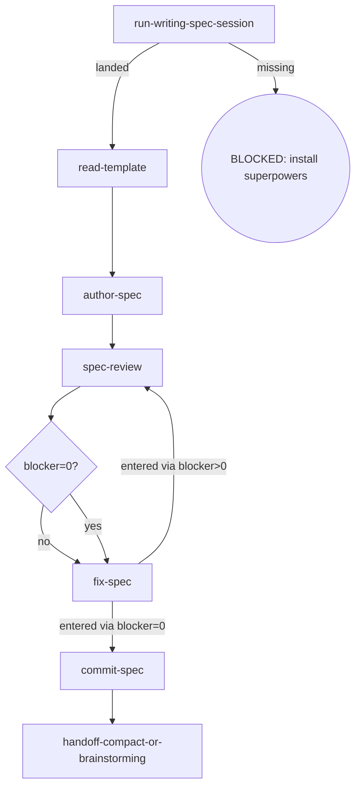

# Osuperpowers Overall-Spec Writing

Writes the program-level (overall) spec from the writing-spec import, reviews it under the cdd spec contract, commits it on approval, and hands off to the next phase's brainstorming. The overall spec is charter-only and carries the four tables (issue inventory / phase inventory / dependency graph / change history); per-phase increment lives in writing-phase-spec.

## Flow Digraph

## Skeleton deltas

| skeleton node | writing-overall-spec |
|---|---|
| read-template | `docs/overall-spec-template.md` |
| scope changed? | N/A |
| sync-overall | N/A — this skill is the overall writer; no parent overall to sync |
| review loop (D/E/F) | shared shape — no delta (only the `--spec <path>` target differs: this skill's own product) |
| handoff-spec | `handoff-compact-or-brainstorming` — /compact, or prepare the handoff to `/osuperpowers:brainstorming [Px program]` |

## Node Definitions

### `run-writing-spec-session`

- **Do**: Import `/superpowers:brainstorming` (writing-spec import) — its flow is consumed inline as this session's baseline; it lands the design decisions (including the program charter and phase decomposition) this overall spec will capture
- **Read**: nothing before the import; the import lands the design
- **Exit**: Import landed → `read-template`; upstream missing → BLOCKED (install superpowers)
- **Fail**: Upstream superpowers plugin missing → BLOCKED: install superpowers (no downgrade, no skip, no inline restatement)

### `read-template`

- **Do**: Read this skill's `docs/overall-spec-template.md` — the program-level spec structure (charter only — no implementation detail; the template carries the GATE: overall approval is not equivalent to any phase started)
- **Read**: `docs/overall-spec-template.md`
- **Exit**: Template loaded → `author-spec`; missing → BLOCKED
- **Fail**: Template missing/unreadable → BLOCKED (missing template)

### `author-spec`

- **Do**: Write the overall spec to `docs/osuperpowers/specs/YYYY-MM-DD-<feature>-overall.md` from the session output — charter only (scope decomposition + issue inventory + phase inventory + dependency graph + acceptance criteria); no phase-level implementation detail. Role note: the charter's phase inventory / dependency graph / change history are machine-checked in this repo by `scripts/validate/overall-consistency.ts` (block 12 of `pnpm run validate`), as is the issue inventory while it keeps the literal `## Issue inventory` heading the guard section-matches (renaming the table — per template Section 4 — silently unhooks it from the guard) — a maintainer-mode, this-repo dogfood guard, not a consumer surface (consumers have no `scripts/validate/`; it is not a packaging feature the overall spec may rely on)
- **Read**: Session output + the overall spec template
- **Exit**: File written → `spec-review`
- **Fail**: Template missing → BLOCKED (missing template)

### `spec-review`

- **Do**: Execute one review per cycle — one dispatch: `cdd review --type spec --spec <path>` (the overall spec document under review). Self-review, manual checks, or any other substitute for cdd review CLI invocation is forbidden. Review Convergence (I1): after a blocker=0 review, fixing all captured findings finishes the cycle — no re-run. Ensure the working tree is clean before entering review (engine entry gate: dirty → BLOCKED; the orchestrator writes no tree during dispatch)
- **Read**: The authored spec document
- **Exit**: Blockers routed via `blocker=0?` → `fix-spec` (both branches; the edge inherits the re-run routing)
- **Fail**: Re-run review after blocker=0 → violates I1 (Review Convergence)

### `fix-spec`

- **Do**: Fix ALL findings (blocker + warn + nit) via `cdd fix --type spec --spec <path> --findings <workspace>/spec-review-{R}.json`. No new review invocation — work from the findings already captured in the current cycle
- **Read**: The captured spec-review handoff (current cycle findings)
- **Exit**: entered via blocker>0 → `spec-review` (re-run); entered via blocker=0 → `commit-spec` (no re-run)
- **Fail**: Invoking a new review instead of fixing from captured findings → violates I1 (Review Convergence)

### `commit-spec`

- **Do**: `git add` the spec + conventional commit. Spec approved = commit immediately (I2); do not wait for dev merge
- **Read**: Spec file path
- **Exit**: Commit complete → `handoff-compact-or-brainstorming`
- **Fail**: Git error → report + fail-open (do not block user spec review)

### `handoff-compact-or-brainstorming`

- **Do**: Run /compact to collapse the completed overall session, or prepare the handoff to `/osuperpowers:brainstorming [Px program]` — its flow is consumed inline as this session's baseline to start the next phase's full brainstorm → plan → dev cycle
- **Read**: The committed overall spec
- **Exit**: Handoff executed → flow ends for this skill
- **Fail**: Handing a phase decided by the overall straight to writing-plans (skipping phase-level brainstorming) → violates the overall boundary rule

## Invariants

| # | Invariant |
|---|---|
| I1 | **Review Convergence** — blocker=0 → fix all findings via `cdd fix`, then stop; do not re-run (for task/branch the review ref moves with the fix commit — the engine cannot intercept it, so this discipline is the only guard). Fixes always dispatch via `cdd fix`; the orchestrator must not edit in place as a substitute |
| I2 | **Spec commit discipline** — spec approved = commit immediately; do not wait for dev merge |

## Failure Modes

| failure | behavior | reason |
|---|---|---|
| Upstream superpowers plugin missing | BLOCKED (install superpowers) | Block policy: no silent fallback |
| Template missing/unreadable | BLOCKED (missing template) | Cannot determine overall spec structure |
| spec-review re-run after blocker=0 | Violates I1 (Review Convergence) — stop + report to user | Agent declares blocker=0 after fixing without re-running cdd review on that pass |
| Git commit error | report + fail-open | Do not block user spec review |
