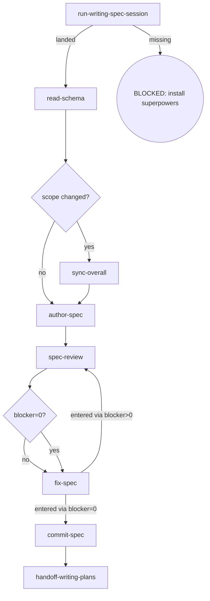

# Osuperpowers Phase-Spec Writing

Writes a single phase's spec document (increment only) from the writing-spec import, reviews it under the cdd spec contract, commits it on approval, and hands it off to writing-plans. If the phase scope changed, the change is synced to the parent overall **before** the phase spec is written (overall v1.4 ordering).

## Flow Digraph

## Skeleton deltas

| skeleton node | writing-phase-spec |
|---|---|
| read-schema | run `cdd schema get phase-spec` → read the canonical doc-structure schema (the schema is the single structure fact; the retired md template is gone) |
| scope changed? | present — first decision node, positioned between `read-schema` and `author-spec` |
| sync-overall | present — only when phase scope changed: `B2 --yes--> G --> C` (sync to the parent overall first, then write the phase spec — overall v1.4 ordering) |
| review loop (D/E/F) | shared shape — no delta (only the `--spec <path>` target differs: this skill's own product) |
| handoff-spec | `handoff-writing-plans` — prepare the handoff to `/osuperpowers:writing-plans` (plan authoring) |

## Node Definitions

### `run-writing-spec-session`

- **Do**: Import `/superpowers:brainstorming` (writing-spec import) — its flow is consumed inline as this session's baseline; it lands the design decisions (including grilling output: root cause / fix direction / technical decisions) this phase spec will capture. The grilling that produced them ran enumerate-then-grill: the requirements registered for this phase in the parent overall were enumerated item by item (each requirement's status — `[Pending]` / `Done` / dropped — cross-referenced from the phase's Phase inventory `[Pending]`/Done cells and the change-history dropped claims) and user-confirmed complete before the grilling frontier
- **Read**: nothing before the import; the import lands the design
- **Exit**: Import landed → `read-schema`; upstream missing → BLOCKED (install superpowers)
- **Fail**: Upstream superpowers plugin missing → BLOCKED: install superpowers (no downgrade, no skip, no inline restatement)

### `read-schema`

- **Do**: Run `cdd schema get phase-spec` to read the canonical phase-spec doc-structure schema (the consumer/install surface, never a hardcoded repo path) — the single structure fact its `properties` + `description` carry (increment only; the schema carries the GATE: a phase spec is produced by a full brainstorm → plan → dev cycle). Direct invocation — read the full output (stdout/stderr); cdd truncates its own output. Output filtering is forbidden — no piping to `tail`/`head`, no `2>&1 |`, no `EXIT=$?` capture.
- **Read**: run `cdd schema get phase-spec` (the canonical phase-spec schema, direct)
- **Exit**: Schema read → `scope changed?`; `cdd schema get phase-spec` unavailable or schema missing → BLOCKED
- **Fail**: Schema missing/unreadable → BLOCKED (missing schema — cannot determine phase spec structure)

### `scope changed?`

- **Do**: Decide whether the phase scope changed since the parent overall was last synced (new issues, scope shift, or dependency changes surfaced during the session)
- **Read**: Parent overall (`docs/osuperpowers/specs/*-overall.md`) + session output
- **Exit**: Changed → `sync-overall` → `author-spec`; unchanged → `author-spec`
- **Fail**: Writing the phase spec against a stale overall when scope changed → violates the sync-before-write ordering (overall v1.4)

### `sync-overall`

- **Do**: Import `/osuperpowers:writing-overall-spec` — its flow is consumed inline as this session's baseline; it lands the scope change synced into the parent overall (issue inventory / phase inventory / dependency graph / version bump + change history), then return here to write the phase spec
- **Read**: The parent overall
- **Exit**: Sync landed → `author-spec`
- **Fail**: Parent overall unparseable / four-table sync inconsistent → BLOCKED (overall-sync-failed)

### `author-spec`

- **Do**: Write the phase spec to `docs/osuperpowers/specs/YYYY-MM-DD-<feature>-<phase-id>-design.md` from the session output — increment only (this phase's approaches / architecture / components / data flow / errors / testing / acceptance criteria); cross-phase conventions live in the parent overall (overall wins on conflict). The section skeleton and the `### Acceptance criteria` subsection follow the canonical `phase-spec.json` schema (`cdd schema get phase-spec` — the same single structure fact `docContractValidate` asserts at dispatch). Direct invocation — read the full output (stdout/stderr); cdd truncates its own output. Output filtering is forbidden — no piping to `tail`/`head`, no `2>&1 |`, no `EXIT=$?` capture.
- **Read**: Session output + the canonical phase-spec schema (via `cdd schema get phase-spec`)
- **Exit**: File written → `spec-review`
- **Fail**: Schema missing → BLOCKED (missing schema)

### `spec-review`

- **Do**: Execute one review per cycle — one dispatch: `cdd review --type spec --spec <path>` (the phase spec document under review). Self-review, manual checks, or any other substitute for cdd review CLI invocation is forbidden. Review Convergence (I1): after a blocker=0 review, fixing all captured findings finishes the cycle — no re-run. Ensure the working tree is clean before entering review (engine entry gate: dirty → BLOCKED; the orchestrator writes no tree during dispatch). Direct invocation — read the full output (stdout/stderr); cdd truncates its own output. Output filtering is forbidden — no piping to `tail`/`head`, no `2>&1 |`, no `EXIT=$?` capture.
- **Read**: The authored spec document
- **Exit**: Blockers routed via `blocker=0?` → `fix-spec` (both branches; the edge inherits the re-run routing)
- **Fail**: Re-run review after blocker=0 → violates I1 (Review Convergence)

### `fix-spec`

- **Do**: Fix ALL findings (blocker + warn + nit) via `cdd fix --type spec --spec <path> --findings <workspace>/spec-review-{R}.json`. No new review invocation — work from the findings already captured in the current cycle. Direct invocation — read the full output (stdout/stderr); cdd truncates its own output. Output filtering is forbidden — no piping to `tail`/`head`, no `2>&1 |`, no `EXIT=$?` capture. After the review, the orchestrator reads only the `status` / `blocker` count from the stdout result line; findings full text is consumed by `cdd fix`'s fix-agent via `--findings <handoff>` — the orchestrator must not self-apply findings as inline edits.
- **Read**: The captured spec-review handoff (current cycle findings)
- **Exit**: entered via blocker>0 → `spec-review` (re-run); entered via blocker=0 → `commit-spec` (no re-run)
- **Fail**: Invoking a new review instead of fixing from captured findings → violates I1 (Review Convergence)

### `commit-spec`

- **Do**: `git add` the spec + conventional commit. Spec approved = commit immediately (I2); do not wait for dev merge
- **Read**: Spec file path
- **Exit**: Commit complete → `handoff-writing-plans`
- **Fail**: Git error → report + fail-open (do not block user spec review)

### `handoff-writing-plans`

- **Do**: Prepare the handoff to `/osuperpowers:writing-plans` — the plan-authoring flow takes over to plan the implementation of the approved phase spec (flow import, consumed inline as this session's baseline; not a session spawn)
- **Read**: The committed phase spec file
- **Exit**: Handoff executed → flow ends for this skill
- **Fail**: Target skill missing → BLOCKED (install osuperpowers)

## Invariants

| # | Invariant |
|---|---|
| I1 | **Review Convergence** — blocker=0 → fix all findings via `cdd fix`, then stop; do not re-run (for task/branch the review ref moves with the fix commit — the engine cannot intercept it, so this discipline is the only guard). Fixes always dispatch via `cdd fix`; the orchestrator must not edit in place as a substitute |
| I2 | **Spec commit discipline** — spec approved = commit immediately; do not wait for dev merge |
| I3 | **Sync before write** — a phase scope change is synced to the parent overall BEFORE the phase spec is authored (overall v1.4 ordering); never write a phase spec against a stale overall |
| I4 | **Mid-Flight Backfill** — a user-raised backfill of overall/spec/plan docs surfaced while a dispatch is in flight lands through four ordered steps on the current `cdd` call's return (any dispatch — implement/review/fix): (1) **land immediately** — hot context; no deferral to cycle close (deferral risks losing the decision); (2) **commit on its own** — committed as its own standalone change, never mixed with implementation commits; (3) **pause the loop until clean** — the loop pauses (tree clean, backfill committed) before the next dispatch; an uncommitted backfill trips the next review's entry gate (dirty → BLOCKED); (4) **audit in-band on resume** — after the loop resumes, the next review audits the backfill in-band (changed-surface booking, not a block); a backfill rewriting the current task's own plan/spec text routes per Pending Acceptance (sole-writer), otherwise it rides the moving ref. |

## Failure Modes

| failure | behavior | reason |
|---|---|---|
| Upstream superpowers plugin missing | BLOCKED (install superpowers) | Block policy: no silent fallback |
| Schema missing/unreadable | BLOCKED (missing schema) | Cannot determine phase spec structure |
| Parent overall unparseable / sync inconsistent | BLOCKED (overall-sync-failed) | Refuse to write a phase spec against a stale overall |
| spec-review re-run after blocker=0 | Violates I1 (Review Convergence) — stop + report to user | Agent declares blocker=0 after fixing without re-running cdd review on that pass |
| Git commit error | report + fail-open | Do not block user spec review |
