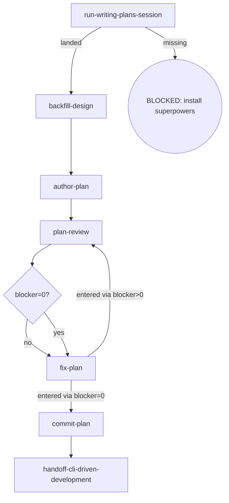

# Osuperpowers Writing-Plans

Writes a plan document from an approved spec, backfills the design when planning surfaces substantive drift, reviews under the cdd plan contract, commits on approval, and hands off to cli-driven-development.

## Flow Digraph



## Node Definitions

### `run-writing-plans-session`

- **Do**: Import `/superpowers:writing-plans` — its flow is consumed inline as this session's baseline (loading an upstream skill imports its flow once; no second spawn) to plan the approved spec; it lands the draft plan (session-call; the upstream document is not read)
- **Read**: nothing before the import; the import plans from the approved spec and lands the draft plan
- **Exit**: Import landed → `backfill-design`; upstream missing → BLOCKED (install superpowers)
- **Fail**: Upstream superpowers plugin missing → BLOCKED: install superpowers (no downgrade, no skip, no inline restatement)

### `backfill-design`

- **Do**: Check the drafted plan against the approved design. Substantive drift (factual error / missing constraint / a new implementation step the design does not cover) → **backfill the design spec first** — revise the spec + record the drift — so spec and plan agree before plan-review (overall v1.6 rule). Cross-phase matters still backfill to the parent overall per Boundary rules
- **Read**: approved spec + landed plan draft
- **Exit**: spec ↔ plan consistent → `author-plan`
- **Fail**: Entering plan-review with an un-backfilled drift → violates the design-backfill rule (overall v1.6)

### `author-plan`

- **Do**: Write the complete plan document to `docs/osuperpowers/plans/YYYY-MM-DD-<feature>.md`. Plan header MUST carry the approved design link as **`**Spec:**` on line 2** (immediately after the `# Title`): `**Spec:** [<name>-design.md](docs/osuperpowers/specs/<name>-design.md)` — the same source as `plan-review`'s `--spec` pointer; `report-issues` resolves program attribution through this header (workspace plan record → **Spec:** → overall → Related), the plan record being the first hop of its program chain. The rest of the plan structure is canonical — run `cdd help` → read the plan doc-structure schema (`plan.json`, the same single structure fact the engine asserts) and follow its properties + descriptions: task-heading format (colon form — em dash / Chinese colon / any other delimiter fails brief extraction), the constraint surface declared for `cdd implement` to materialize `plan-constraints.md` (see the schema's constraint-form nodes; declaring neither blocks pre-flight with `plan Constraints source undeclared` — no silent fallback), the optional pending-acceptance-patch zone, and the header fields. The pending-patch zone's writer discipline is fixed: the orchestrator is the zone's sole writer; fix/implement agents hold zero plan-modification authority (I3). Full definition + samples: **Pending Acceptance Patch (cross-task findings consolidation)** below. Includes self-review (spec coverage + placeholder scan + type consistency) — issues found are fixed inline, not looped or passed to plan-review. Direct invocation — read the full output (stdout/stderr); cdd truncates its own output. Output filtering is forbidden — no piping to `tail`/`head`, no `2>&1 |`, no `EXIT=$?` capture.
- **Read**: approved spec + `backfill-design` output
- **Exit**: Plan written + self-review passed → `plan-review`
- **Fail**: Write error or self-review finds an unfixable defect → report + fail-open (do not block plan review)

### `plan-review`

- **Do**: Execute one review per cycle — one dispatch: `cdd review --type plan --plan <path> --spec <spec-path>` (completeness / decomposition / buildability in one run; findings are lens-tagged; round auto-increments in the engine). Self-review, manual checks, or any other substitute for cdd review CLI invocation is forbidden. All findings are fixed from the captured handoff; `blocker=0` → no re-run. Ensure the working tree is clean before entering review (engine entry gate: dirty → BLOCKED; the orchestrator writes no tree during dispatch). Direct invocation — read the full output (stdout/stderr); cdd truncates its own output. Output filtering is forbidden — no piping to `tail`/`head`, no `2>&1 |`, no `EXIT=$?` capture.
- **Read**: plan document + spec document
- **Exit**: Blockers routed via `blocker=0?` → `fix-plan` (both branches; the edge inherits the re-run routing)
- **Fail**: Re-running the review after blocker=0 → violates the review-convergence discipline

### `fix-plan`

- **Do**: Fix ALL findings (blocker + warn + nit) via `cdd fix --type plan --plan <path> --findings <workspace>/plan-review-{R}.json`. No new review invocation — work from the findings already captured in the current cycle. A finding tagged `targets later task` belongs to the plan's pending-acceptance-patch zone, not this fix round — it is reported and collected by the orchestrator as sole writer (I3); the fix agent holds zero plan-modification authority. Direct invocation — read the full output (stdout/stderr); cdd truncates its own output. Output filtering is forbidden — no piping to `tail`/`head`, no `2>&1 |`, no `EXIT=$?` capture. After the review, the orchestrator reads only the `status` / `blocker` count from the stdout result line; findings full text is consumed by `cdd fix`'s fix-agent via `--findings <handoff>` — the orchestrator must not self-apply findings as inline edits.
- **Read**: captured plan-review handoff (current cycle findings)
- **Exit**: entered via blocker>0 → `plan-review` (re-run); entered via blocker=0 → `commit-plan` (no re-run)
- **Fail**: Invoking a new review instead of fixing from captured findings → violates the review-convergence discipline

### `commit-plan`

- **Do**: `git add` the plan + conventional commit. Plan approved = commit immediately (I2); do not wait for dev merge
- **Read**: Plan file path
- **Exit**: Commit complete → `handoff-cli-driven-development`
- **Fail**: Git error → report + fail-open (do not block user plan review)

### `handoff-cli-driven-development`

- **Do**: Prepare the handoff to `/osuperpowers:cli-driven-development` — its `cdd` implement → review → fix orchestration takes over to implement the approved plan (flow handoff, not a session spawn; the cdd chain drives the work)
- **Read**: The committed plan file
- **Exit**: Handoff executed → flow ends for this skill
- **Fail**: Target skill missing → BLOCKED (install osuperpowers)

## Pending Acceptance Patch (cross-task findings consolidation)

The plan's cross-task findings surface: how a review finding whose remedy belongs to a LATER task is tagged, consolidated by the orchestrator, and carried into the later task's acceptance.

- **Finding tag (convention, zero schema change)** — a review finding that targets a later task marks the target in the finding text with a `targets later task` tag plus the target heading reference (the task-heading form, N later than the current task). The tag is plain free text in the existing findings payload (the handoff schema is untouched — no new field, no engine contract).
- **Zone shape (canonical)** — the zone is a top-level `##` section (conventionally `## Pending Acceptance Patch`) with one patch-entry bullet per pending patch; the exact entry form, the heading token and the carry-through surface are canonical in the plan doc-structure schema's `pendingAcceptancePatch` node (`cdd help` → `plan.json`) — author the zone from that single structure fact. The zone exists only while a patch is pending — the plan convention reserves it, the plan text realizes it.
- **Sole writer** — the pending-acceptance-patch zone is written by the orchestrator alone (I3).
- **Carry-through (mechanically assertable)** — the later task's acceptance line carries the patch as an acceptance bullet, so the patch rides the standard brief-extraction surface (task headings + acceptance lines — the same canonical tokens above) into the later task's dispatch. The patch is therefore assertable by the same mechanical means as any acceptance line — no special parser, no schema change.

Sample — the zone entries (task-ref + patch description) and the later task's acceptance carry-through:

```md
## Pending Acceptance Patch

- **Task 14 (patch)**: the Task 13 review round tagged a `targets later task` finding — Task 14 must accept a guard that untagged cross-task findings cannot pass a review round (task-ref + patch description).

### Task 14: …

- **Do**: …
- **验收**: existing Task 14 acceptance · **accepts pending-acceptance-patch** (task-ref `### Task 14:` · patch: untagged cross-task findings fail the review round) — the patch is a first-class bullet of this acceptance and rides into the Task 14 brief unchanged.
```

## Invariants

| # | Invariant |
|---|---|
| I1 | **Review Convergence** — blocker=0 → fix all findings via `cdd fix`, then stop; do not re-run the same ref (for spec/plan the engine binds the ref to `(doc_path, doc_hash)` and rejects a same-ref re-run; editing the plan opens a new review round legitimately). Fixes always dispatch via `cdd fix`; the orchestrator must not edit in place as a substitute |
| I2 | **Plan commit discipline** — plan approved = commit immediately; do not wait for dev merge |
| I3 | **Plan Sole Writer (Pending Acceptance)** — the plan's pending-acceptance-patch zone is written by the orchestrator alone. A review finding tagged `targets later task` (the canonical task-heading form, N later than the current task) is reported and consolidated by the orchestrator — never fixed in-place by the round that found it — and the later task's acceptance line carries the patch bullet so the deferred requirement rides into its brief. Fix/implement agents hold zero plan-modification authority (v1.31). |
| I4 | **Mid-Flight Backfill** — a user-raised backfill of overall/spec/plan docs surfaced while a dispatch is in flight lands immediately when the current `cdd` call returns (hot context; no deferral to cycle close — deferral risks losing the decision), committed as its own change; the tree must be clean (backfill committed) before the next dispatch: an uncommitted backfill trips the next review's entry gate (dirty → BLOCKED). A backfill rewriting the current task's own plan/spec text routes per Pending Acceptance (sole-writer); otherwise it rides the moving ref and the next review audits it in-band (changed-surface booking, not a block). |

## Failure Modes

| failure | behavior | reason |
|---|---|---|
| Upstream superpowers plugin missing | BLOCKED (install superpowers) | Block policy: no silent fallback |
| Design drift not backfilled before plan-review | BLOCKED (design-backfill violation) | spec and plan must agree before review |
| Git commit error | report + fail-open | Do not block user plan review |
