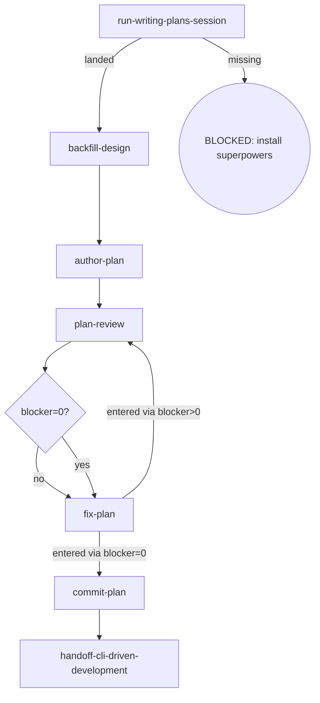

# Osuperpowers Writing-Plans

Writes a plan document from an approved spec, backfills the design when planning surfaces substantive drift, reviews under the cdd plan contract, commits on approval, and hands off to cli-driven-development.

## Flow Digraph

## Node Definitions

### `run-writing-plans-session`

- **Do**: Import `/superpowers:writing-plans` — its flow is consumed inline as this session's baseline (loading an upstream skill imports its flow once; no second spawn) to plan the approved spec; it lands the draft plan (session-call; the upstream document is not read)
- **Read**: nothing before the import; the import plans from the approved spec and lands the draft plan
- **Exit**: Import landed → `backfill-design`; upstream missing → BLOCKED (install superpowers)
- **Fail**: Upstream superpowers plugin missing → BLOCKED: install superpowers (no downgrade, no skip, no inline restatement)

### `backfill-design`

- **Do**: Check the drafted plan against the approved design. Substantive drift (factual error / missing constraint / a new implementation step the design does not cover) → **backfill the design spec first** — revise the spec + record the drift — so spec and plan agree before plan-review (overall v1.6 rule). Cross-phase matters still backfill to the parent overall per Boundary rules
- **Read**: approved spec + landed plan draft
- **Exit**: spec ↔ plan consistent → `author-plan`
- **Fail**: Entering plan-review with an un-backfilled drift → violates the design-backfill rule (overall v1.6)

### `author-plan`

- **Do**: Write the complete plan document to `docs/osuperpowers/plans/YYYY-MM-DD-<feature>.md`. Plan header MUST carry the approved design link as **`**Spec:**` on line 2** (immediately after the `# Title`): `**Spec:** [<name>-design.md](docs/osuperpowers/specs/<name>-design.md)` — the same source as `plan-review`'s `--spec` pointer; `report-issues` resolves program attribution through this header (workspace plan record → **Spec:** → overall → Related), the plan record being the first hop of its program chain. The rest of the plan structure is canonical — run `cdd schema get plan` to read the plan doc-structure schema (the same single structure fact the engine asserts) and follow its properties + descriptions: task-heading format (colon form — em dash / Chinese colon / any other delimiter fails brief extraction), the constraint surface declared for `cdd implement` to materialize `plan-constraints.md` (see the schema's constraint-form nodes; declaring neither blocks pre-flight with `plan Constraints source undeclared` — no silent fallback), the optional `## Task Groups` section (the `taskGroups` dispatch-group declaration), and the header fields. When the task list is written, adjudicate the dispatch grouping **non-interactively** — a design judgment at authoring time, no AskUserQuestion: merged groups (2+ tasks with a shared acceptance surface) land one `- **Task a, b**:` bullet per group under `## Task Groups`, each also declared in the plan `taskGroups` record; zero merged groups → no section (the all-singleton default — each `### Task N:` its own group, zero plan churn). Cross-task adjudication surfaced later (user adjudication / phase-level re-scope) is handled by the orchestrator as Plan Sole Writer — it writes the target task's **Do** and the `**验收**` acceptance lines directly; fix/implement agents hold zero plan-modification authority (I3). Includes self-review (spec coverage + placeholder scan + type consistency) — issues found are fixed inline, not looped or passed to plan-review. Direct invocation — read the full output (stdout/stderr); cdd truncates its own output. Output filtering is forbidden — no piping to `tail`/`head`, no `2>&1 |`, no `EXIT=$?` capture.
- **Read**: approved spec + `backfill-design` output
- **Exit**: Plan written + self-review passed → `plan-review`
- **Fail**: Write error or self-review finds an unfixable defect → report + fail-open (do not block plan review)

### `plan-review`

- **Do**: Execute one review per cycle — one dispatch: `cdd review --type plan --plan <path> --spec <spec-path>` (completeness / decomposition / buildability in one run; findings are lens-tagged; round auto-increments in the engine). Self-review, manual checks, or any other substitute for cdd review CLI invocation is forbidden. Review Convergence (I1): a review closes in three segments — S1 blocker>0 → `cdd fix`, then re-review (cycle to convergence); S2 blocker=0 with warn/nit findings → `cdd fix` closing round (REVIEW_FIX — the plan completes without a re-review); S3 zero findings → approved convergence. Ensure the working tree is clean before entering review (engine entry gate: dirty → BLOCKED; the orchestrator writes no tree during dispatch). Direct invocation — read the full output (stdout/stderr); cdd truncates its own output. Output filtering is forbidden — no piping to `tail`/`head`, no `2>&1 |`, no `EXIT=$?` capture.
- **Read**: plan document + spec document
- **Exit**: Blockers routed via `blocker=0?` → `fix-plan` (both branches; the edge inherits the re-run routing)
- **Fail**: Re-running the review after blocker=0 → violates the review-convergence discipline

### `fix-plan`

- **Do**: Fix ALL findings (blocker + warn + nit) via `cdd fix --type plan --plan <path> --findings <workspace>/plan-review-{R}.json`. No new review invocation — work from the findings already captured in the current cycle (a blocker=0 fix is the closing REVIEW_FIX round — all captured findings fixed, complete, no re-review); cross-task adjudication never happens here — it lands via the orchestrator as Plan Sole Writer, the fix agent holds zero plan-modification authority (I3). Direct invocation — read the full output (stdout/stderr); cdd truncates its own output. Output filtering is forbidden — no piping to `tail`/`head`, no `2>&1 |`, no `EXIT=$?` capture. After the review, the orchestrator reads only the `status` / `blocker` count from the stdout result line; findings full text is consumed by `cdd fix`'s fix-agent via `--findings <handoff>` — the orchestrator must not self-apply findings as inline edits.
- **Read**: captured plan-review handoff (current cycle findings)
- **Exit**: entered via blocker>0 → `plan-review` (re-run); entered via blocker=0 → `commit-plan` (no re-run)
- **Fail**: Invoking a new review instead of fixing from captured findings → violates the review-convergence discipline

### `commit-plan`

- **Do**: `git add` the plan + conventional commit. Plan approved = commit immediately (I2); do not wait for dev merge
- **Read**: Plan file path
- **Exit**: Commit complete → `handoff-cli-driven-development`
- **Fail**: Git error → report + fail-open (do not block user plan review)

### `handoff-cli-driven-development`

- **Do**: Prepare the handoff to `/osuperpowers:cli-driven-development` — its `cdd` implement → review → fix orchestration takes over to implement the approved plan (flow handoff, not a session spawn; the cdd chain drives the work)
- **Read**: The committed plan file
- **Exit**: Handoff executed → flow ends for this skill
- **Fail**: Target skill missing → BLOCKED (install osuperpowers)

## Invariants

| # | Invariant |
|---|---|
| I1 | **Review Convergence** — a review closes in three segments: S1 blocker>0 → `cdd fix`, then re-review (cycle to convergence); S2 blocker=0 with warn/nit findings → `cdd fix` closing round — REVIEW_FIX: complete, no re-review; S3 zero findings → approved convergence, no fix dispatch (for spec/plan the engine binds the ref to `(doc_path, doc_hash)` and rejects a same-ref re-run; editing the plan opens a new review round legitimately). Fixes always dispatch via `cdd fix`; the orchestrator must not edit in place as a substitute |
| I2 | **Plan commit discipline** — plan approved = commit immediately; do not wait for dev merge |
| I3 | **Plan Sole Writer** — cross-task adjudication (user adjudication / phase-level re-scope) is the orchestrator's call as Plan Sole Writer: the target task's **Do** and the `**验收**` acceptance lines are written directly, so the decision rides the standard brief-extraction surface (task headings + acceptance lines) into the target task's dispatch verbatim. Fix/implement agents hold zero plan-modification authority. |
| I4 | **Mid-Flight Backfill** — a user-raised backfill of overall/spec/plan docs surfaced while a dispatch is in flight lands through four ordered steps on the current `cdd` call's return (any dispatch — implement/review/fix): (1) **land immediately** — hot context; no deferral to cycle close (deferral risks losing the decision); (2) **commit on its own** — committed as its own standalone change, never mixed with implementation commits; (3) **pause the loop until clean** — the loop pauses (tree clean, backfill committed) before the next dispatch; an uncommitted backfill trips the next review's entry gate (dirty → BLOCKED); (4) **audit in-band on resume** — after the loop resumes, the next review audits the backfill in-band (changed-surface booking, not a block); a backfill rewriting the current task's own plan/spec text routes through the orchestrator as Plan Sole Writer (cross-task adjudication), otherwise it rides the moving ref. |

## Failure Modes

| failure | behavior | reason |
|---|---|---|
| Upstream superpowers plugin missing | BLOCKED (install superpowers) | Block policy: no silent fallback |
| Design drift not backfilled before plan-review | BLOCKED (design-backfill violation) | spec and plan must agree before review |
| Git commit error | report + fail-open | Do not block user plan review |
