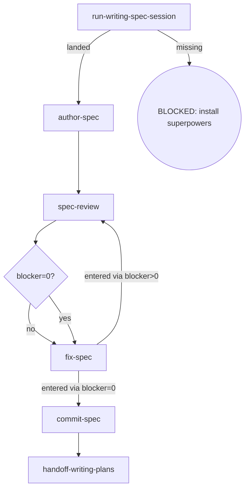

# Osuperpowers Single-Spec Writing

Writes a single (non-phase) spec from the writing-spec import, reviews it under the cdd spec contract, commits it on approval, and hands it off to writing-plans. Single specs have no canonical structure schema and no parent overall to sync.

## Flow Digraph

## Skeleton deltas

| skeleton node | writing-single-spec |
|---|---|
| read-schema | N/A — no canonical structure schema (single specs are authored free-form) |
| scope changed? | N/A |
| sync-overall | N/A |
| review loop (D/E/F) | shared shape — no delta (only the `--spec <path>` target differs: this skill's own product) |
| handoff-spec | `handoff-writing-plans` — prepare the handoff to `/osuperpowers:writing-plans` (plan authoring) |

## Node Definitions

### `run-writing-spec-session`

- **Do**: Import `/superpowers:brainstorming` (writing-spec import) — its flow is consumed inline as this session's baseline; it lands the design decisions this single spec will capture
- **Read**: nothing before the import; the import lands the design
- **Exit**: Import landed → `author-spec`; upstream missing → BLOCKED (install superpowers)
- **Fail**: Upstream superpowers plugin missing → BLOCKED: install superpowers (no downgrade, no skip, no inline restatement)

### `author-spec`

- **Do**: Write the spec document to `docs/osuperpowers/specs/` from the session output. **No canonical structure schema (single variant) — free-form authoring**
- **Read**: Session output
- **Exit**: File written → `spec-review`
- **Fail**: Session output unusable or write error → BLOCKED (missing design input)

### `spec-review`

- **Do**: Execute one review per cycle — one dispatch: `cdd review --type spec --spec <path>` (the single spec document under review). Self-review, manual checks, or any other substitute for cdd review CLI invocation is forbidden. Review Convergence (I1): after a blocker=0 review, fixing all captured findings finishes the cycle — no re-run. Ensure the working tree is clean before entering review (engine entry gate: dirty → BLOCKED; the orchestrator writes no tree during dispatch)
- **Read**: The authored spec document
- **Exit**: Blockers routed via `blocker=0?` → `fix-spec` (both branches; the edge inherits the re-run routing)
- **Fail**: Re-run review after blocker=0 → violates I1 (Review Convergence)

### `fix-spec`

- **Do**: Fix ALL findings (blocker + warn + nit) via `cdd fix --type spec --spec <path> --findings <workspace>/spec-review-{R}.json`. No new review invocation — work from the findings already captured in the current cycle
- **Read**: The captured spec-review handoff (current cycle findings)
- **Exit**: entered via blocker>0 → `spec-review` (re-run); entered via blocker=0 → `commit-spec` (no re-run)
- **Fail**: Invoking a new review instead of fixing from captured findings → violates I1 (Review Convergence)

### `commit-spec`

- **Do**: `git add` the spec + conventional commit. Spec approved = commit immediately (I2); do not wait for dev merge
- **Read**: Spec file path
- **Exit**: Commit complete → `handoff-writing-plans`
- **Fail**: Git error → report + fail-open (do not block user spec review)

### `handoff-writing-plans`

- **Do**: Prepare the handoff to `/osuperpowers:writing-plans` — the plan-authoring flow takes over to plan the implementation of the approved spec (flow import, consumed inline as this session's baseline; not a session spawn)
- **Read**: The committed spec file
- **Exit**: Handoff executed → flow ends for this skill
- **Fail**: Target skill missing → BLOCKED (install osuperpowers)

## Invariants

| # | Invariant |
|---|---|
| I1 | **Review Convergence** — blocker=0 → fix all findings via `cdd fix`, then stop; do not re-run (for task/branch the review ref moves with the fix commit — the engine cannot intercept it, so this discipline is the only guard). Fixes always dispatch via `cdd fix`; the orchestrator must not edit in place as a substitute |
| I2 | **Spec commit discipline** — spec approved = commit immediately; do not wait for dev merge |

## Failure Modes

| failure | behavior | reason |
|---|---|---|
| Upstream superpowers plugin missing | BLOCKED (install superpowers) | Block policy: no silent fallback |
| spec-review re-run after blocker=0 | Violates I1 (Review Convergence) — stop + report to user | Agent declares blocker=0 after fixing without re-running cdd review on that pass |
| Git commit error | report + fail-open | Do not block user spec review |
