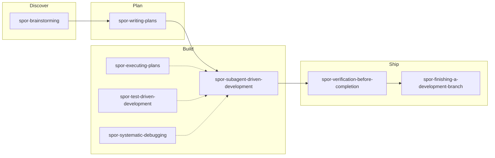

# superpowers-overrides

[English](README.md) | [简体中文](README.zh-CN.md)

Personal overrides for [superpowers](https://github.com/obra/superpowers). Each `spor-*` skill runs **before** its upstream target — replacing behavior or delegating to [mattpocock-skills](../mattpocock-skills/).

## What overrides do

When you invoke `/brainstorming`, `/writing-plans`, or any other superpowers skill, the matching `spor-*` override loads first. It either **replaces** upstream steps (e.g. self-review → fresh subagent passes) or **delegates** to mattpocock skills (e.g. clarifying questions → `grilling`, implementation → `tdd`).

Three layers keep overrides from being skipped:

1. **Skill description** — four-trigger frontmatter; override must be the first tool call.
2. **Hook** — `UserPromptExpansion` on `/superpowers:*` slash commands (Claude Code).
3. **Project rules** — `/spor-init` writes self-check rules into your project (`CLAUDE.md` or `.cursor/rules/superpowers-overrides.mdc`).

## Workflow

Simplified main-path diagram — not a complete skill inventory. Overall/phase, policy, cross-cutting skills, and `spor-receiving-code-review` are in the table below.

**Overall + phase:** large scope → write an overall spec and get decomposition approval → explicit gate → per-phase discover→ship cycle. The main README ASCII pipeline includes Phase spec; this diagram shows the per-phase skill intercept chain from Discover onward.

## Skills by phase

| Phase | Skill | What it does |
|-------|-------|--------------|
| Setup | `spor-init` | Project wiring; run once after install |
| Discover | `spor-brainstorming` | Delegates discovery to `grilling`; subagent spec review; overall/phase for large scope |
| Plan | `spor-writing-plans` | Section-by-section plan writes + review; tickets to `docs/superpowers/tickets/` |
| Build | `spor-subagent-driven-development` | Complexity-based review rounds; implementers delegate to `tdd` |
| Build | `spor-executing-plans` | Plan execution; redirects to SDD when subagents available; per-task commits |
| Build | `spor-test-driven-development` | Confirms seams with user; delegates loop to mattpocock `tdd` |
| Build | `spor-systematic-debugging` | Evidence before fixes; delegates to `diagnosing-bugs` |
| Ship | `spor-verification-before-completion` | No completion claims without verification evidence |
| Ship | `spor-finishing-a-development-branch` | Branch finish / PR; no worktrees; conventional commits |
| Ship | `spor-receiving-code-review` | Unclear feedback → `grilling`; fixes → `tdd` (not in diagram — often mid-build or pre-ship) |
| Policy | `spor-using-git-worktrees` | Refuses worktree creation (user policy) |
| Cross-cutting | `spor-subagent-lifecycle` | Fresh subagent per pass; concurrency rules (referenced, no slash) |
| Cross-cutting | `spor-token-efficient-review-dispatch` | D1/D2/D3 review dispatch (referenced, no slash) |

## Usage

### Common

1. Install `superpowers`, `superpowers-overrides`, and `mattpocock-skills` from the oscaner marketplace.
2. Run **`/spor-init`** in each project (re-run after plugin upgrades).
3. Invoke upstream superpowers skills — overrides intercept automatically.

### Claude Code

- Workflow: `/superpowers:brainstorming`, `/superpowers:writing-plans`, …
- Init: `/superpowers-overrides:spor-init` → writes self-check block to project `CLAUDE.md`.

### Cursor

- Workflow: `/spor-brainstorming`, `/spor-writing-plans`, … (or rules-based intercept).
- Init: `/spor-init` → writes `.cursor/rules/superpowers-overrides.mdc`.
- See [cross-harness-overrides.md](docs/cross-harness-overrides.md) and [CURSOR-SMOKE.md](docs/CURSOR-SMOKE.md).

## Docs for maintainers

- [cross-harness-overrides.md](docs/cross-harness-overrides.md)
- [CLAUDE.md](../../CLAUDE.md) — override pattern, contributor guide
- [CHANGELOG.md](CHANGELOG.md)

## License

[MIT](LICENSE)
