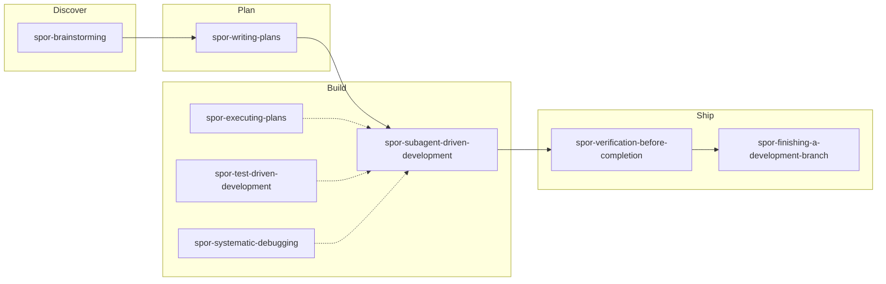

# superpowers-overrides

[English](README.md) | [简体中文](README.zh-CN.md)

对 [superpowers](https://github.com/obra/superpowers) 的个人 override。每个 `spor-*` skill 在对应上游 skill **之前**运行——替换行为或 delegate 到 [mattpocock-skills](../mattpocock-skills/)。

## overrides 做什么

调用 `/brainstorming`、`/writing-plans` 等 superpowers skill 时，匹配的 `spor-*` override 会先加载。它要么 **replace** 上游步骤（如 self-review → 全新 subagent 审查），要么 **delegate** 给 mattpocock skill（如澄清问题 → `grilling`，实现 → `tdd`）。

三层机制防止 override 被跳过：

1. **Skill description** — 四触发 frontmatter；override 必须是本 turn 第一个 tool call。
2. **Hooks（plugin-bundled）** — Claude Code：`UserPromptExpansion` 三重 matcher（`^superpowers:`、bare `/<slug>`、`^/spor-<slug>`）。Cursor：`beforeSubmitPrompt` detect + `preToolUse` enforce（`hooks/hooks-cursor.json`）。**不写项目 hook 文件。**
3. **项目规则** — `/spor-init` 写入项目（`CLAUDE.md` 或 `.cursor/rules/superpowers-overrides.mdc`）；Cursor 上 hooks 未命中时为 fallback。

## 工作流

简化主路径图——不是完整 skill 清单。overall/phase、policy、cross-cutting skills 和 `spor-receiving-code-review` 见下方表格。

**Overall + phase：** 大 scope → 写 overall spec 并获分解批准 → 显式 gate → 每个 phase 独立跑 discover→ship。主 README 的 ASCII 流水线包含 Phase spec；此图展示从 Discover 起的 per-phase skill 拦截链。

## 按阶段划分的 Skills

| 阶段 | Skill | 作用 |
|------|-------|------|
| Setup | `spor-init` | 项目 wiring；安装后跑一次 |
| Discover | `spor-brainstorming` | discovery delegate 给 `grilling`；subagent spec review；大 scope 走 overall/phase |
| Plan | `spor-writing-plans` | 分段写 plan + review；tickets 发布到 `docs/superpowers/tickets/` |
| Build | `spor-subagent-driven-development` | 按复杂度多轮 review；implementer delegate 给 `tdd` |
| Build | `spor-executing-plans` | 执行 plan；有 subagent 时转 SDD；每 task commit |
| Build | `spor-test-driven-development` | seam 确认门在 templates/cdd/implement.md；循环 delegate 给 mattpocock `tdd` |
| Build | `spor-systematic-debugging` | 先有证据再提 fix；delegate 给 `diagnosing-bugs` |
| Ship | `spor-verification-before-completion` | 无验证证据不得声称完成 |
| Ship | `spor-finishing-a-development-branch` | 分支收尾 / PR；禁止 worktree；conventional commits |
| Ship | `spor-receiving-code-review` | 不清楚的反馈 → `grilling`；fix → `tdd`（不在图中——常在 build 中或 ship 前） |
| Policy | `spor-using-git-worktrees` | 拒绝创建 worktree（用户策略） |
| Cross-cutting | `spor-token-efficient-controller-handoff` | H1–H5 SDD orchestrator 文件-only handoff（被引用，无 slash） |
| Cross-cutting | `spor-handoff-writer` | handoff.json schema reference doc（handoff 写入已内联，不再独立 dispatch） |

## 用法

### 通用

1. 从 oscaner marketplace 安装 `superpowers`、`superpowers-overrides`、`mattpocock-skills`。
2. 每个项目运行 **`/spor-init`**（插件升级后重跑）。
3. 照常调用 upstream superpowers skill——overrides 自动拦截。

### Claude Code

- 工作流：`/superpowers:brainstorming`、`/superpowers:writing-plans` …
- Init：`/superpowers-overrides:spor-init` → 写入项目 `CLAUDE.md` self-check 块。

### Cursor

- 工作流：`/spor-brainstorming`、`/spor-writing-plans` …（或 rules 拦截）。
- Init：`/spor-init` → 写入 `.cursor/rules/superpowers-overrides.mdc`。
- Hooks：从 marketplace 安装插件即可——detect/enforce 随插件发布；**不要**添加项目 `.cursor/hooks.json`。
- 详见 [cross-harness-overrides.md](docs/cross-harness-overrides.md)。

### Manual skill attach（手动附加 skill）

**推荐：**

- 使用 `/spor-brainstorming` 等 slash，或 bare upstream slash（`/brainstorming`）——hooks + rules 自动拦截。
- 需要 inline 上下文时 attach **`spor-*`** skill 文件（如 `spor-brainstorming/SKILL.md`）。

**禁止：**

- Attach upstream `superpowers/*/SKILL.md` 正文——内联 upstream checklist 会压过 spor 纪律（即使 hooks 已触发）。应改用 slash 或 agent skills 列表。

Hook 与 enforcement 脚本 **随 plugin 安装**（与 upstream `superpowers` 同模式）。`spor-init` 不应在 consumer 项目里新增 hook 文件。

## CDD CLI harness 脚本

Token-efficient CDD 编排（`spor-token-efficient-controller-handoff`）通过 plugin 内脚本 dispatch。Orchestrator 只解析一次 harness；唯一 CLI runner 是 `os-engineering/bin/cdd-run.sh`。

| Harness | CLI 二进制 | 实现级别 |
|---------|------------|----------|
| **claude** | `claude` | **Full** — `claude -p … --output-format text --dangerously-skip-permissions` |
| **cursor-agent** | `cursor-agent` | **Full** — `cursor-agent --print --output-format text --force` |
| **droid** | `droid` | **Full** — `droid exec --auto medium --output-format stream-json` |
| **pi** | `pi` | **Full** — `pi -p --no-session --no-approve` |
| **codex** | `codex` | **Not-supported** — exit 1 BLOCKED |
| **copilot** | `copilot` | **Not-supported** — exit 1 BLOCKED |
| **gemini** | `gemini` | **Not-supported** — exit 1 BLOCKED |

共享库：`os-engineering/bin/lib/cdd-common.sh`（workspace 路径、plugin root 解析、exit code）承载 task/plan run-loop（`cdd_run_task` / `cdd_run_plan`）；`os-engineering/bin/cdd-run.sh` 是唯一 CLI runner（`--harness <name> --task N --mode M` | `--plan <path>`）。

**Mode A（单 task）：** `{os-engineering}/bin/cdd-run.sh --harness <name> --task N --mode implement|review|fix`

**Mode B（plan driver / AFK）：** `{os-engineering}/bin/cdd-run.sh --harness <name> --plan <path>` — pending tasks × 3-mode 链。

Not-supported harness → exit 1 → orchestrator **BLOCKED**（非 in-session p0 fallback）。CLI 缺失 → exit 2 → orchestrator **BLOCKED**。详见 [cross-harness-overrides.md](docs/cross-harness-overrides.md#cdd-cli-harness-scripts-p1)。

## 维护者文档

- [cross-harness-overrides.md](docs/cross-harness-overrides.md)
- [CLAUDE.md](../../CLAUDE.md) — override 模式、贡献指南
- [CHANGELOG.md](CHANGELOG.md)

## 许可

[MIT](LICENSE)
